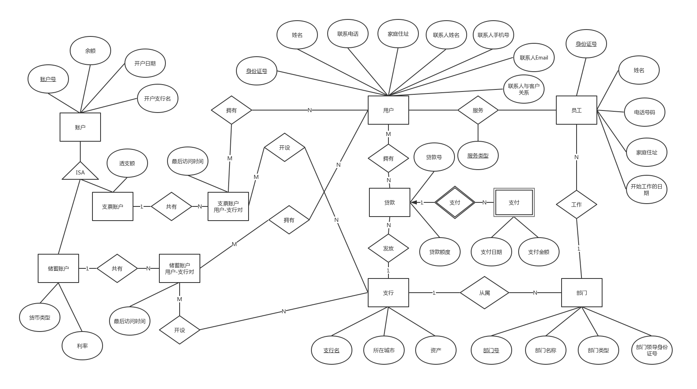
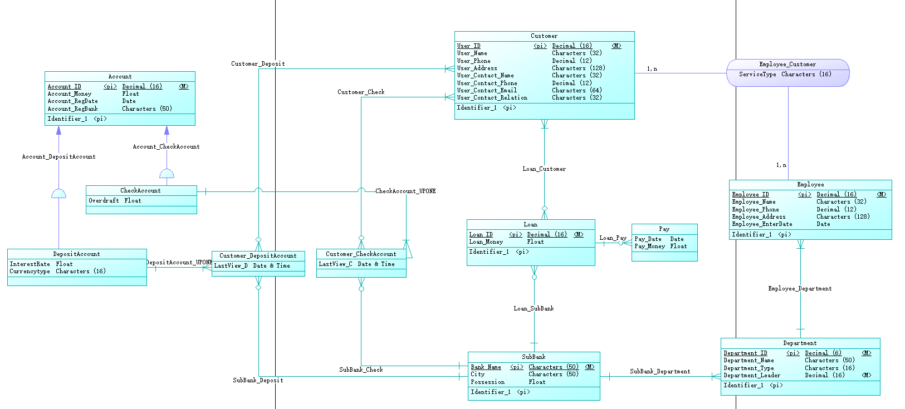
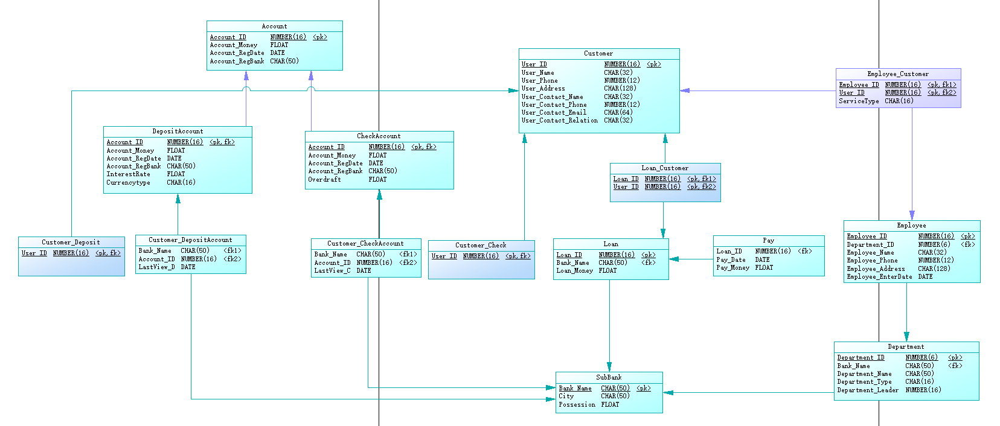

# 数据库系统及应用实验报告-Lab02

>   姓名：		张劲暾
>
>   学号：		PB16111485
>
>   实验：		Database Design
>
>   实验环境：
>
>   *   DBMS:	Oracle18.3
>   *   IDE:     PowerDesigner® v16.5

## 实验内容

某银行准备开发一个银行业务管理系统，通过调查，得到以下的主要需求： 

1.  银行有多个**支行**。各个支行位于某个城市，每个支行有唯一的名字。银行要监控每个支行的资产。 
2.  银行的**客户**通过其身份证号来标识。银行存储每个客户的姓名、联系电话以及家庭住址。为了安全起见，银行还要求客户提供一位联系人的信息，包括联系人姓名、手机号、Email 以及与客户的关系。
3.  客户可以有**帐户**，并且可以**贷款**。
4.  客户可能和某个银行**员工**发生联系，该员工是此客户的贷款负责人或银行帐户负责人。 
5.  银行员工也通过身份证号来标识。员工分为部门经理和普通员工，每个部门经理都负责领导其所在**部门**的员工，并且每个员工只允许在一个部门内工作。每个支行的管理机构存储每个员工的姓名、电话号码、家庭地址、所在的部门号、部门名称、部门类型及部门经理的身份证号。银行还需知道每个员工开始工作的日期，由此日期可以推知员工的雇佣期。
6.  银行提供两类帐户——储蓄帐户和支票帐户。 **帐户可以由多个客户所共有，一个客户也可开设多个账户，但在一个支行内最多只能开设一个储蓄账户和一个支票账户。**
7.  每个帐户被赋以唯一的帐户号。银行记录每个帐户的余额、开户日期、开户的支行名以及每个帐户所有者访问该帐户的最近日期。
8.  另外，每个储蓄帐户有利率和货币类型，且每个支票帐户有透支额。 
9.  每笔贷款由某个分支机构发放，能被一个或多个客户所共有。每笔贷款用唯一的贷款号标识。
10.  银行需要知道每笔贷款所贷金额以及逐次**支付**的情况（银行将贷款分几次付给客户）。虽然贷款号不能唯一标识银行所有为贷款所付的款项，但可以唯一标识为某贷款所付的款项。对每次的付款需要记录日期和金额。

## 实验设计

### 概念模型设计(db_lab2.cdm)

#### 设计思路

1.  **支行**是现实实体，并且具有自身性质，所以设计为实体，将**支行名**作为主键
2.  **部门**是现实实体，并且具有自身性质，所以设计为实体，将**部门编号**作为主键，部门对支行的关系是多(部门)对一(支行)
3.  **顾客**是现实实体，并且具有自身性质，所以设计为实体，将**身份证号**作为主键
4.  **员工**是现实实体，并且具有自身性质，所以设计为实体，将**身份证号**作为主键，员工对部门的关系是多(员工)对一(部门)
5.  客户和员工的关系是多对多，用关系属性表明员工是客户的贷款负责人或银行帐户负责人
6.  因为在这个问题中，*领导*并不具备单独的自身属性，所以不设计为员工实体的子类，而是将领导身份证号作为部门的一个Unique属性
7.  **贷款**是现实实体，并且具有自身性质，所以设计为实体，将**贷款号**作为主键，贷款对顾客的关系是多(贷款)对多(顾客)，贷款对支行的关系是多(贷款)对一(支行)
8.  *支付*是依赖于贷款的实体，所以设计为依赖于贷款实体的弱实体
9.  **账户**是现实实体，并且具有自身性质，所以设计为实体，将**账户号**作为主键
10.  *支票账户*是现实实体，属于账户实体，所并且具有自身属性，所以设计为账户的子类
11.  *存储账户*是现实实体，属于账户实体，所并且具有自身属性，所以设计为账户的子类
12.  为了实现“一个用户在一个支行内最多只能开设一个储蓄账户和一个支票账户”，首先需要一个由用户和支行对应的组合实体，再去和支票账户和储蓄账户做一(账户)对多(组合)的关系，这样每个支票账户或储蓄账户对应的都是不重复的用户和支行组合，就实现了“一个用户在一个支行内最多只能开设一个储蓄账户和一个支票账户”，并且将最近访问日期作为用户和支行组合的属性，实现为每一位用户的每一个账户记录最近访问日期

#### E-R图



#### 具体设计



### 数据模型生成(db_lab2.pdm)



### 物理数据库生成(db_lab2.sql)

```sql
/*==============================================================*/
/* DBMS name:      ORACLE Version 11g                           */
/* Created on:     2019/5/19 20:33:38                           */
/*==============================================================*/


alter table "CheckAccount"
   drop constraint FK_CHECKACC_ACCOUNT_C_ACCOUNT;

alter table "Customer_Check"
   drop constraint FK_CUSTOMER_CUSTOMER_CHECK;

alter table "Customer_CheckAccount"
   drop constraint FK_CUSTOMER_CHECKACCO_CHECKACC;

alter table "Customer_CheckAccount"
   drop constraint FK_CUSTOMER_SUBBANK_C_SUBBANK;

alter table "Customer_Deposit"
   drop constraint FK_CUSTOMER_CUSTOMER_DEPOSIT;

alter table "Customer_DepositAccount"
   drop constraint FK_CUSTOMER_DEPOSITAC_DEPOSITA;

alter table "Customer_DepositAccount"
   drop constraint FK_CUSTOMER_SUBBANK_D_SUBBANK;

alter table "Department"
   drop constraint FK_DEPARTME_SUBBANK_D_SUBBANK;

alter table "DepositAccount"
   drop constraint FK_DEPOSITA_ACCOUNT_D_ACCOUNT;

alter table "Employee"
   drop constraint FK_EMPLOYEE_EMPLOYEE__DEPARTME;

alter table "Employee_Customer"
   drop constraint FK_EMPLOYEE_EMPLOYEE__EMPLOYEE;

alter table "Employee_Customer"
   drop constraint FK_EMPLOYEE_EMPLOYEE__CUSTOMER;

alter table "Loan"
   drop constraint FK_LOAN_LOAN_SUBB_SUBBANK;

alter table "Loan_Customer"
   drop constraint FK_LOAN_CUS_LOAN_CUST_LOAN;

alter table "Loan_Customer"
   drop constraint FK_LOAN_CUS_LOAN_CUST_CUSTOMER;

alter table "Pay"
   drop constraint FK_PAY_LOAN_PAY_LOAN;

drop table "Account" cascade constraints;

drop table "CheckAccount" cascade constraints;

drop table "Customer" cascade constraints;

drop table "Customer_Check" cascade constraints;

drop index "CheckAccount_UPONE_FK";

drop index "SubBank_Check_FK";

drop table "Customer_CheckAccount" cascade constraints;

drop table "Customer_Deposit" cascade constraints;

drop index "DepositAccount_UPONE_FK";

drop index "SubBank_Deposit_FK";

drop table "Customer_DepositAccount" cascade constraints;

drop index "SubBank_Department_FK";

drop table "Department" cascade constraints;

drop table "DepositAccount" cascade constraints;

drop index "Employee_Department_FK";

drop table "Employee" cascade constraints;

drop index "Employee_Customer2_FK";

drop index "Employee_Customer_FK";

drop table "Employee_Customer" cascade constraints;

drop index "Loan_SubBank_FK";

drop table "Loan" cascade constraints;

drop index "Loan_Customer2_FK";

drop index "Loan_Customer_FK";

drop table "Loan_Customer" cascade constraints;

drop index "Loan_Pay_FK";

drop table "Pay" cascade constraints;

drop table "SubBank" cascade constraints;

/*==============================================================*/
/* Table: "Account"                                             */
/*==============================================================*/
create table "Account" 
(
   "Account_ID"         NUMBER(16)           not null,
   "Account_Money"      FLOAT,
   "Account_RegDate"    DATE,
   "Account_RegBank"    CHAR(50),
   constraint PK_ACCOUNT primary key ("Account_ID")
);

/*==============================================================*/
/* Table: "CheckAccount"                                        */
/*==============================================================*/
create table "CheckAccount" 
(
   "Account_ID"         NUMBER(16)           not null,
   "Account_Money"      FLOAT,
   "Account_RegDate"    DATE,
   "Account_RegBank"    CHAR(50),
   "Overdraft"          FLOAT,
   constraint PK_CHECKACCOUNT primary key ("Account_ID")
);

/*==============================================================*/
/* Table: "Customer"                                            */
/*==============================================================*/
create table "Customer" 
(
   "User_ID"            NUMBER(16)           not null,
   "User_Name"          CHAR(32),
   "User_Phone"         NUMBER(12),
   "User_Address"       CHAR(128),
   "User_Contact_Name"  CHAR(32),
   "User_Contact_Phone" NUMBER(12),
   "User_Contact_Email" CHAR(64),
   "User_Contact_Relation" CHAR(32),
   constraint PK_CUSTOMER primary key ("User_ID")
);

/*==============================================================*/
/* Table: "Customer_Check"                                      */
/*==============================================================*/
create table "Customer_Check" 
(
   "User_ID"            NUMBER(16)           not null,
   constraint PK_CUSTOMER_CHECK primary key ("User_ID")
);

/*==============================================================*/
/* Table: "Customer_CheckAccount"                               */
/*==============================================================*/
create table "Customer_CheckAccount" 
(
   "Bank_Name"          CHAR(50)             not null,
   "Account_ID"         NUMBER(16)           not null,
   "LastView_C"         DATE
);

/*==============================================================*/
/* Index: "SubBank_Check_FK"                                    */
/*==============================================================*/
create index "SubBank_Check_FK" on "Customer_CheckAccount" (
   "Bank_Name" ASC
);

/*==============================================================*/
/* Index: "CheckAccount_UPONE_FK"                               */
/*==============================================================*/
create index "CheckAccount_UPONE_FK" on "Customer_CheckAccount" (
   "Account_ID" ASC
);

/*==============================================================*/
/* Table: "Customer_Deposit"                                    */
/*==============================================================*/
create table "Customer_Deposit" 
(
   "User_ID"            NUMBER(16)           not null,
   constraint PK_CUSTOMER_DEPOSIT primary key ("User_ID")
);

/*==============================================================*/
/* Table: "Customer_DepositAccount"                             */
/*==============================================================*/
create table "Customer_DepositAccount" 
(
   "Bank_Name"          CHAR(50)             not null,
   "Account_ID"         NUMBER(16)           not null,
   "LastView_D"         DATE
);

/*==============================================================*/
/* Index: "SubBank_Deposit_FK"                                  */
/*==============================================================*/
create index "SubBank_Deposit_FK" on "Customer_DepositAccount" (
   "Bank_Name" ASC
);

/*==============================================================*/
/* Index: "DepositAccount_UPONE_FK"                             */
/*==============================================================*/
create index "DepositAccount_UPONE_FK" on "Customer_DepositAccount" (
   "Account_ID" ASC
);

/*==============================================================*/
/* Table: "Department"                                          */
/*==============================================================*/
create table "Department" 
(
   "Department_ID"      NUMBER(6)            not null,
   "Bank_Name"          CHAR(50)             not null,
   "Department_Name"    CHAR(50),
   "Department_Type"    CHAR(16),
   "Department_Leader"  NUMBER(16)           not null,
   constraint PK_DEPARTMENT primary key ("Department_ID")
);

/*==============================================================*/
/* Index: "SubBank_Department_FK"                               */
/*==============================================================*/
create index "SubBank_Department_FK" on "Department" (
   "Bank_Name" ASC
);

/*==============================================================*/
/* Table: "DepositAccount"                                      */
/*==============================================================*/
create table "DepositAccount" 
(
   "Account_ID"         NUMBER(16)           not null,
   "Account_Money"      FLOAT,
   "Account_RegDate"    DATE,
   "Account_RegBank"    CHAR(50),
   "InterestRate"       FLOAT,
   "Currencytype"       CHAR(16),
   constraint PK_DEPOSITACCOUNT primary key ("Account_ID")
);

/*==============================================================*/
/* Table: "Employee"                                            */
/*==============================================================*/
create table "Employee" 
(
   "Employee_ID"        NUMBER(16)           not null,
   "Department_ID"      NUMBER(6)            not null,
   "Employee_Name"      CHAR(32),
   "Employee_Phone"     NUMBER(12),
   "Employee_Address"   CHAR(128),
   "Employee_EnterDate" DATE,
   constraint PK_EMPLOYEE primary key ("Employee_ID")
);

/*==============================================================*/
/* Index: "Employee_Department_FK"                              */
/*==============================================================*/
create index "Employee_Department_FK" on "Employee" (
   "Department_ID" ASC
);

/*==============================================================*/
/* Table: "Employee_Customer"                                   */
/*==============================================================*/
create table "Employee_Customer" 
(
   "Employee_ID"        NUMBER(16)           not null,
   "User_ID"            NUMBER(16)           not null,
   "ServiceType"        CHAR(16),
   constraint PK_EMPLOYEE_CUSTOMER primary key ("Employee_ID", "User_ID")
);

/*==============================================================*/
/* Index: "Employee_Customer_FK"                                */
/*==============================================================*/
create index "Employee_Customer_FK" on "Employee_Customer" (
   "Employee_ID" ASC
);

/*==============================================================*/
/* Index: "Employee_Customer2_FK"                               */
/*==============================================================*/
create index "Employee_Customer2_FK" on "Employee_Customer" (
   "User_ID" ASC
);

/*==============================================================*/
/* Table: "Loan"                                                */
/*==============================================================*/
create table "Loan" 
(
   "Loan_ID"            NUMBER(16)           not null,
   "Bank_Name"          CHAR(50)             not null,
   "Loan_Money"         FLOAT,
   constraint PK_LOAN primary key ("Loan_ID")
);

/*==============================================================*/
/* Index: "Loan_SubBank_FK"                                     */
/*==============================================================*/
create index "Loan_SubBank_FK" on "Loan" (
   "Bank_Name" ASC
);

/*==============================================================*/
/* Table: "Loan_Customer"                                       */
/*==============================================================*/
create table "Loan_Customer" 
(
   "Loan_ID"            NUMBER(16)           not null,
   "User_ID"            NUMBER(16)           not null,
   constraint PK_LOAN_CUSTOMER primary key ("Loan_ID", "User_ID")
);

/*==============================================================*/
/* Index: "Loan_Customer_FK"                                    */
/*==============================================================*/
create index "Loan_Customer_FK" on "Loan_Customer" (
   "Loan_ID" ASC
);

/*==============================================================*/
/* Index: "Loan_Customer2_FK"                                   */
/*==============================================================*/
create index "Loan_Customer2_FK" on "Loan_Customer" (
   "User_ID" ASC
);

/*==============================================================*/
/* Table: "Pay"                                                 */
/*==============================================================*/
create table "Pay" 
(
   "Loan_ID"            NUMBER(16)           not null,
   "Pay_Date"           DATE,
   "Pay_Money"          FLOAT
);

/*==============================================================*/
/* Index: "Loan_Pay_FK"                                         */
/*==============================================================*/
create index "Loan_Pay_FK" on "Pay" (
   "Loan_ID" ASC
);

/*==============================================================*/
/* Table: "SubBank"                                             */
/*==============================================================*/
create table "SubBank" 
(
   "Bank_Name"          CHAR(50)             not null,
   "City"               CHAR(50),
   "Possession"         FLOAT,
   constraint PK_SUBBANK primary key ("Bank_Name")
);

alter table "CheckAccount"
   add constraint FK_CHECKACC_ACCOUNT_C_ACCOUNT foreign key ("Account_ID")
      references "Account" ("Account_ID");

alter table "Customer_Check"
   add constraint FK_CUSTOMER_CUSTOMER_CHECK foreign key ("User_ID")
      references "Customer" ("User_ID");

alter table "Customer_CheckAccount"
   add constraint FK_CUSTOMER_CHECKACCO_CHECKACC foreign key ("Account_ID")
      references "CheckAccount" ("Account_ID");

alter table "Customer_CheckAccount"
   add constraint FK_CUSTOMER_SUBBANK_C_SUBBANK foreign key ("Bank_Name")
      references "SubBank" ("Bank_Name");

alter table "Customer_Deposit"
   add constraint FK_CUSTOMER_CUSTOMER_DEPOSIT foreign key ("User_ID")
      references "Customer" ("User_ID");

alter table "Customer_DepositAccount"
   add constraint FK_CUSTOMER_DEPOSITAC_DEPOSITA foreign key ("Account_ID")
      references "DepositAccount" ("Account_ID");

alter table "Customer_DepositAccount"
   add constraint FK_CUSTOMER_SUBBANK_D_SUBBANK foreign key ("Bank_Name")
      references "SubBank" ("Bank_Name");

alter table "Department"
   add constraint FK_DEPARTME_SUBBANK_D_SUBBANK foreign key ("Bank_Name")
      references "SubBank" ("Bank_Name");

alter table "DepositAccount"
   add constraint FK_DEPOSITA_ACCOUNT_D_ACCOUNT foreign key ("Account_ID")
      references "Account" ("Account_ID");

alter table "Employee"
   add constraint FK_EMPLOYEE_EMPLOYEE__DEPARTME foreign key ("Department_ID")
      references "Department" ("Department_ID");

alter table "Employee_Customer"
   add constraint FK_EMPLOYEE_EMPLOYEE__EMPLOYEE foreign key ("Employee_ID")
      references "Employee" ("Employee_ID");

alter table "Employee_Customer"
   add constraint FK_EMPLOYEE_EMPLOYEE__CUSTOMER foreign key ("User_ID")
      references "Customer" ("User_ID");

alter table "Loan"
   add constraint FK_LOAN_LOAN_SUBB_SUBBANK foreign key ("Bank_Name")
      references "SubBank" ("Bank_Name");

alter table "Loan_Customer"
   add constraint FK_LOAN_CUS_LOAN_CUST_LOAN foreign key ("Loan_ID")
      references "Loan" ("Loan_ID");

alter table "Loan_Customer"
   add constraint FK_LOAN_CUS_LOAN_CUST_CUSTOMER foreign key ("User_ID")
      references "Customer" ("User_ID");

alter table "Pay"
   add constraint FK_PAY_LOAN_PAY_LOAN foreign key ("Loan_ID")
      references "Loan" ("Loan_ID");
```


