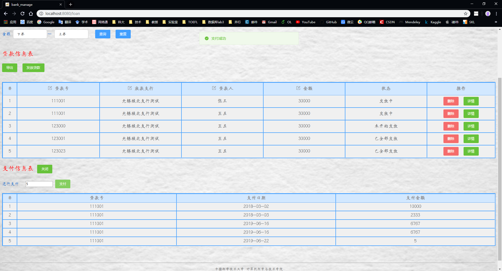
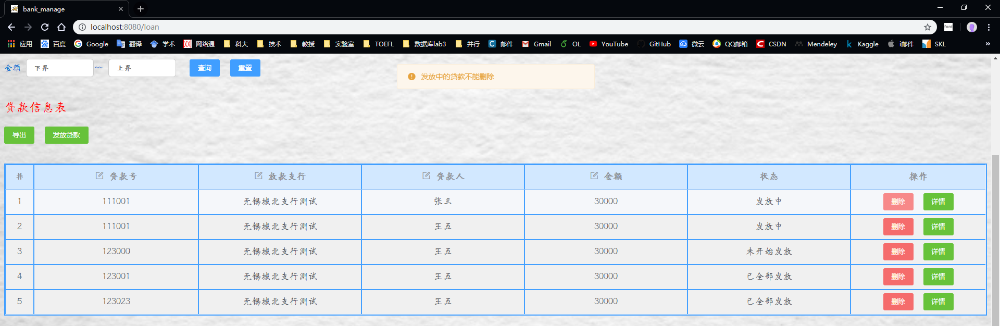
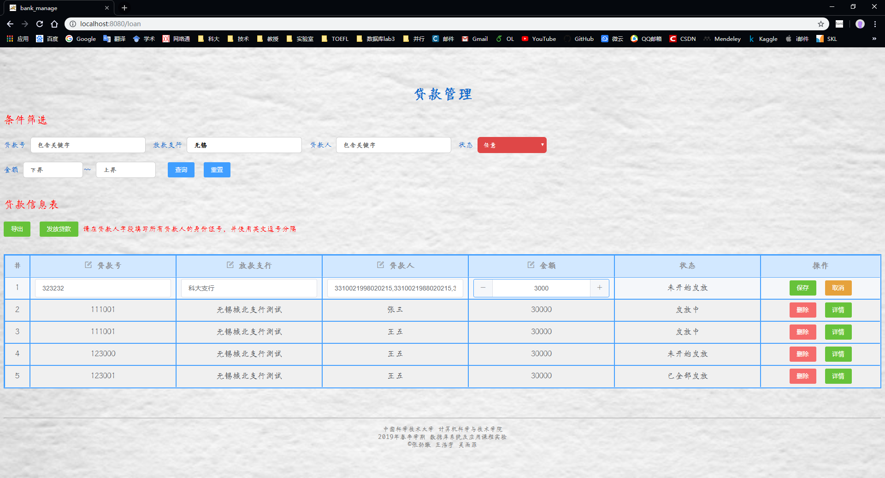
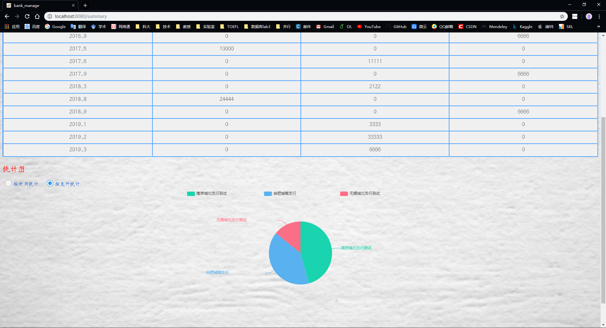

# **“银行业务管理系统”**——系统设计报告

>   小组成员：
>
>   王浩宇（PB16110428）
>
>   吴雨菲（PB15020693）
>
>   张劲暾（PB16111485）
>
>   AT:
>
>   **中国科学技术大学**
>
>   **计算机科学与技术学院**
>
>   **2019年6月**

## 目录

---

[TOC]

---

## 1. 概述

### 1.1 系统目标

构建一个B/S结构的银行业务管理系统，实现系统的前端页面、后台服务器和数据库的设计构建，最终系统运行结果达到功能完整简洁流畅，数据库操作安全规范，界面美观友好，满足银行业务管理的实际需求，保证数据的一致性，具有较强的鲁棒性和可用性。

### 1.2 需求说明

#### 1.2.1 数据需求

银行有多个支行。各个支行位于某个城市，每个支行有唯一的名字。银行要监控每个支行的资产。银行的客户通过其身份证号来标识。银行存储每个客户的姓名、联系电话以及家庭住址。为了安全起见，银行还要求客户提供一位联系人的信息，包括联系人姓名、手机号、 Email 以及与客户的关系。客户可以有帐户，并且可以贷款。客户可能和某个银行员工发生联系，该员工是此客户的贷款负责人或银行帐户负责人。银行员工也通过身份证号来标识。员工分为部门经理和普通员工，每个部门经理都负责领导其所在部门的员工，并且每个员工只允许在一个部门内工作。每个支行的管理机构存储每个员工的姓名、电话号码、家庭地址及部门经理的身份证号。银行还需知道每个员工开始工作的日期，由此日期可以推知员工的雇佣期。银行提供两类帐户——储蓄帐户和支票帐户。帐户可以由多个客户所共有，一个客户也可开设多个账户，但在一个支行内最多只能开设一个储蓄账户和一个支票账户。每个帐户被赋以唯一的帐户号。银行记录每个帐户的余额、开户日期、开户的支行名以及每个帐户所有者访问该帐户的最近日期。另外，每个储蓄帐户有利率和货币类型，且每个支票帐户有透支额。每笔贷款由某个分支机构发放，能被一个或多个客户所共有。每笔贷款用唯一的贷款号标识。银行需要知道每笔贷款所贷金额以及逐次支付的情况（银行将贷款分几次付给客户）。虽然贷款号不能唯一标识银行所有为贷款所付的款项，但可以唯一标识为某贷款所付的款项。对每次的付款需要记录日期和金额。

#### 1.2.2 主要功能需求

+   **支行管理**：提供支行所有信息的增、删、改、查功能；如果支行存在着关联信息，如员工、账户等，则不允许删除；
+   **员工管理**：提供支行员工所有信息的增、删、改、查功能；如果员工存在着关联数据，则不允许删除；
+   **客户管理**：提供客户所有信息的增、删、改、查功能；如果客户存在着关联账户或者贷款记录，则不允许删除；
+   **账户管理**：提供账户开户、销户、修改、查询功能，包括储蓄账户和支票账户；账户号不允许修改；
+   **贷款管理**：提供贷款信息的增、删、查功能，提供贷款发放功能；贷款信息一旦添加成功后不允许修改；要求能查询每笔贷款的当前状态（未开始发放、发放中、已全部发放）；处于发放中状态的贷款记录不允许删除；
+   **业务统计**：按业务分类（储蓄、贷款）和时间（月、季、年）统计各个支行的业务总金额和用户数（选做：对统计结果以饼图或曲线图显示）。

### 1.3 本报告的主要贡献

+    提供了银行业务管理系统各项功能需求的解决方案
+    提供了满足要求、设计合理的数据库设计方案
+    给出了清晰明了的前后端功能结构设计和模块关系
+    详细说明了前后端各个功能模块的具体设计
+    给出了系统最终的测试结果展示
+    为系统的使用和开发人员提供了基本参考

## 2. 总体设计

### 2.1 系统模块结构

```shell
bankManage\                     # web工程前后端项目文件夹
    |
    | - backEndService\         # FLASK后端项目文件夹
    |       |
    |       | - __pycache__\    # FLASK后端-Python字节码文件夹
    |       | - account.py      # FLASK后端-账户管理模块
    |       | - bank.py         # FLASK后端-支行管理模块
    |       | - customer.py     # FLASK后端-客户管理模块
    |       | - loan.py         # FLASK后端-贷款管理模块
    |       | - login.py        # FLASK后端-登录与全局路由模块
    |       | - register.py     # FLASK后端-注册模块
    |       | - staff.py        # FLASK后端-员工管理模块
    |       | - summary.py      # FLASK后端-业务统计模块
    |       | - test.py         # FLASK后端-独立于数据库的调试模块
    | - build\					# VUE webpacket 项目构建文件夹
    | - config\                 # VUE webpacket 项目配置文件夹
    | - node_modules\           # VUE webpacket 项目模型组件文件夹
    | - src\                    # VUE webpacket 项目前端源代码文件夹
    |       |
    |       | - assets
    |       | - components
    |       | - router\
    |       |       |
    |       |       | - index.js       # 全局路由
    |       | - views\
    |       |       |
    |       |       | - account.vue    # VUE前端-账户管理模块
    |       |       | - bank.vue       # VUE前端-支行管理模块
    |       |       | - customer.vue   # VUE前端-客户管理模块
    |       |       | - error.vue      # VUE前端-错误处理模块
    |       |       | - index.vue      # VUE前端-主页模块
    |       |       | - loan.vue       # VUE前端-贷款管理模块
    |       |       | - login.vue      # VUE前端-登录模块
    |       |       | - register.vue   # VUE前端-注册模块
    |       |       | - staff.vue      # VUE前端-员工管理模块
    |       |       | - summary.vue    # VUE前端-业务统计模块
    |       | - App.vue  
    |       | - main.js
    | - static\					# VUE webpacket 项目静态文件文件夹，版本控制与背景图片
    | - test\                   # VUE webpacket 项目系统测试文件夹
    | - .babelrc
    | - .editorconfig
    | - .eslintignore
    | - .eslintrc.js
    | - .gitignore
    | - .postcssrc.js
    | - index.html
    | - package-lock.json
    | - package.json
    | - README.md
sql\
    |
    | - bank.sql                    # 数据库设计构建脚本
    | - build.sql                   # 提供的SQLplus命令行构建脚本，用于建库和编译存储过程
    |							 	# 容易出现中文编码问题，不建议使用
    | - change_customer_name.sql    # 修改客户身份证号码的存储过程
    | - change_employee_name.sql    # 修改员工身份证号码的存储过程
    | - change_sub_bank_name.sql    # 修改支行名称的存储过程
    | - test_data.sql               # 测试数据加载脚本
```

### 2.2 系统工作流程

基本参考：


具体设计：


### 2.3 数据库设计

#### 2.3.0 E-R图


#### 2.3.1 支行表

存储所有支行账户信息。

| 属性       | 说明                         |
| ---------- | ---------------------------- |
| BANK_NAME  | 主键，支行名称               |
| CITY       | 支行所在城市                 |
| POSSESSION | 支行资产，默认值为0          |
| BANK_PASS  | 支行账户密码，默认值为123456 |

```sql
/* 支行表 */
CREATE TABLE SUB_BANK (
    BANK_NAME   CHAR(50)    CONSTRAINT BAMK_PK PRIMARY KEY,
    CITY        CHAR(50),
    POSSESSION  FLOAT       DEFAULT 0.0,
------------------------------------------------
    BANK_PASS   CHAR(6)     DEFAULT '123456'
);
```

#### 2.3.2 员工表

存储支行员工的信息，其中EMPLOYEE_BANK_NAME不是必须的，因为每个员工表是存储在支行管理机构的，也就是说实际上每个支行都有一张员工表，而支行名是整个表的属性，这里加一条完全是因为测试的时候只有一台主机一个表，为了测试方便所加，所以也没有对应的外键约束。

**这里对于领导并不是存储领导的身份证号码，因为这会在领导变更的时候造成巨大的修改代价，而是采用领导保存领导的部门号，普通员工对应域为NULL的设计，需要时通过连接查询确定领导身份证号码，这样在领导变更时只需要修改两条数据。**

| 属性               | 说明                                         |
| ------------------ | -------------------------------------------- |
| EMPLOYEE_ID        | 主键，员工身份证号码                         |
| EMPLOYEE_DEPART_ID | 员工所在部门ID                               |
| EMPLOYEE_BANK_NAME | 员工所在支行名称                             |
| EMPLOYEE_NAME      | 员工姓名                                     |
| EMPLOYEE_PHONE     | 员工电话                                     |
| EMPLOYEE_ADDRESS   | 员工家庭住址                                 |
| EMPLOYEE_ENTERDATE | 员工入职日期                                 |
| EMPLOYEE_LEADER    | 如果是领导就是领导的部门ID，不是领导就是NULL |
| EMPLOYEE_PASS      | 员工账户密码，默认值为123456                 |

```sql
/* 用户表 */
CREATE TABLE EMPLOYEE (
    EMPLOYEE_ID         NUMBER(16) CONSTRAINT EMPLOYEE_PK PRIMARY KEY,
    EMPLOYEE_DEPART_ID  CHAR(10),
    EMPLOYEE_BANK_NAME  CHAR(50),
    EMPLOYEE_NAME       CHAR(32),
    EMPLOYEE_PHONE      NUMBER(12),
    EMPLOYEE_ADDRESS    CHAR(128),
    EMPLOYEE_ENTERDATE  DATE,
    EMPLOYEE_LEADER     CHAR(10),  /* 不是领导就是NULL */
------------------------------------------------
    EMPLOYEE_PASS       CHAR(6)     DEFAULT '123456',
------------------------------------------------
    CONSTRAINT LEADER_UQ    UNIQUE(EMPLOYEE_LEADER)
);
```

#### 2.3.3 客户表

储存所有客户信息

| 属性                      | 说明                         |
| ------------------------- | ---------------------------- |
| CUSTOMER_ID               | 主键，客户身份证号码         |
| CUSTOMER_NAME             | 客户姓名                     |
| CUSTOMER_PHONE            | 客户电话                     |
| CUSTOMER_ADDRESS          | 客户家庭地址                 |
| CUSTOMER_CONTACT_NAME     | 联系人姓名                   |
| CUSTOMER_CONTACT_PHONE    | 联系人电话                   |
| CUSTOMER_CONTACT_EMAIL    | 联系人电子邮件               |
| CUSTOMER_CONTACT_RELATION | 客户与联系人关系             |
| CUSTOMER_PASS             | 客户账户密码，默认值为123456 |

```plsql
/* 用户表 */
CREATE TABLE CUSTOMER (
    CUSTOMER_ID                 NUMBER(16) CONSTRAINT CUSTOMER_PK PRIMARY KEY,
    CUSTOMER_NAME               CHAR(32),
    CUSTOMER_PHONE              NUMBER(12),
    CUSTOMER_ADDRESS            CHAR(128),
    CUSTOMER_CONTACT_NAME       CHAR(32),
    CUSTOMER_CONTACT_PHONE      NUMBER(12),
    CUSTOMER_CONTACT_EMAIL      CHAR(64),
    CUSTOMER_CONTACT_RELATION   CHAR(32),
------------------------------------------------
    CUSTOMER_PASS               CHAR(6) DEFAULT '123456'
);
```

#### 2.3.4 支票账户表

储存所有支票账户信息

| 属性                    | 说明                         |
| ----------------------- | ---------------------------- |
| CHECK_ACCOUNT_ID        | 主键，支票账户号             |
| CHECK_ACCOUNT_MONEY     | 账户余额                     |
| CHECK_ACCOUNT_REGDATE   | 开户日期                     |
| CHECK_ACCOUNT_OVERDRAFT | 透支额度                     |
| CHECK_ACCOUNT_PASS      | 支票账户密码，默认值为123456 |

```plsql
/* 支票账户表 */
CREATE TABLE CHECK_ACCOUNT (
    CHECK_ACCOUNT_ID            NUMBER(16) CONSTRAINT CHECK_ACCOUNT_PK PRIMARY KEY,
    CHECK_ACCOUNT_MONEY         FLOAT,
    CHECK_ACCOUNT_REGDATE       DATE,
    CHECK_ACCOUNT_OVERDRAFT     FLOAT,
------------------------------------------------
    CHECK_ACCOUNT_PASS          CHAR(6) DEFAULT '123456'
);
```

#### 2.3.5 存储账户表

储存所有存储账户信息

| 属性                         | 说明                                                 |
| ---------------------------- | ---------------------------------------------------- |
| DEPOSIT_ACCOUNT_ID           | 主键，储蓄账户号                                     |
| DEPOSIT_ACCOUNT_MONEY        | 账户余额                                             |
| DEPOSIT_ACCOUNT_REGDATE      | 开户日期                                             |
| DEPOSIT_ACCOUNT_INTERESTRATE | 利率                                                 |
| DEPOSIT_ACCOUNT_CURRENCYTYPE | 货币类型：<br>0:人民币<br>1:美元<br>2:欧元<br>3:日元 |
| DEPOSIT_ACCOUNT_PASS         | 储蓄账户密码，默认值为123456                         |

```plsql
/* 存储账户表 */
CREATE TABLE DEPOSIT_ACCOUNT (
    DEPOSIT_ACCOUNT_ID              NUMBER(16) CONSTRAINT DEPOSIT_ACCOUNT_PK PRIMARY KEY,
    DEPOSIT_ACCOUNT_MONEY           FLOAT,
    DEPOSIT_ACCOUNT_REGDATE         DATE,
    DEPOSIT_ACCOUNT_INTERESTRATE    FLOAT   DEFAULT 0,
    DEPOSIT_ACCOUNT_CURRENCYTYPE    NUMBER(1),
------------------------------------------------
    DEPOSIT_ACCOUNT_PASS            CHAR(6) DEFAULT '123456'
);
```

#### 2.3.6 贷款表

存储所有的贷款信息

| 属性       | 说明                                                         |
| ---------- | ------------------------------------------------------------ |
| LOAN_ID    | 主键，贷款号                                                 |
| BANK_NAME  | 发放支行支行名                                               |
| LOAN_MONEY | 贷款额度                                                     |
| STATUS     | 发放状态：<br>0:"未开始发放"<br>1:"发放中"<br>2:"已全部发放" |

```plsql
/* 贷款表 */
CREATE TABLE LOAN (
    LOAN_ID     NUMBER(16)  CONSTRAINT LOAN_PK PRIMARY KEY,
    BANK_NAME   CHAR(50),
    LOAN_MONEY  FLOAT,
    STATUS      NUMBER(1),
    CONSTRAINT FK_BANK_NAME FOREIGN KEY(BANK_NAME)  REFERENCES SUB_BANK(BANK_NAME)
);
```

#### 2.3.7 支付表

存储所有的支付信息

| 属性      | 说明             |
| --------- | ---------------- |
| LOAN_ID   | 支付对应的贷款号 |
| PAY_DATE  | 支付日期         |
| PAY_MONEY | 支付金额         |

```plsql
/* 支付表 */
CREATE TABLE PAY (
    LOAN_ID     NUMBER(16),
    PAY_DATE    DATE,
    PAY_MONEY   FLOAT,
    CONSTRAINT FK_LOAN_ID   FOREIGN KEY(LOAN_ID)    REFERENCES LOAN(LOAN_ID)
);
```

#### 2.3.8 客户-存储账户唯一表

为了实现“一个用户在一个支行内最多只能开设一个储蓄账户”的要求，首先需要一个由用户和支行对应的组合实体，再去和存储账户做一(账户)对多(组合)的关系映射，这样每个储蓄账户对应的都是不重复的用户和支行组合，就实现了“一个用户在一个支行内最多只能开设一个储蓄账户”的要求，并且将最近访问日期作为用户和支行组合的属性，实现为每一位用户的每一个账户记录最近访问日期

| 属性               | 说明                 |
| ------------------ | -------------------- |
| BANK_NAME          | 主键，开户支行支行名 |
| CUSTOMER_ID        | 主键，户主身份证号码 |
| DEPOSIT_ACCOUNT_ID | 对应的存储账户账户号 |
| LAST_VIEW          | 最近访问日期         |

```plsql
CREATE TABLE CUSTOMER_DEPOSIT_ACCOUNT (
    BANK_NAME           CHAR(50), 
    CUSTOMER_ID         NUMBER(16),
    DEPOSIT_ACCOUNT_ID  NUMBER(16),
    LAST_VIEW           DATE,
    CONSTRAINT PK_CUSTOMER_DEPOSIT_ACCOUNT  PRIMARY KEY(BANK_NAME, CUSTOMER_ID),
    CONSTRAINT FK_CD_BANK_NAME              FOREIGN KEY(BANK_NAME)          
    REFERENCES SUB_BANK(BANK_NAME),
    CONSTRAINT FK_CD_CUSTOMER_ID            FOREIGN KEY(CUSTOMER_ID)
    REFERENCES CUSTOMER(CUSTOMER_ID),
    CONSTRAINT FK_CD_DEPOSIT_ACCOUNT_ID     FOREIGN KEY(DEPOSIT_ACCOUNT_ID) 
    REFERENCES DEPOSIT_ACCOUNT(DEPOSIT_ACCOUNT_ID)
);
```

#### 2.3.9 客户-支票账户唯一表

为了实现“一个用户在一个支行内最多只能开设一个支票账户”的要求，首先需要一个由用户和支行对应的组合实体，再去和支票账户做一(账户)对多(组合)的关系映射，这样每个支票账户对应的都是不重复的用户和支行组合，就实现了“一个用户在一个支行内最多只能开设一个支票账户”的要求，并且将最近访问日期作为用户和支行组合的属性，实现为每一位用户的每一个账户记录最近访问日期

| 属性             | 说明                 |
| ---------------- | -------------------- |
| BANK_NAME        | 主键，开户支行支行名 |
| CUSTOMER_ID      | 主键，户主身份证号码 |
| CHECK_ACCOUNT_ID | 对应的支票账户账户号 |
| LAST_VIEW        | 最近访问日期         |

```plsql
CREATE TABLE CUSTOMER_CHECK_ACCOUNT (
    BANK_NAME           CHAR(50),
    CUSTOMER_ID         NUMBER(16),
    CHECK_ACCOUNT_ID    NUMBER(16),
    LAST_VIEW           DATE,
    CONSTRAINT PK_CUSTOMER_CHECK_ACCOUNT    PRIMARY KEY(BANK_NAME, CUSTOMER_ID),
    CONSTRAINT FK_CC_BANK_NAME              FOREIGN KEY(BANK_NAME)          
    REFERENCES SUB_BANK(BANK_NAME),
    CONSTRAINT FK_CC_CUSTOMER_ID            FOREIGN KEY(CUSTOMER_ID)        
    REFERENCES CUSTOMER(CUSTOMER_ID),
    CONSTRAINT FK_CC_CHECK_ACCOUNT_ID       FOREIGN KEY(CHECK_ACCOUNT_ID)   
    REFERENCES CHECK_ACCOUNT(CHECK_ACCOUNT_ID)
);
```

#### 2.3.10 客户-贷款表

记录客户和贷款的对应关系

| 属性        | 说明                 |
| ----------- | -------------------- |
| CUSTOMER_ID | 主键，用户身份证号码 |
| LOAN_ID     | 主键，贷款号         |

```plsql
CREATE TABLE LOAN_CUSTOMER (
    CUSTOMER_ID NUMBER(16),
    LOAN_ID     NUMBER(16),
    CONSTRAINT PK_LOAN_CUSTOMER     PRIMARY KEY(LOAN_ID, CUSTOMER_ID),
    CONSTRAINT FK_LC_CUSTOMER_ID    FOREIGN KEY(CUSTOMER_ID)
    REFERENCES CUSTOMER(CUSTOMER_ID),
    CONSTRAINT FK_LC_LOAN_ID        FOREIGN KEY(LOAN_ID)
    REFERENCES LOAN(LOAN_ID)
);
```

#### 2.3.11 员工-客户表

记录员工和客户的服务关系

| 属性        | 说明                 |
| ----------- | -------------------- |
| CUSTOMER_ID | 主键，用户身份证号码 |
| EMPLOYEE_ID | 主键，员工身份证号码 |
| SERVICETYPE | 服务类型             |

```plsql
CREATE TABLE EMPLOYEE_CUSTOMER (
    CUSTOMER_ID NUMBER(16),
    EMPLOYEE_ID NUMBER(16),
    SERVICETYPE CHAR(16),
    CONSTRAINT PK_EMPLOYEE_CUSTOMER PRIMARY KEY(EMPLOYEE_ID, CUSTOMER_ID),
    CONSTRAINT FK_EC_CUSTOMER_ID    FOREIGN KEY(CUSTOMER_ID)
    REFERENCES CUSTOMER(CUSTOMER_ID),
    CONSTRAINT FK_EC_EMPLOYEE_ID    FOREIGN KEY(EMPLOYEE_ID)
    REFERENCES EMPLOYEE(EMPLOYEE_ID)
);
```

#### 2.3.12 修改用户身份证号码存储过程

修改有诸多约束的主键的存储过程

用来处理类如国籍变更、身份证升级换代等情况

| 接口        | 说明                                                         |
| ----------- | ------------------------------------------------------------ |
| oldBankName | 输入，原用户身份证号                                         |
| newBankName | 输出，新用户身份证号                                         |
| result      | 操作结果:<br>0:操作成功,<br>1:新身份证号码被占用,<br>2:旧身份证号码不存在 |

```plsql
CREATE OR REPLACE PROCEDURE CHANGE_CUSTOMER_NAME(
    oldBankName IN  CHAR,
    newBankName IN  CHAR,
    result      OUT NUMBER
)
AS
    tempCount number;
BEGIN
    SELECT COUNT(*) INTO tempCount 
    FROM DUAL 
    WHERE EXISTS(SELECT NULL FROM CUSTOMER WHERE CUSTOMER_ID = newBankName);

    IF(tempCount > 0) THEN
        result := 1;
    ELSE
        SELECT COUNT(*) INTO tempCount 
        FROM DUAL 
        WHERE EXISTS(SELECT NULL FROM CUSTOMER WHERE CUSTOMER_ID = oldBankName);

        IF(tempCount = 0) THEN
            result := 2;
        ELSE
            EXECUTE IMMEDIATE ' ALTER TABLE EMPLOYEE_CUSTOMER DROP 
                                CONSTRAINT FK_EC_CUSTOMER_ID
                                ';
            EXECUTE IMMEDIATE ' ALTER TABLE CUSTOMER_DEPOSIT_ACCOUNT DROP 
                                CONSTRAINT FK_CD_CUSTOMER_ID
                                ';
            EXECUTE IMMEDIATE ' ALTER TABLE CUSTOMER_CHECK_ACCOUNT DROP 
                                CONSTRAINT FK_CC_CUSTOMER_ID
                                ';
            EXECUTE IMMEDIATE ' ALTER TABLE LOAN_CUSTOMER DROP 
                                CONSTRAINT FK_LC_CUSTOMER_ID
                                ';
        -----------------------------------------------
            UPDATE  CUSTOMER 
            SET     CUSTOMER_ID = newBankName
            WHERE   CUSTOMER_ID = oldBankName;
        -----------------------------------------------
            UPDATE  EMPLOYEE_CUSTOMER 
            SET     CUSTOMER_ID = newBankName
            WHERE   CUSTOMER_ID = oldBankName;
        -----------------------------------------------
            UPDATE  CUSTOMER_DEPOSIT_ACCOUNT 
            SET     CUSTOMER_ID = newBankName
            WHERE   CUSTOMER_ID = oldBankName;
        -----------------------------------------------
            UPDATE  CUSTOMER_CHECK_ACCOUNT 
            SET     CUSTOMER_ID = newBankName
            WHERE   CUSTOMER_ID = oldBankName;
        -----------------------------------------------
            UPDATE  LOAN_CUSTOMER 
            SET     CUSTOMER_ID = newBankName
            WHERE   CUSTOMER_ID = oldBankName;
        -----------------------------------------------
            EXECUTE IMMEDIATE ' ALTER TABLE EMPLOYEE_CUSTOMER 
                                ADD CONSTRAINT FK_EC_CUSTOMER_ID 
                                    FOREIGN KEY(CUSTOMER_ID)  
                                    REFERENCES CUSTOMER(CUSTOMER_ID)
                                ';
            EXECUTE IMMEDIATE ' ALTER TABLE CUSTOMER_DEPOSIT_ACCOUNT 
                                ADD CONSTRAINT FK_CD_CUSTOMER_ID 
                                    FOREIGN KEY(CUSTOMER_ID)  
                                    REFERENCES CUSTOMER(CUSTOMER_ID)
                                ';
            EXECUTE IMMEDIATE ' ALTER TABLE CUSTOMER_CHECK_ACCOUNT 
                                ADD CONSTRAINT FK_CC_CUSTOMER_ID 
                                    FOREIGN KEY(CUSTOMER_ID)  
                                    REFERENCES CUSTOMER(CUSTOMER_ID)
                                ';
            EXECUTE IMMEDIATE ' ALTER TABLE LOAN_CUSTOMER 
                                ADD CONSTRAINT FK_LC_CUSTOMER_ID 
                                    FOREIGN KEY(CUSTOMER_ID)  
                                    REFERENCES CUSTOMER(CUSTOMER_ID)
                                ';
            result := 0;
        END IF;
    END IF;
END CHANGE_CUSTOMER_NAME;
/
```

#### 2.3.14 修改员工身份证号码存储过程

修改有诸多约束的主键的存储过程
用来处理类如国籍变更、身份证升级换代等情况

| 接口 | 说明 |
| ---- | ---- |
| oldBankName | 输入，原员工身份证号                                         |
| newBankName | 输出，新员工身份证号                                         |
| result      | 操作结果:<br>0:操作成功,<br>1:新身份证号码被占用,<br>2:旧身份证号码不存在 |

```plsql
CREATE OR REPLACE PROCEDURE CHANGE_EMPLOYEE_NAME(
    oldBankName IN  CHAR,
    newBankName IN  CHAR,
    result      OUT NUMBER
)
AS
    tempCount number;
BEGIN
    SELECT COUNT(*) INTO tempCount 
    FROM DUAL 
    WHERE EXISTS(SELECT NULL FROM EMPLOYEE WHERE EMPLOYEE_ID = newBankName);

    IF(tempCount > 0) THEN
        result := 1;
    ELSE
        SELECT COUNT(*) INTO tempCount 
        FROM DUAL 
        WHERE EXISTS(SELECT NULL FROM EMPLOYEE WHERE EMPLOYEE_ID = oldBankName);

        IF(tempCount = 0) THEN
            result := 2;
        ELSE
            EXECUTE IMMEDIATE ' ALTER TABLE EMPLOYEE_CUSTOMER DROP 
                                CONSTRAINT FK_EC_EMPLOYEE_ID
                                ';
        -----------------------------------------------
            UPDATE  EMPLOYEE 
            SET     EMPLOYEE_ID = newBankName
            WHERE   EMPLOYEE_ID = oldBankName;
        -----------------------------------------------
            UPDATE  EMPLOYEE_CUSTOMER 
            SET     EMPLOYEE_ID = newBankName
            WHERE   EMPLOYEE_ID = oldBankName;
        -----------------------------------------------
            EXECUTE IMMEDIATE ' ALTER TABLE EMPLOYEE_CUSTOMER 
                                ADD CONSTRAINT FK_EC_EMPLOYEE_ID 
                                    FOREIGN KEY(EMPLOYEE_ID)  
                                    REFERENCES EMPLOYEE(EMPLOYEE_ID)
                                ';
            result := 0;
        END IF;
    END IF;
END CHANGE_EMPLOYEE_NAME;
/
```

#### 2.3.15 修改支行名存储过程

修改有诸多约束的主键的存储过程

用来处理如支行搬迁改名，地名变迁等情况

| 接口 | 说明 |
| ---- | ---- |
| oldBankName | 输入，原支行名                                         |
| newBankName | 输出，新支行名                                      |
| result      | 操作结果:<br>0:操作成功,<br>1:新支行名被占用,<br>2:旧支行名不存在 |
```plsql
CREATE OR REPLACE PROCEDURE CHANGE_BANK_NAME(
    oldBankName IN  CHAR,
    newBankName IN  CHAR,
    result      OUT NUMBER
)
AS
    tempCount number;
BEGIN
    SELECT COUNT(*) INTO tempCount 
    FROM DUAL 
    WHERE EXISTS(SELECT NULL FROM SUB_BANK WHERE BANK_NAME = newBankName);

    IF(tempCount > 0) THEN
        result := 1;
    ELSE
        SELECT COUNT(*) INTO tempCount 
        FROM DUAL 
        WHERE EXISTS(SELECT NULL FROM SUB_BANK WHERE BANK_NAME = oldBankName);

        IF(tempCount = 0) THEN
            result := 2;
        ELSE
            EXECUTE IMMEDIATE ' ALTER TABLE LOAN DROP 
                                CONSTRAINT FK_BANK_NAME
                                ';
            EXECUTE IMMEDIATE ' ALTER TABLE CUSTOMER_DEPOSIT_ACCOUNT 
                                DROP CONSTRAINT FK_CD_BANK_NAME
                                ';
            EXECUTE IMMEDIATE ' ALTER TABLE CUSTOMER_CHECK_ACCOUNT 
                                DROP CONSTRAINT FK_CC_BANK_NAME
                                ';
        -----------------------------------------------
            UPDATE  SUB_BANK 
            SET     BANK_NAME = newBankName
            WHERE   BANK_NAME = oldBankName;
        -----------------------------------------------
            UPDATE  LOAN 
            SET     BANK_NAME = newBankName
            WHERE   BANK_NAME = oldBankName;
        -----------------------------------------------
            UPDATE  CUSTOMER_DEPOSIT_ACCOUNT
            SET     BANK_NAME = newBankName
            WHERE   BANK_NAME = oldBankName;
        -----------------------------------------------
            UPDATE  CUSTOMER_CHECK_ACCOUNT
            SET     BANK_NAME = newBankName
            WHERE   BANK_NAME = oldBankName;
        -----------------------------------------------
            EXECUTE IMMEDIATE ' ALTER TABLE LOAN 
                                ADD CONSTRAINT FK_BANK_NAME 
                                    FOREIGN KEY(BANK_NAME)  
                                    REFERENCES SUB_BANK(BANK_NAME)
                                ';
            EXECUTE IMMEDIATE ' ALTER TABLE CUSTOMER_DEPOSIT_ACCOUNT 
                                ADD CONSTRAINT FK_CD_BANK_NAME 
                                    FOREIGN KEY(BANK_NAME)  
                                    REFERENCES SUB_BANK(BANK_NAME)
                                ';
            EXECUTE IMMEDIATE ' ALTER TABLE CUSTOMER_CHECK_ACCOUNT 
                                ADD CONSTRAINT FK_CC_BANK_NAME 
                                    FOREIGN KEY(BANK_NAME)  
                                    REFERENCES SUB_BANK(BANK_NAME)
                                ';
            result := 0;
        END IF;
    END IF;
END CHANGE_BANK_NAME;
/
```

## 3. 详细设计

### 3.1 运行环境配置概述

+   实验环境：
    +   操作系统：Windows10 64bit
    +   前端框架：VUE 3.8.2
    +   后端框架：Flask 1.0.3, Flask-Cors 3.0.7, Python 3.7.3
    +   数据库：Oracle18.3, cx-Oracle 7.1.3
+   配置与部署方式：
    1. 下载npm
    
        1. 参考网页：https://www.runoob.com/vue2/vue-install.html
        2. 下载NodeJS，可以去[官网](https://nodejs.org/en/download/)下载，在Windows10平台上可以下载64位msi文件进行安装
        3. 安装完毕后，可以在命令行中使用下面的命令判断是否安装成功
    
        ```shell
        npm -v
        ```
    
    2. 使用淘宝npm镜像
    
        ```shell
        npm install -g cnpm --registry=https://registry.npm.taobao.org
        ```
    
    3. 下载vue.js
    
        ```shell
        cnpm install vue  
        cnpm install --global vue-cli
        ```
    
    4. 下载相关库
    
        ```shell
        cnpm install --save vue-resource  
        cnpm install element-ui   
        cnpm install xe-utils vue-element-extends  
        cnpm install --save xe-ajax  
        cnpm install --save xe-utils  
        ```
    
    5. 进入lab3-BankManage\bankManage目录，在命令行中输入下面的命令
    
        ```shell
        cnpm install  
        cnpm run dev
        ```
    
    6. 打开浏览器，在地址栏输入[http://localhost:8080/](http://localhost:8080/)可以对网页进行访问
    
    7. 安装Flask
    
         ```shell
        pip install Flask  
        pip install flask-cors --upgrade
         ```
    
    8. 进入lab3-BankManage\bankManage\backEndService目录，在命令行中输入下面的命令
    
         ```shell
        python login.py
         ```
    
    9. 前后端启动部署完成

### 3.2 VUE前端
Vue前端为用户提供了一个友好的接口，用户在前端的操作会被发送到后端，后端的返回也会被显示在前端。本质上，前端做的只是数据的传递与转换，并不对数据进行本质上的处理。
#### 3.2.1 全局路由
##### 3.2.1.1 设计思路
在Vue中，如果要实现页面跳转，必须先将组件注册在路由表中，为其配置路径。之后，就可以通过URL进行跳转。为了实现对用户输入错误URL的处理，错误处理界面的URL被注册为*，即输入任何未注册的URL都会跳转到该界面。
##### 3.2.1.2 路由表
|     页面     |  组件名  |    URL    |
| :----------: | :------: | :-------: |
|   登录界面   |  login   |     /     |
|   注册界面   | register | /register |
|     主页     |  index   |  /index   |
| 支行管理界面 |   bank   |   /bank   |
| 员工管理界面 |  staff   |  /staff   |
| 客户管理界面 | customer | /customer |
| 账户管理界面 | account  | /account  |
| 贷款管理界面 |   loan   |   /loan   |
| 业务统计界面 | summary  | /summary  |
| 错误处理界面 |  error   |     *     |

#### 3.2.2 权限管理
在银行管理系统中，我们设置了三种账户类型：支行账户、员工账户、客户账户，分别对应于三种权限：支行的管理人员、普通员工和普通客户。

##### 3.2.2.1 权限信息的存取
当用户成功登录时，我们将会在本地保存用户的账户类型和用户名（对于支行而言是支行名称，对员工和客户而言是身份证号）。使用下面的JS语句可以进行保存：
```js
localStorage.setItem("type", this.type);
localStorage.setItem("username", this.username);
```
我们也可以通过下面的语句得到保存在本地的权限信息：
```js
this.type = localStorage.getItem("type");
this.username = localStorage.getItem("username");
```
当我们点击“退出登录”按钮时，可以使用下面的语句清空权限信息：
```js
localStorage.setItem("type", null);
localStorage.setItem("username", null);
```

##### 3.2.2.2 粗粒度的权限控制
在前端，可以通过允许或禁止用户访问某些页面实现粗粒度的权限控制。下面是我们的权限表，描述了各个内部界面与三种权限的访问控制关系：

| 权限  | 主页  | 支行管理 | 员工管理 | 客户管理 | 账户管理 | 贷款管理 | 业务统计 |
| :---: | :---: | :------: | :------: | :------: | :------: | :------: | :------: |
| 支行  |   Y   |    Y     |    Y     |    Y     |    Y     |    Y     |    Y     |
| 员工  |   Y   |    N     |    Y     |    N     |    Y     |    Y     |    N     |
| 客户  |   Y   |    N     |    N     |    Y     |    Y     |    Y     |    N     |

这种粗粒度的权限控制是靠下面两种方法实现的：

+ Vue中的v-if属性，该属性可以对组件的显示与否进行条件控制。只有当v-if后面的条件成立时，该组件才会被显示在网页中。例如，下面的代码表明，只有当拥有支行权限时，该按钮才会被显示。通过这样的方法隐藏页面入口，可以阻止用户进入无权访问的页面。
    ```html
    <button v-on:click="goBank" v-if="type == 'SUB_BANK'">
        <span>支行管理</span>
    </button>
    ```
+ Vue中的created()方法，该方法会在页面被创建时调用。我们可以在该页面中对权限进行判断，当权限不足时，自动跳转到错误处理界面。这样，即使用户通过URL进行访问，绕过了上面的权限控制，也无法对页面进行访问。例如，下面的代码是支行管理界面的created()方法。
    ```js
    created() {
        this.permission = localStorage.getItem("type");
        if (this.permission != "SUB_BANK") {
            this.$router.push("/404");
        }
    }
    ```
##### 3.2.2.3 对细粒度的权限控制的探索
上面方法实现的权限控制粒度太粗，当用户进入某个页面时，就默认其拥有了对页面对应的表进行增删改查的所有权限。在实际情况下，我们需要对增删改查进行分别考虑，甚至对于不同的记录，也要进行不同的权限管理。

例如，对于员工账户的员工管理界面，我们实现了更加细粒度的权限控制。

+ 员工信息表
  + 增：不允许
  + 删：不允许
  + 改：只允许修改自己的信息
  + 查：允许
+ 客户联系表
  + 增：只允许增加与自己联系的客户
  + 删：只允许删除与自己联系的客户
  + 改：只允许修改与自己联系的客户
  + 查：允许

这种控制主要通过两种方法实现：一是上面提到的v-if属性，我们使用该属性隐藏员工信息表的“新增”和“删除”按钮；二是通过在按钮绑定的事件中增加权限判定代码，如下面是两个表的“修改”按钮绑定事件的权限判定代码，当修改他人信息时，会弹出警告信息：
```js
openActiveRowEvent(name, row) {
    switch (name) {
        case "elxEditable1":
            if (this.permission != "SUB_BANK" && 
                row.id != localStorage.getItem("username")) {
                Message({ message: "您没有操作权限", type: "warning" });
                return;
            }
            break;
        case "elxEditable2":
            if (this.permission != "SUB_BANK" && 
                row.staffid != localStorage.getItem("username")) {
                Message({ message: "您没有操作权限", type: "warning" });
                return;
            }
            break;
    }
    ...
}
```

由于时间的限制，我们仅仅对这一个界面实现了细粒度的权限管理。但依照类似的方法，可以实现所有界面的细粒度权限管理。

#### 3.2.3 模块概述

##### 3.2.3.1 前后端交互
前端使用POST报文与后端进行交互，并接收后端的响应报文，加以解析，得到后端返回的数据。

在前端使用下面的代码发送信息给后端，以及解析后端发送的响应报文：

```js
    this.$http.post('http://' + document.domain + ':5000/register', {
        type: this.type,
        username: this.username,
        password: this.password
        //发送给后端的信息，可以按照需求增加条目
    },{  
        emulateJSON:true  //必需，否则可能会json解析出错
    }).then(function (response) {
        //response.body是报文的主体内容
        if (parseInt(response.body.code) === 200){
            ...      
        }                
    })
```

在后端使用下面的代码解析前端发送的信息，并发送响应报文：

```python
    # 解析前端发送的信息
    username=request.form['username']
    password=request.form['password']
    account_type=request.form['type']
    ...
    # 给前端发送响应报文
    response = make_response(jsonify({    
                                        'code':200,
                                        'msg':'ok'
                                        # 报文的主体，可以按需求增加条目
                                    })
                                )
    response.headers['Access-Control-Allow-Origin'] = '*'
    response.headers['Access-Control-Allow-Methods'] = 'OPTIONS,HEAD,GET,POST'
    response.headers['Access-Control-Allow-Headers'] = 'x-requested-with'
    return response

```

##### 3.2.3.2 增删改查功能的实现
一般而言，我们使用如下的方法实现增删改查功能。


1. 查询:
   + `type`="Search"
   + 前端会将用户在查询栏中的输入都发送给后端，后端将这些输入组织成SQL语句，从数据库中查询得到结果
   + 后端将查询结果按照既定的格式组织，发送给前端。后端的查询结果是一个列表，列表的每一个元素都是一个字典（对应表格的一行），字典中将列名与对应的值以键值对的形式存储 
   + 有关字符串的查询都是不精确匹配，只要求用户的输入被该字段包含（子串），输入为空代表对该字段无约束
   + 关于有序量的查询（数值、日期），前端会提供上下界：如果上界为空代表无上界，下界为空代表无下界
2. 删除：
   + `type`="Delete"
   + 前端会将被删除记录的主键发送给后端
   + 后端组织SQL语句，对数据库进行删除，向前端反馈删除是否成功 
3. 修改：
   + `type`="Update"
   + 前端会将被修改记录的主键和所有字段的值都发送给后端  
   + 后端组织SQL语句，对数据库进行修改，向前端反馈修改是否成功 
4. 增加：
   + `type`="Update"
   + 前端会将新增记录所有字段的值都发送给后端，注意被修改记录的主键也会被发送，但是它为null
   + 后端组织SQL语句，对数据库进行增加，向前端反馈增加是否成功


#### 3.2.4 登录模块

##### 3.2.4.1 设计思路
该模块的设计比较简单，主要需要用户提供三个输入。一个下拉框用于选择账户类型，一个文本框用于输入用户名，一个密码框用于输入密码。前端将这些数据都发送给后端，后端验证用户名和密码是否正确并予以反馈。

##### 3.2.4.2 向后端发送的数据
+ 目的地址：/login
+ `type`: 账户类型
+ `username`: 用户名
+ `password`: 密码

##### 3.2.4.3 后端反馈的数据
登录是否成功

#### 3.2.5 注册模块

##### 3.2.5.1 设计思路
三种账户类型对应于三张表，因此注册时需要填写的就是表的各个字段名。使用v-if属性，可以在用户选择不同的类型时，向用户提供不同的输入框以填写不同的字段。同时，只有用户名和密码是必填的，其它字段可以为空，此时后端会用默认值填充该字段。

##### 3.2.5.2 向后端发送的数据
+ 目的地址： /register
+ 支行账户
  + `type`='SUB_BANK'
  + `username`: 支行名（必填）
  + `password`: 密码（必填）
  + `city`: 所在城市
  + `money`: 资产总额
+ 客户账户
  + `type`='CUSTOMER'
  + `username`: 身份证号（必填）
  + `password`: 密码（必填）
  + `name`: 姓名
  + `tel`: 联系电话
  + `addr`: 家庭住址
  + `name_link`: 联系人姓名
  + `tel_link`: 联系人手机号
  + `email_link`: 联系人Email
  + `relation`: 联系人与客户关系
+ 员工账户
  + `type`='EMPLOYEE'
  + `username`: 身份证号（必填）
  + `password`: 密码（必填）
  + `name`: 姓名
  + `dept`: 所在部门
  + `bankname`: 所在支行
  + `tel`: 电话号码
  + `addr`: 家庭住址
  + `date_s`: 入职时间

##### 3.2.5.3 后端反馈的数据
注册是否成功


#### 3.2.6 主页模块
这是用户登录后看到的第一个界面，界面上显示了所有可达的子界面，点击对应的按钮即可跳转。同时，该界面显示了用户的账户类型和用户名，并使用v-if属性隐藏了无权访问的界面。此外，点击“退出登录”按钮可以退出登录，回到登录界面。

该界面不与后端进行任何交互。


#### 3.2.7 支行管理模块

##### 3.2.7.1 设计思路
该界面比较简单，只存在一张表格，显示支行的所有信息（对应于数据库中的SUB_BANK表）。该表格提供增、删、改功能。页面另有查询部分，可以对表格进行查询。

##### 3.2.7.2 向后端发送的数据
+ 查询表格内容
  + 目的地址：/bank
  + `type`: "Search"
  + `bankSearch`: 支行名称（模糊查询）
  + `citySearch`: 所在城市（模糊查询）
  + `lowerBound`: 资产总额下界
  + `upperBound`: 资产总额上界
+ 删除表格记录
  + 目的地址：/bank
  + `type`: "Delete"
  + `primary`: 支行名称（主键）
+ 新增或修改表格记录
  + 目的地址：/bank
  + `type`: "Update"
  + `name`: 支行名称
  + `city`: 所在城市
  + `money`: 资产总额
  + `old_primary`: 修改前的支行名称（当新增时为null）

##### 3.2.7.3 后端反馈的数据
+ 查询表格内容：查询得到的结果
+ 新增表格记录：操作成功/错误码+错误原因
+ 修改表格记录：操作成功/错误码+错误原因
+ 删除表格记录：操作成功/错误码+错误原因

#### 3.2.8 客户管理模块

##### 3.2.8.1 设计思路
由于一个客户可能存在多个与之联系的员工，该页面设计为两个表格：主表显示客户所有的信息（对应于数据库中的CUSTOMER表），点击主表中“详情”按钮，可以在子表中显示与之联系的所有员工信息（对应于EMPLOYEE_CUSTOMER表）。每张表格都提供了增、删、改功能。页面另有查询部分，可以对主表进行查询。
##### 3.2.8.2 向后端发送的数据
+ 查询主表内容
  + 目的地址：/customer
  + `type`: "Search"
  + `nameSearch`: 姓名（模糊查询）
  + `idSearch`: 身份证号（模糊查询）
  + `telSearch`: 电话号码（模糊查询）
  + `addrSearch`: 家庭住址（模糊查询）
  + `linknameSearch`: 联系人姓名（模糊查询）
  + `linktelSearch`: 联系人电话（模糊查询）
  + `emailSearch`: 联系人Email（模糊查询）
+ 删除主表记录
  + 目的地址：/customer
  + `type`: "Delete"
  + `primary`: 身份证号（主键）
+ 新增或修改主表记录
  + 目的地址：/customer
  + `type`: "Update"
  + `id`: 身份证号
  + `name`: 姓名
  + `tel`: 电话号码
  + `addr`: 家庭住址
  + `name_link`: 联系人姓名
  + `tel_link`: 联系人电话
  + `email_link`: 联系人Email
  + `relation`: 联系人与客户关系
  + `old_primary`: 修改前的身份证号（当新增时为null）
+ 查询子表内容
  + 目的地址：/staffCustomer
  + `type`: "SearchByCustomer"
  + `custid`: 客户身份证号
+ 新增或修改子表记录
  + 目的地址：/staffCustomer
  + `type`: "Update"
  + `custID`: 客户身份证号
  + `staffID`: 员工身份证号
  + `serviceType`: 服务类型
  + `old_custID`: 修改前的客户身份证号
  + `old_staffID`: 修改前的员工身份证号（当新增时为null）
+ 删除子表记录
  + 目的地址：/staffCustomer
  + `type`: "Delete"
  + `custID`: 客户身份证号（主键）
  + `staffID`: 员工身份证号（主键）
##### 3.2.8.3 后端反馈的数据
+ 查询主表内容：查询得到的结果
+ 新增主表记录：操作成功/错误码+错误原因
+ 修改主表记录：操作成功/错误码+错误原因
+ 删除主表记录：操作成功/错误码+错误原因
+ 查询子表内容：查询得到的结果
+ 新增子表内容：操作成功/错误码+错误原因  
+ 修改子表记录：操作成功/错误码+错误原因
+ 删除子表内容：操作成功/错误码+错误原因

#### 3.2.9 员工管理模块

##### 3.2.9.1 设计思路
由于一个员工可能存在多个与之联系的客户，该页面设计为两个表格：主表显示员工所有的信息（对应于数据库中的EMPLOYEE表），点击主表中“详情”按钮，可以在子表中显示与之联系的所有客户信息（对应于EMPLOYEE_CUSTOMER表）。每张表格都提供了增、删、改功能。页面另有查询部分，可以对主表进行查询。
##### 3.2.9.2 向后端发送的数据
+ 查询主表内容
  + 目的地址：/staff
  + `type`: "Search"
  + `nameSearch`: 姓名（模糊查询）
  + `idSearch`: 身份证号（模糊查询）
  + `bankSearch`: 所属支行（模糊查询）
  + `telSearch`: 电话号码（模糊查询）
  + `deptSearch`: 所属部门（模糊查询）
  + `addrSearch`: 家庭住址（模糊查询）
  + `lowerBound`: 入职日期下界
  + `upperBound`: 入职日期上界
+ 删除主表记录
  + 目的地址：/staff
  + `type`: "Delete"
  + `primary`: 身份证号（主键）
+ 新增或修改主表记录
  + 目的地址：/staff
  + `type`: "Update"
  + `id`: 身份证号
  + `name`: 姓名
  + `bank`: 所属支行
  + `dept`: 所属部门
  + `tel`: 电话号码
  + `addr`: 家庭住址
  + `date_s`: 入职日期
  + `old_primary`: 修改前的身份证号（当新增时为null）
+ 查询子表内容
  + 目的地址：/staffCustomer
  + `type`: "SearchByStaff"
  + `custid`: 员工身份证号
+ 新增或修改子表记录
  + 目的地址：/staffCustomer
  + `type`: "Update"
  + `custID`: 客户身份证号
  + `staffID`: 员工身份证号
  + `serviceType`: 服务类型
  + `old_custID`: 修改前的客户身份证号（当新增时为null）
  + `old_staffID`: 修改前的员工身份证号
+ 删除子表记录
  + 目的地址：/staffCustomer
  + `type`: "Delete"
  + `custID`: 客户身份证号（主键）
  + `staffID`: 员工身份证号（主键）
##### 3.2.9.3 后端反馈的数据
+ 查询主表内容：查询得到的结果
+ 新增主表记录：操作成功/错误码+错误原因
+ 修改主表记录：操作成功/错误码+错误原因
+ 删除主表记录：操作成功/错误码+错误原因
+ 查询子表内容：查询得到的结果
+ 新增子表内容：操作成功/错误码+错误原因  
+ 修改子表记录：操作成功/错误码+错误原因
+ 删除子表内容：操作成功/错误码+错误原因

#### 3.2.10 账户管理模块

##### 3.2.10.1 设计思路
由于账户可能存在多个户主，该页面设计为两个表格：主表显示账户所有的信息（对应于数据库中的CHECK_ACCOUNT表和DEPOSIT_ACCOUNT表），点击主表中“显示户主”按钮，可以在子表中显示所有的户主信息（对应于CUSTOMER_CHECK_ACCOUNT表和CUSTOMER_DEPOSIT_ACCOUNT表）。每张表格都提供了增、删、改功能。页面另有查询部分，可以对主表进行查询。
##### 3.2.10.2 向后端发送的数据
+ 查询主表内容
  + 目的地址：/account
  + `type`: "Search"
  + `bankSearch`: 支行名称（模糊查询）
  + `idSearch`: 账户号（模糊查询）
  + `ownerSearch`: 户主姓名（模糊查询）
  + `tpeSearch`: 账户类型
  + `money_lo`: 余额下界
  + `money_up`: 余额上界
  + `open_lo`: 开户日期下界
  + `open_up`: 开户日期上界
+ 删除主表记录
  + 目的地址：/account
  + `type`: "Delete"
  + `primary`: 账户号（主键）
  + `acctype`: 账户类型
+ 新增或修改主表记录
  + 目的地址：/account
  + `type`: "Update"
  + `id`: 账户号
  + `bank`: 支行名称
  + `money`: 余额
  + `ownerid`: 开户者ID（只在新增时使用）
  + `open_date`: 开户日期
  + `acctype`: 账户类型
  + `interest`: 利率
  + `cashtype`: 货币类型
  + `overdraft`: 透支额
  + `old_primary`: 修改前的账户号（当新增时为null）
+ 查询子表内容
  + 目的地址：/accountCustomer
  + `type`: "Search"
  + `accid`: 账户号
  + `bank`: 开户支行
  + `acctype`: 账户类型
+ 新增子表记录
  + 目的地址：/accountCustomer
  + `type`: "Insert"
  + `accid`: 账户号
  + `bank`: 开户支行
  + `visit_date`: 最近访问日期  
  + `ownerid`: 户主ID
  + `acctype`: 账户类型
+ 删除子表记录
  + 目的地址：/accountCustomer
  + `type`: "Delete"
  + `accid`: 账户号
  + `bank`: 开户支行
  + `ownerid`: 户主ID
  + `acctype`: 账户类型
##### 3.2.10.3 后端反馈的数据
+ 查询主表内容：查询得到的结果
+ 新增主表记录：操作成功/错误码+错误原因
+ 修改主表记录：操作成功/错误码+错误原因
+ 删除主表记录：操作成功/错误码+错误原因
+ 查询子表内容：查询得到的结果
+ 新增子表内容：操作成功/错误码+错误原因  
+ 删除子表内容：操作成功/错误码+错误原因

#### 3.2.11 贷款管理模块

##### 3.2.11.1 设计思路
由于一笔贷款可能存在多笔支付，该页面设计为两个表格：主表显示贷款所有的信息（对应于数据库中的LOAN表），点击主表中“详情”按钮，可以在子表中显示所有的支付信息（对应于PAY表）。主表提供了增、删功能，子表只提供删除功能。页面另有查询部分，可以对主表进行查询。

##### 3.2.11.2 向后端发送的数据
+ 查询主表内容
  + 目的地址：/loan
  + `type`: "Search"
  + `bankSearch`: 放款支行（模糊查询）
  + `idSearch`: 贷款号（模糊查询）
  + `statusSearch`: 贷款状态
  + `custSearch`: 贷款人姓名（模糊查询）
  + `upperBound`: 贷款金额上界
  + `lowerBound`: 贷款金额下界
+ 删除主表记录
  + 目的地址：/loan
  + `type`: "Delete"
  + `primary`: 贷款号（主键）
+ 新增主表记录
  + 目的地址：/loan
  + `type`: "Update"
  + `loanid`: 贷款号
  + `bank`: 放款支行名称
  + `customer`: 贷款人身份证号
  + `amount`: 贷款金额
  + `status`: '0'
  + `old_primary`: null
+ 查询子表内容
  + 目的地址：/pay
  + `type`: "Search"
  + `loanid`: 贷款号
+ 新增子表记录
  + 目的地址：/pay
  + `type`: "Insert"
  + `loanid`: 贷款号
  + `date`: 支付日期
  + `money`: 支付金额

##### 3.2.11.3 后端反馈的数据
+ 查询主表内容：查询得到的结果
+ 新增主表记录：操作成功/错误码+错误原因
+ 删除主表记录：操作成功/错误码+错误原因
+ 查询子表内容：查询得到的结果
+ 新增子表内容：操作成功/错误码+错误原因  

#### 3.2.12 业务统计模块

##### 3.2.12.1 设计思想
用户输入统计范围与统计指标，前端将其发给后端。后端据此访问数据库，将统计结果表发给前端。前端根据该表以及用户选择的图像类别，使用开源图表组件v-charts在前端绘制统计图。

##### 3.2.12.2 发送给后端的数据
+ 目的地址： /summary
+ `upperBound`: 统计时间范围的上界
+ `lowerBound`: 统计时间范围的下界
+ `timegrain`: 统计的时间粒度
+ `sumtype`: 统计的业务
+ `datatype`: 统计的指标
+ `graphtype`: "curve"

##### 3.2.12.3 后端反馈的数据
+ `columnList`: 一个列表，包含所有的支行名称，每一个元素都是一个支行名称的字符串
+ `rawData`: 一个列表，每一个元素都是一个字典，其中一个键值对的键是'time'，值是该字典对应的统计时间段，其他所有键值对的键都是支行名称，值是支行对应的统计值


##### 3.2.12.4 v-charts的使用
下面的代码用于绘制饼图和折线图，chartData和chartData2用于提供数据源：
```html
<ve-pie :data="chartData" v-if="graphtype=='pie'"></ve-pie>
<ve-line :data="chartData2" v-else></ve-line>
```
下面是数据源格式的一个示例：
```js
chartData: {
    columns: ['time','bank1','bank2','bank3'],
    rawData: [
        { time: "2016年", bank1: "12", bank2: "13", bank3: "12" },
        { time: "2017年", bank1: "13", bank2: "23", bank3: "17" },
        { time: "2018年", bank1: "14", bank2: "33", bank3: "12" }
    ]
};
```

#### 3.2.13 错误处理模块

当发生错误时，VUE会跳转到该界面。实际上，该界面只是一个静态的界面，用于告知用户出现差错，并提供一个回到主界面的链接。如果不设置该界面，VUE会呈现一个完全空白的界面，对用户不太友好。

### 3.3 FLASK后端

#### 3.3.1 FLASK登录与全局路由模块

##### 3.3.1.1 设计思路

1.  根据用户类型构造 SELECT SQL 语句，调用Oracle数据库接口执行SQL语句，判断用户输入的密码与数据库中的密码是否相同，如果相同则登录成功，否则登录失败。
2.  将整个后台应用注册为名为app的接口，登录功能直接由app接口路由，其他模块使用蓝图方法，提供各自的API接口，将这些接口注册在app接口中，完成全局路由。

##### 3.3.1.2 输入

+   `custype`:用户类型
+   `username`:支行名/客户或员工身份证号码
+   `password`:登录密码

##### 3.3.1.3 输出

+   200 message + "登录成功" + 支行名/客户或员工身份证号码作为token向前端确认用户权限
+   400 message + "登录失败" 

##### 3.3.1.4 核心代码概述

("..." 表示省略的部分，包括出错处理，打包，DEBUG输出等代码)

```python
from register   import register_api
from bank       import bank_api
from staff      import staff_api
from summary    import summary_api
from loan       import loan_api
from customer   import customer_api
from account    import account_api

app = Flask(__name__)
app.register_blueprint(register_api)
app.register_blueprint(bank_api)
app.register_blueprint(staff_api)
app.register_blueprint(summary_api)
app.register_blueprint(loan_api)
app.register_blueprint(customer_api)
app.register_blueprint(account_api)

CORS(app, supports_credentials=True)
#======================================================================================
# 登录 后台功能
@app.route('/login', methods=['POST'])
def login():
    username = request.form['username']
    password = request.form['password']
    custype  = request.form['custype']
    ...
    sqlcommand = ""
    if custype == "SUB_BANK" :
        sqlcommand =    ...
    elif custype == "EMPLOYEE":
        sqlcommand =    ...
    else :
        sqlcommand =    ...
    print(sqlcommand)
    cursor.execute(sqlcommand)
    # 使读取的 Oracle 数据字典化
    cursor.rowfactory = makeDictFactory(cursor)
    result = cursor.fetchone()

    cursor.close()
    connection.close()
    # 登录成功
    if result and len(password) > 0 and result['password'][:len(password)] == password :
        # print("登录成功")
        response = make_response(jsonify({    
                                            'code':200,
                                            'msg':'get',
                                            'token':username
                                        })
                                    )
        ...
        return response
    # 登陆失败
    response = make_response(jsonify({    
                                        'code':400,
                                        'msg':'error'
                                    })
                                )
    ...
    return response

if __name__ == '__main__':
    app.run(host='0.0.0.0')
```

#### 3.3.2 FLASK账户管理模块

##### 3.3.2.1 设计思路

/account 路径下：

STEP 1: 判断前端请求的服务类型

STEP 2: 

+   搜索服务：
    +   获取搜索的支行名、账户号、户主、账户类型、余额上下界、开户日期上下界、最近访问日期上下界等信息
    +   根据账户类型构建 SELECT SQL 命令字符串
    +   调用数据库接口执行 SELECT SQL 命令，搜索符合条件的条目
    +   获取操作结果
+   修改、新增服务：
    +   获取新的账户号、账户余额、账户类型、利率、透支额度、旧的账户号、开户日期、货币类型、开户支行、户主身份证号码等信息
    +   判断是修改还是新增操作
    +   修改操作：
        +   根据账户类型构建 UPDATE SQL 命令字符串
        +   调用数据库接口执行 UPDATE SQL 命令，修改其他属性值
    +   新增操作：
        +   根据账户类型构建 INSERT SQL 命令字符串
        +   调用数据库接口执行 INSERT SQL 命令，增加新的条目
+   删除服务：
    +   获取需要删除的账户号和账户类型
    +   构建并调用数据库接口执行 SELECT SQL 命令，判断账户是否还有余额，如果有，则不能删除账户
    +   如果没有，构建并调用数据库接口执行 DELETE SQL 命令，删除对应的账户和对应的账户-客户唯一表条目

STEP 3: 打包结果信息发送给前端

---

/accountCustomer 路径下：

STEP 1: 判断前端请求的服务类型

STEP 2: 

+   搜索服务：
    +   获取搜索的支行名、账户号、账户类型等信息
    +   根据账户类型构建 SELECT SQL 命令字符串
    +   调用数据库接口执行 SELECT SQL 命令，搜索符合条件的条目
    +   获取操作结果
+   新增服务：
    +   获取新的账户号、账户类型、开户日期、开户支行、户主身份证号码等信息
    +   根据账户类型构建 INSERT SQL 命令字符串
    +   调用数据库接口执行 INSERT SQL 命令，增加新的条目
    +   根据账户类型构建 SELECT SQL 命令字符串
    +   调用数据库接口执行 SELECT SQL 命令，向前端返回户主姓名
+   删除服务：
    +   获取需要删除的账户号、开户支行、户主身份证号码和账户类型
    +   构建并调用数据库接口执行 DELETE SQL 命令，删除对应的账户-客户唯一表条目

STEP 3: 打包结果信息发送给前端

##### 3.3.2.2 输入

`type`: 前端请求的服务类型

/account 路径下：

+   搜索服务：
    +   `bankSearch`:要搜索的支行名
    +   `idSearch`:要搜索的账户号
    +   `ownerSearch`:要搜索的账户对应的户主
    +   `typeSearch`:要搜索的账户类型
    +   `money_lo`:要搜索的余额下界
    +   `money_up`:要搜索的余额上界
    +   `open_lo`:要搜索的开户日期下界
    +   `open_up`:要搜索的开户日期上界
    +   `visit_lo`:要搜索的最近访问日期下界
    +   `visit_up`:要搜索的最近访问日期上界

+   修改、新增服务：
    +   `id_s`:要修改、新增的新的账户号
    +   `money`:要修改、新增的账户余额
    +   `acctype`:要修改、新增的账户类型
    +   `interest`:要修改、新增的利率
    +   `overdraft`:要修改、新增的透支额度
    +   `old_primary`:要修改、新增的旧的账户号
    +   `open_date`:要修改、新增的开户日期
    +   `cashtype`:要修改、新增的货币类型
    +   `bank`:要修改、新增的开户支行
    +   `ownerid`:要修改、新增的用户身份证号码

+   删除服务：
    +   `primary`:要删除的账户号
    +   `acctype`:要删除的账户类型

/accountCustomer 路径下：

+   搜索服务：
    +   `accid`:要搜索的账户号
    +   `bank`:要搜索的开户支行
    +   `acctype`:要搜索的账户类型
+   新增服务：
    +   `accid`:要新增的账户号
    +   `bank`:要新增的开户支行
    +   `ownerid`:要新增的户主身份证号码
    +   `visit_date`:要新增的最近访问日期
    +   `acctype`:要新增的账户类型
+   删除服务：
    +   `accid`:要删除的账户号
    +   `bank`:要删除的开户支行
    +   `ownerid`:要删除的户主身份证号码
    +   `acctype`:要删除的账户类型

##### 3.3.2.3 输出

/account 路径下：

+   搜索服务：
    +   200 message + 查询结果列表
    +   400 message + "操作失败"
+   修改、新增服务：
    +   200 message + "操作成功"
    +   400 message + "操作失败"
+   删除服务：
    +   200 message + "操作成功"
    +   413 message + "尚有余额不能删除"

/accountCustomer 路径下：

+   搜索服务：
    +   200 message + 查询结果列表
    +   400 message + "操作失败"
+   新增服务：
    +   400 message + "操作失败"
    +   200 message + 新增的户主姓名
+   删除服务：
    +   200 message + "操作成功"

##### 3.3.2.4 核心代码概

("..." 表示省略的部分，包括出错处理，打包，DEBUG输出等代码)

```python
#=====================================================================================
# 账户管理 后台功能
@account_api.route('/account',methods=['POST'])
def account():
    rstype=request.form['type']
    if (rstype=="Search"):
        ...
        bankSearch  = request.form['bankSearch']
        ...
        idSearch    = request.form['idSearch']
        ...
        ownerSearch = request.form['ownerSearch']
        ...
        typeSearch  = request.form['typeSearch']
        ...
        money_lo    = request.form['money_lo']
        ...
        money_up    = request.form['money_up']
        ...
        open_lo     = request.form['open_lo']
        ...
        open_up     = request.form['open_up']
        ...
        visit_lo    = request.form['visit_lo']
        ...
        visit_up    = request.form['visit_up']
        ...
        checkresult = []
        depositresult = []
        if typeSearch == "any" or typeSearch == "check" :
            sqlcommand = ""
            sqlcommand = sqlcommand + " SELECT"
            ...
            cursor.execute(sqlcommand)
            cursor.rowfactory = makeDictFactory(cursor)
            checkresult = cursor.fetchall()
            checkresult = [dict(t) for t in set([tuple(d.items()) for d in checkresult])]
            for line in checkresult :
                line['type'] = "1"
                line['open_date']  = line['open_date'].strftime('%Y-%m-%d')

        if typeSearch == "any" or typeSearch == "saving" :
            sqlcommand = ""
            sqlcommand = sqlcommand + " SELECT"
            ...
            cursor.execute(sqlcommand)
            cursor.rowfactory = makeDictFactory(cursor)
            depositresult = cursor.fetchall()
            depositresult = [dict(t) for t in set([tuple(d.items()) for d in depositresult])]
            for line in depositresult :
                line['type'] = "0"
                line['cashtype'] = str(line['cashtype'])
                line['open_date']  = line['open_date'].strftime('%Y-%m-%d')

        result = checkresult + depositresult
        print(result)

        if result :
            response = make_response(jsonify({    
                                            'code':200,
                                            'list':result
                                        })
                                    )
            ...
            return response

        response = make_response(
            jsonify(
                {
                    'code': 400
                }
            )
        )
        ...
        return response

    if (rstype=="Update"):
        ...
        id_s        = request.form['id']
        money       = request.form['money']
        acctype     = request.form['acctype']
        interest    = request.form['interest']
        overdraft   = request.form['overdraft']
        old_primary = request.form['old_primary']
        open_date   = request.form['open_date']
        cashtype    = request.form['cashtype']
        bank        = request.form['bank']
        ownerid     = request.form['ownerid']
        overdraft   = request.form['overdraft']
        ...
        sqlcommand = ""
        if len(old_primary) > 0 : # 改 #
            if acctype == "0" :
                sqlcommand = sqlcommand + " UPDATE DEPOSIT_ACCOUNT SET   "
                ...
        else : # 增 #
            if acctype == "0" :
                insert = "("
                ...
                insert = insert + ")"
                sqlcommand =    sqlcommand + "   INSERT ... " + insert

                print(sqlcommand)
                cursor.execute(sqlcommand)
                sqlcommand = ""

                insert = "("
                ...
                insert = insert + ")"
                sqlcommand =    sqlcommand + "   INSERT ... " + insert
            else :
                insert = "("
                ...
                insert = insert + ")"
                sqlcommand =    sqlcommand + "   INSERT ... " + insert

                print(sqlcommand)
                cursor.execute(sqlcommand)
                sqlcommand = ""

                insert = "("
                ...
                insert = insert + ")"
                sqlcommand =   sqlcommand + "   INSERT ... " + insert

        print(sqlcommand)
        try :
            cursor.execute(sqlcommand)
        except :
            cursor.close()
            connection.close()
            response = make_response(jsonify({    
                                            'code':400,
                                            'msg': 'fail'
                                            })
                                    )
            ...
            return response

        cursor.close()
        connection.commit()
        connection.close()
        response = make_response(jsonify({    
                                        'code':200,
                                        'msg': 'ok'
                                        })
                                )
        ....
        return response

    if (rstype=="Delete"):
        ...
        primary = request.form['primary']
        acctype = request.form['acctype']
        ...
        if acctype == "0" :
            sqlcommand = " SELECT * FROM DEPOSIT_ACCOUNT WHERE "
            ...
            cursor.execute(sqlcommand)
            # 使读取的 Oracle 数据字典化
            cursor.rowfactory = makeDictFactory(cursor)
            result = cursor.fetchall()
            if len(result) > 0 :
                cursor.close()
                connection.close()
                response = make_response(jsonify({    
                                                'code': 413,
                                                'msg': '尚有余额不能删除'
                                                })
                                        )
                ...
                return response

            sqlcommand = " DELETE FROM CUSTOMER_DEPOSIT_ACCOUNT WHERE "
            ...
            cursor.execute(sqlcommand)

            sqlcommand = " DELETE FROM DEPOSIT_ACCOUNT WHERE "
            ...
            cursor.execute(sqlcommand)

            cursor.close()
            connection.commit()
            connection.close()

        else :
            sqlcommand = " SELECT * FROM CHECK_ACCOUNT WHERE "
            ...
            cursor.execute(sqlcommand)
            # 使读取的 Oracle 数据字典化
            cursor.rowfactory = makeDictFactory(cursor)
            result = cursor.fetchall()
            if len(result) > 0 :
                cursor.close()
                connection.close()
                response = make_response(jsonify({    
                                                'code': 413,
                                                'msg': '尚有余额不能删除'
                                                })
                                        )
                response.headers['Access-Control-Allow-Origin'] = '*'
                response.headers['Access-Control-Allow-Methods'] = 'OPTIONS,HEAD,GET,POST'
                response.headers['Access-Control-Allow-Headers'] = 'x-requested-with'
                return response

            sqlcommand = " DELETE FROM CUSTOMER_CHECK_ACCOUNT WHERE "
            ...
            cursor.execute(sqlcommand)

            sqlcommand = " DELETE FROM CHECK_ACCOUNT WHERE "
            ...
            cursor.execute(sqlcommand)

            cursor.close()
            connection.commit()
            connection.close()

        response = make_response(jsonify({    
                                        'code':200,
                                        'msg': 'ok'
                                        })
                                )
        ...
        return response

#=====================================================================================
@account_api.route('/accountCustomer',methods=['POST'])
def accountCustomer():   
    rstype=request.form['type']
    ...
    if (rstype=="Search"):
        ...
        accid   = request.form['accid']
        bank    = request.form['bank']
        acctype = request.form['acctype']
        ...
        sqlcommand = ""
        if acctype == "0" :
            sqlcommand = sqlcommand + " SELECT"
            ...
        cursor.execute(sqlcommand)
        # 使读取的 Oracle 数据字典化
        cursor.rowfactory = makeDictFactory(cursor)
        result = cursor.fetchall()
        for line in result:
            line['visit_date']  = line['visit_date'].strftime('%Y-%m-%d')

        if result :
            response = make_response(jsonify({    
                                            'code': 200,
                                            'list': result
                                        })
                                    )
            ...
            return response
        response = make_response(
            jsonify(
                {
                    'code': 400
                }
            )
        )
        ...
        return response

    if (rstype=="Insert"):
        ...
        sqlcommand = ""

        if acctype == "0" :
            insert = "("
            ...
            insert = insert + ")"
            sqlcommand =    sqlcommand + "   INSERT ... " + insert
        else :
            insert = "("
            ...
            insert = insert + ")"
            sqlcommand =    sqlcommand + "   INSERT ... " + insert
        
        print(sqlcommand)
        try :
            cursor.execute(sqlcommand)
        except :
            cursor.close()
            connection.close()
            response = make_response(jsonify({    
                                            'code':400,
                                            'msg': 'fail'
                                            })
                                    )
            ...
            return response

        sqlcommand = " SELECT"
        ...
        cursor.execute(sqlcommand)
        # 使读取的 Oracle 数据字典化
        cursor.rowfactory = makeDictFactory(cursor)
        result = cursor.fetchone()
        result['id']      = accid
        result['bank']    = bank
        result['ownerid'] = ownerid

        cursor.close()
        connection.commit()
        connection.close()
        response = make_response(jsonify({    
                                        'code':200,
                                        'record': result
                                        })
                                )
        ...
        return response

    if (rstype=="Delete"):
        ...
        if acctype == "0" :
            sqlcommand = " DELETE FROM CUSTOMER_DEPOSIT_ACCOUNT WHERE "
            ...
            cursor.execute(sqlcommand)
        else :
            sqlcommand = " DELETE FROM CUSTOMER_CHECK_ACCOUNT WHERE "
            ...
            cursor.execute(sqlcommand)

        cursor.close()
        connection.commit()
        connection.close()

        response = make_response(jsonify({    
                                        'code':200,
                                        'msg': 'ok'
                                        })
                                )
        ...
        return response
```

#### 3.3.3 FLASK支行管理模块

##### 3.3.3.1 设计思路

STEP 1: 判断前端请求的服务类型

STEP 2:

+   搜索服务：
    +   获取搜索的支行名、支行所在城市、资产上界、资产下界等信息
    +   构建 SELECT SQL 命令字符串
    +   调用数据库接口执行 SELECT SQL 命令，搜索符合条件的条目
    +   获取操作结果
+   修改、新增服务：
    +   获取新的支行名、支行所在城市、资产、旧的支行名等信息
    +   判断是修改还是新增操作
    +   修改操作：
        +   判断是否修改主键，如果修改了，调用存储过程完成对主键的修改
        +   构建 UPDATE SQL 命令字符串
        +   调用数据库接口执行 UPDATE SQL 命令，修改其他属性值
    +   新增操作：
        +   构建 INSERT SQL 命令字符串
        +   调用数据库接口执行 INSERT SQL 命令，增加新的条目
+   删除服务：
    +   获取需要删除的支行名
    +   构建并调用数据库接口执行 SELECT SQL 命令，判断需要删除的支行是否还有关联的员工、支票账户、储蓄账户和贷款，如果有，则不能删除支行
    +   如果没有，构建并调用数据库接口执行 DELETE SQL 命令，删除对应的支行

STEP 3: 打包结果信息发送给前端

##### 3.3.3.2 输入

`type`: 前端请求的服务类型

+   搜索服务：
    +   `bankSearch`:要搜索的支行名
    +   `citySearch`:要搜索的支行所在城市
    +   `lowerBound`:要搜索的支行资产下界
    +   `upperBound`:要搜索的支行资产上界
+   修改、新增服务：
    +   `name`:要修改、新增的支行名
    +   `city`:要修改、新增的支行所在城市
    +   `money`:要修改、新增的支行资产
    +   `old_primary`:要修改、新增的旧的支行名
+   删除服务：
    +   `primary`:要删除的支行名

##### 3.3.3.3 输出

+   搜索服务：
    +   200 message + 查询结果列表
    +   400 message + "操作失败"
+   修改、新增服务：
    +   402 message + "旧支行名不存在"
    +   401 message + "新支行名被使用"
    +   400 message + "操作失败"
    +   200 message + "操作成功"
+   删除服务：
    +   200 message + "操作成功"
    +   403 message + "有关联员工信息"
    +   405 message + "有关联贷款信息"
    +   405 message + "有关联支票账户信息"
    +   406 message + "有关联存款账户信息"

##### 3.3.3.4 核心代码概述

("..." 表示省略的部分，包括出错处理，打包，DEBUG输出等代码)

```python
# 支行管理 后台功能
@bank_api.route('/bank',methods=['POST'])
def bank():
    rstype=request.form['type']
#===============================================================================
    if (rstype=="Search"):  # 查 #
        ...
        bankSearch = request.form['bankSearch']
        citySearch = request.form['citySearch']
        lowerBound = request.form['lowerBound']
        upperBound = request.form['upperBound']

        sqlcommand = ""
        sqlcommand = sqlcommand + " SELECT"
        ...
        cursor.execute(sqlcommand)
        # 使读取的 Oracle 数据字典化
        cursor.rowfactory = makeDictFactory(cursor)
        result = cursor.fetchall()
        if result :
            response = make_response(
                jsonify(
                    {
                        'code': 200,
                        'list': result
                    }
                )
            )
            ...
        response = make_response(
            jsonify(
                {
                    'code': 400
                }
            )
        )
        ...
        return response
#===============================================================================
    if (rstype=="Update"):
        ...
        name        = request.form['name']
        ...
        city        = request.form['city']
        ...
        money       = request.form['money']
        old_primary = request.form['old_primary']
        ...

        sqlcommand = ""
        if len(old_primary) > 0 : # 改 #
            if name != old_primary :
                result = cursor.var(cx_Oracle.NUMBER)
                cursor.callproc('CHANGE_BANK_NAME',[old_primary, name, result ])
                ...
                if result.getvalue() == 2 :
                    cursor.close()
                    connection.close()
                    response = make_response(jsonify({    
                                                        'code':402,
                                                        'msg': 'old name do not find'
                                                    })
                                            )
                    ...
                    return response
                if result.getvalue() == 1 :
                    cursor.close()
                    connection.close()
                    response = make_response(jsonify({    
                                                        'code':401,
                                                        'msg': 'new name used'
                                                    })
                                            )
                    ...
                    return response

            sqlcommand = sqlcommand + " UPDATE SUB_BANK SET   "
            ...
        else : # 增 #
            insert = "("
            ...
            insert = insert + ")"
            sqlcommand = sqlcommand + "INSERT INTO ... " + insert

        print(sqlcommand)
        try :
            cursor.execute(sqlcommand)
        except :
            cursor.close()
            connection.close()
            response = make_response(jsonify({    
                                            'code':400,
                                            'msg': 'fail'
                                            })
                                    )
            ...
            return response

        cursor.close()
        connection.commit()
        connection.close()
        response = make_response(jsonify({    
                                        'code':200,
                                        'msg': 'ok'
                                        })
                                )
        ...
        return response
#================================================================================
    if (rstype=="Delete"): # 删 #
        ...
        primary = request.form['primary']
        ...
        sqlcommand = " SELECT * FROM EMPLOYEE WHERE "
        ...
        cursor.execute(sqlcommand)
        # 使读取的 Oracle 数据字典化
        cursor.rowfactory = makeDictFactory(cursor)
        result = cursor.fetchall()
        if len(result) > 0 :
            cursor.close()
            connection.close()
            response = make_response(jsonify({    
                                            'code': 403,
                                            'msg': '有关联员工信息'
                                            })
                                    )
            ...
            return response
        
        sqlcommand = " SELECT * FROM LOAN WHERE "
        ...
        cursor.execute(sqlcommand)
        # 使读取的 Oracle 数据字典化
        cursor.rowfactory = makeDictFactory(cursor)
        result = cursor.fetchall()
        if len(result) > 0 :
            cursor.close()
            connection.close()
            response = make_response(jsonify({    
                                            'code': 405,
                                            'msg': '有关联贷款信息'
                                            })
                                    )
            ...
            return response

        sqlcommand = " SELECT * FROM CUSTOMER_CHECK_ACCOUNT WHERE "
        sqlcommand = sqlcommand + " BANK_NAME = '" + primary + "'"
        print(sqlcommand)
        cursor.execute(sqlcommand)
        # 使读取的 Oracle 数据字典化
        cursor.rowfactory = makeDictFactory(cursor)
        result = cursor.fetchall()
        if len(result) > 0 :
            cursor.close()
            connection.close()
            response = make_response(jsonify({    
                                            'code': 405,
                                            'msg': '有关联支票账户信息'
                                            })
                                    )
            ...
            return response
        
        sqlcommand = " SELECT * FROM CUSTOMER_DEPOSIT_ACCOUNT WHERE "
        sqlcommand = sqlcommand + " BANK_NAME = '" + primary + "'"
        print(sqlcommand)
        cursor.execute(sqlcommand)
        # 使读取的 Oracle 数据字典化
        cursor.rowfactory = makeDictFactory(cursor)
        result = cursor.fetchall()
        if len(result) > 0 :
            cursor.close()
            connection.close()
            response = make_response(jsonify({    
                                            'code': 406,
                                            'msg': '有关联存款账户信息'
                                            })
                                    )
            ...
            return response

        sqlcommand = " DELETE FROM SUB_BANK WHERE "
        sqlcommand = sqlcommand + " BANK_NAME = '" + primary + "'"
        print(sqlcommand)
        cursor.execute(sqlcommand)
        cursor.close()
        connection.commit()
        connection.close()
        response = make_response(jsonify({    
                                        'code':200,
                                        'msg': 'ok'
                                        })
                                )
        ...
        return response
#===============================================================================
```

#### 3.3.4 FLASK客户管理模块

##### 3.3.4.1 设计思路

STEP 1: 判断前端请求的服务类型

STEP 2: 

+   搜索服务：
    +   获取搜索的客户姓名、客户身份证号、客户电话、客户地址、联系人姓名、联系人电话、联系人电子邮件信息
    +   构建 SELECT SQL 命令字符串
    +   调用数据库接口执行 SELECT SQL 命令，搜索符合条件的条目
    +   获取操作结果
+   修改、新增服务：
    +   获取新的客户姓名、客户身份证号、客户电话、客户地址、联系人姓名、联系人电话、联系人电子邮件信息，联系人和客户关系，旧的客户身份证号
    +   判断是修改还是新增操作
    +   修改操作：
        +   判断是否修改主键，如果修改了，调用存储过程完成对主键的修改
        +   构建 UPDATE SQL 命令字符串
        +   调用数据库接口执行 UPDATE SQL 命令，修改其他属性值
    +   新增操作：
        +   构建 INSERT SQL 命令字符串
        +   调用数据库接口执行 INSERT SQL 命令，增加新的条目
+   删除服务：
    +   获取需要删除的客户身份证号
    +   构建并调用数据库接口执行 SELECT SQL 命令，判断客户是否还有关联的员工、支票账户、储蓄账户和贷款，如果有，则不能删除客户
    +   如果没有，构建并调用数据库接口执行 DELETE SQL 命令，删除对应的客户

STEP 3: 打包结果信息发送给前端

##### 3.3.4.2 输入

`type`: 前端请求的服务类型

+   搜索服务：
    +   `nameSearch`: 要搜索的客户姓名
    +   `idSearch`: 要搜索的客户身份证号
    +   `telSearch`: 要搜索的客户电话
    +   `addrSearch`: 要搜索的客户地址
    +   `linknameSearch`: 要搜索的联系人姓名
    +   `linktelSearch`: 要搜索的联系人电话
    +   `emailSearch`: 要搜索的联系人电子邮件信息
+   修改、新增服务：
    +   `id_s`: 要修改、新增的客户身份证号
    +   `name`: 要修改、新增的客户姓名
    +   `tel`: 要修改、新增的客户电话
    +   `addr`: 要修改、新增的客户地址
    +   `name_link`: 要修改、新增的联系人姓名
    +   `tel_link`: 要修改、新增的联系人电话
    +   `email_link`: 要修改、新增的联系人电子邮件信息
    +   `relation`: 要修改、新增的联系人和客户关系
    +   `old_primary`: 要修改、新增的旧的客户身份证号
+   删除服务：
    +   `primary`: 要删除的客户身份证号

##### 3.3.4.3 输出

+   搜索服务：
    +   200 message + 查询结果列表
    +   400 message + "操作失败"
+   修改、新增服务：
    +   402 message + "旧身份证号不存在"
    +   401 message + "新身份证号被使用"
    +   400 message + "操作失败"
    +   200 message + "操作成功"
+   删除服务：
    +   200 message + "操作成功"
    +   407 message + "有关联员工信息"
    +   408 message + "有关联存储账户信息"
    +   409 message + "有关联支票账户信息"
    +   410 message + "有关联贷款信息"

##### 3.3.4.4 核心代码概述

("..." 表示省略的部分，包括出错处理，打包，DEBUG输出等代码)

```python
#================================================================================
# 客户管理 后台功能
@customer_api.route('/customer',methods=['POST'])
def customer():
    rstype=request.form['type']
    if (rstype=="Search"):
        
        connection = cx_Oracle.connect('System/db2019@localhost/ORCL')
        cursor = connection.cursor()

        nameSearch      = request.form['nameSearch']
        ...
        idSearch        = request.form['idSearch']
        ...
        telSearch       = request.form['telSearch']
        ...
        addrSearch      = request.form['addrSearch']
        ...
        linknameSearch  = request.form['linknameSearch']
        ...
        linktelSearch   = request.form['linktelSearch']
        ...
        emailSearch     = request.form['emailSearch']
        ...

        sqlcommand = ""
        sqlcommand = sqlcommand + " SELECT"
        ...

        cursor.execute(sqlcommand)
        # 使读取的 Oracle 数据字典化
        cursor.rowfactory = makeDictFactory(cursor)
        result = cursor.fetchall()

        response = make_response(...)
        ...
        return response

    if (rstype=="Update"):
       	
        connection = cx_Oracle.connect('System/db2019@localhost/ORCL')
        cursor = connection.cursor()
        id_s        = request.form['id']
        name        = request.form['name']
        ...
        tel         = request.form['tel']
        ...
        addr        = request.form['addr']
        ...
        name_link   = request.form['name_link']
        ...
        tel_link    = request.form['tel_link']
        ...
        email_link  = request.form['email_link']
        ...
        relation    = request.form['relation']
        ...
        old_primary = request.form['old_primary']
        ...

        sqlcommand = ""
        if len(old_primary) > 0 : # 改 #
            if id_s != old_primary :
                result = cursor.var(cx_Oracle.NUMBER)
                cursor.callproc('CHANGE_CUSTOMER_NAME',[old_primary, id_s, result ])
                
                if result.getvalue() == 2 :
                    cursor.close()
                    connection.close()
                    response = make_response(jsonify({    
                                                        'code':402,
                                                        'msg': 'old name do not find'
                                                    })
                                            )
                    ...
                    return response
                if result.getvalue() == 1 :
                    cursor.close()
                    connection.close()
                    response = make_response(jsonify({    
                                                        'code':401,
                                                        'msg': 'new name used'
                                                    })
                                            )
                    ...
                    return response
            
            sqlcommand = sqlcommand + " UPDATE CUSTOMER SET   "
            ...
            sqlcommand = sqlcommand + " WHERE CUSTOMER_ID = '" + id_s + "'"
            
        else : # 增 #
            insert = "("
            ...
            insert = insert + ")"
            sqlcommand =    sqlcommand + "   INSERT ... " + insert
        
        print(sqlcommand)
        try :
            cursor.execute(sqlcommand)
        except :
            cursor.close()
            connection.close()
            response = make_response(jsonify({    
                                            'code':400,
                                            'msg': 'fail'
                                            })
                                    )
            ...
            return response

        cursor.close()
        connection.commit()
        connection.close()
        response = make_response(jsonify({    
                                        'code':200,
                                        'msg': 'ok'
                                        })
                                )
        ...
        return response

    if (rstype=="Delete"):
        
        connection = cx_Oracle.connect('System/db2019@localhost/ORCL')
        cursor = connection.cursor()

        primary = request.form['primary']
        ...
    #==============================================================================
        sqlcommand = " SELECT * FROM EMPLOYEE_CUSTOMER WHERE "
        sqlcommand = sqlcommand + " CUSTOMER_ID = '" + primary + "'"
        print(sqlcommand)
        cursor.execute(sqlcommand)
        # 使读取的 Oracle 数据字典化
        cursor.rowfactory = makeDictFactory(cursor)
        result = cursor.fetchall()
        if len(result) > 0 :
            cursor.close()
            connection.close()
            response = make_response(jsonify({    
                                            'code': 407,
                                            'msg': '有关联员工信息'
                                            })
                                    )
            ...
            return response
    #==============================================================================
        sqlcommand = " SELECT * FROM CUSTOMER_DEPOSIT_ACCOUNT WHERE "
        sqlcommand = sqlcommand + " CUSTOMER_ID = '" + primary + "'"
        print(sqlcommand)
        cursor.execute(sqlcommand)
        # 使读取的 Oracle 数据字典化
        cursor.rowfactory = makeDictFactory(cursor)
        result = cursor.fetchall()
        if len(result) > 0 :
            cursor.close()
            connection.close()
            response = make_response(jsonify({    
                                            'code': 408,
                                            'msg': '有关联存储账户信息'
                                            })
                                    )
            ...
            return response
    #==============================================================================
        sqlcommand = " SELECT * FROM CUSTOMER_CHECK_ACCOUNT WHERE "
        sqlcommand = sqlcommand + " CUSTOMER_ID = '" + primary + "'"
        print(sqlcommand)
        cursor.execute(sqlcommand)
        # 使读取的 Oracle 数据字典化
        cursor.rowfactory = makeDictFactory(cursor)
        result = cursor.fetchall()
        if len(result) > 0 :
            cursor.close()
            connection.close()
            response = make_response(jsonify({    
                                            'code': 409,
                                            'msg': '有关联支票账户信息'
                                            })
                                    )
            ...
            return response
    #==============================================================================
        sqlcommand = " SELECT * FROM LOAN_CUSTOMER WHERE "
        sqlcommand = sqlcommand + " CUSTOMER_ID = '" + primary + "'"
        print(sqlcommand)
        cursor.execute(sqlcommand)
        # 使读取的 Oracle 数据字典化
        cursor.rowfactory = makeDictFactory(cursor)
        result = cursor.fetchall()
        if len(result) > 0 :
            cursor.close()
            connection.close()
            response = make_response(jsonify({    
                                            'code': 410,
                                            'msg': '有关联贷款信息'
                                            })
                                    )
            ...
            return response
    #=============================================================================
        sqlcommand = " DELETE FROM CUSTOMER WHERE "
        sqlcommand = sqlcommand + " CUSTOMER_ID = '" + primary + "'"
        print(sqlcommand)
        cursor.execute(sqlcommand)
        cursor.close()
        connection.commit()
        connection.close()

        response = make_response(jsonify({    
                                        'code':200,
                                        'msg': 'ok'
                                        })
                                )
        ...
        return response
#=================================================================================
```

#### 3.3.5 FLASK贷款管理模块

##### 3.3.5.1 设计思路

/loan 路径下：

STEP 1: 判断前端请求的服务类型

STEP 2:

+   搜索服务：
    +   获取搜索的贷款号、贷款支行、贷款状态、贷款人、贷款额度上界、贷款额度下界等信息
    +   构建 SELECT SQL 命令字符串
    +   调用数据库接口执行 SELECT SQL 命令，搜索符合条件的条目
    +   获取操作结果
+   新增服务：
    +   获取新的贷款号、贷款支行、贷款额度、贷款状态、贷款人、旧的贷款号等信息
    +   构建 INSERT SQL 命令字符串
    +   调用数据库接口执行 INSERT SQL 命令，增加新的贷款条目，为每个贷款人增加对应的客户-贷款表条目
+   删除服务：
    +   获取需要删除的贷款号
    +   构建并调用数据库接口执行 SELECT SQL 命令，判断贷款是否在发放中，如果正在发放中，则不能删除贷款
    +   如果不是在贷款中，构建并调用数据库接口执行 DELETE SQL 命令，删除对应的贷款、用户-贷款表条目（注意先解除外键约束，不然会造成响应缓慢，删除之后再恢复外键约束）、支付信息

STEP 3: 打包结果信息发送给前端

---

/pay 路径下：

STEP 1: 判断前端请求的服务类型

STEP 2:

+   搜索服务：
    +   获取搜索的贷款号
    +   构建 SELECT SQL 命令字符串
    +   调用数据库接口执行 SELECT SQL 命令，搜索符合条件的条目
    +   获取操作结果
+   支付服务：
    +   获取支付的贷款号、支付日期、支付金额等信息
    +   查询数据库判断：
        +   贷款是否已经支付完
        +   此次支付是否超出贷款额度
    +   如果满足上述某种情况，则不能支付
    +   否则构建 INSERT SQL 命令字符串，调用数据库接口执行 INSERT SQL 命令，增加新的支付记录，并检查更新贷款的状态

STEP 3: 打包结果信息发送给前端

##### 3.3.5.2 输入

`type`: 前端请求的服务类型

/loan 路径下：

+   搜索服务：
    +   `idSearch`:要搜索的贷款号
    +   `bankSearch`:要搜索的贷款支行
    +   `statusSearch`:要搜索的贷款状态
    +   `custSearch`:要搜索的贷款人
    +   `upperBound`:要搜索的贷款额度上界
    +   `lowerBound`:要搜索的贷款额度下界
+   新增服务：
    +   `id_s`:要新增的贷款号
    +   `bank`:要新增的贷款支行
    +   `amount`:要新增的贷款额度
    +   `status`:要新增的贷款状态
    +   `old_primary`:要新增的旧的贷款号
    +   `customer`:要新增的贷款人
+   删除服务：
    +   `primary`: 要删除的贷款号

---

/pay 路径下：

+   搜索服务：
    +   `loanid`:要搜索的贷款号
+   支付服务：
    +   `loanid`:要支付的贷款号
    +   `date`:要支付的支付日期
    +   `money`:要支付的支付额度

##### 3.3.5.3 输出

/loan 路径下：

+   搜索服务：
    +   200 message + 查询结果列表
    +   400 message + "操作失败"
+   新增服务：
    +   400 message + "操作失败"
    +   200 message + "操作成功"
+   删除服务：
    +   200 message + "操作成功"
    +   417 message + "贷款正在发放，无法删除"

/pay 路径下：

+   搜索服务：
    +   200 message + 查询结果列表
    +   400 message + "操作失败"
+   支付服务：
    +   200 message + "操作成功"
    +   400 message + "操作失败"
    +   422 message + "贷款已全部发放"
    +   423 message + "超过贷款额度"

##### 3.3.5.4 核心代码概述

("..." 表示省略的部分，包括出错处理，打包，DEBUG输出等代码)

```python
#====================================================================================
# 贷款管理 后台功能
@loan_api.route('/loan',methods=['POST'])
def loan():
    rstype=request.form['type']
    if (rstype=="Search"):
        ...
        idSearch     = request.form['idSearch']... 
        bankSearch   = request.form['bankSearch']...
        statusSearch = request.form['statusSearch']...
        custSearch   = request.form['custSearch']...
        upperBound   = request.form['upperBound']...
        lowerBound   = request.form['lowerBound']... 

        sqlcommand = ""
        sqlcommand = sqlcommand + " SELECT"
        ...
        cursor.execute(sqlcommand)
        # 使读取的 Oracle 数据字典化
        cursor.rowfactory = makeDictFactory(cursor)
        result = cursor.fetchall()
        for line in result:
            line['id']      = str(line['id'])

        if result :
            response = make_response(jsonify({    
                                            'code':200,
                                            'list': result
                                        })
                                    )
            ...
            return response

        response = make_response(
            jsonify(
                {
                    'code': 400
                }
            )
        )
        ...
        return response

    if (rstype=="Update"):
        ...
        id_s        = request.form['id']...
        bank        = request.form['bank']... 
        amount      = request.form['amount']... 
        status      = request.form['status']...
        old_primary = request.form['old_primary']... 
        customer    = request.form['customer']...
        customer    = customer.split(',')

        sqlcommand = ""
        insert = "("
        ...
        insert = insert + ")"
        sqlcommand =    sqlcommand +  "   INSERT ...  " + insert

        print(sqlcommand)
        try :
            cursor.execute(sqlcommand)
        except :
            cursor.close()
            connection.close()
            response = make_response(jsonify({    
                                            'code':400,
                                            'msg': 'fail'
                                            })
                                    )
            ...
            return response
        for cus in customer :
            sqlcommand = ""
            insert = "("
            ...
            insert = insert + ")"
            sqlcommand =    sqlcommand + "   INSERT  ... " + insert
            try :
                cursor.execute(sqlcommand)
            except :
                cursor.close()
                connection.close()
                response = make_response(jsonify({    
                                                'code':400,
                                                'msg': 'fail'
                                                })
                                        )
                ...
                return response

        cursor.close()
        connection.commit()
        connection.close()
        response = make_response(jsonify({    
                                        'code':200,
                                        'msg': 'ok'
                                        })
                                )
        ...
        return response

    if (rstype=="Delete"):
        ...
        primary = request.form['primary']... 
        
        sqlcommand = ""
        sqlcommand = sqlcommand + " SELECT * "
        ...
        cursor.execute(sqlcommand)
        # 使读取的 Oracle 数据字典化
        cursor.rowfactory = makeDictFactory(cursor)
        result = cursor.fetchall()
        if len(result) > 0 :
            cursor.close()
            connection.close()
            response = make_response(jsonify({    
                                            'code': 417,
                                            'msg': '贷款正在发放，无法删除'
                                            })
                                    )
            ...
            return response

        sqlcommand = "ALTER TABLE LOAN_CUSTOMER DROP CONSTRAINT FK_LC_LOAN_ID"
        cursor.execute(sqlcommand)
        sqlcommand = "ALTER TABLE LOAN_CUSTOMER DROP CONSTRAINT FK_LC_CUSTOMER_ID"
        cursor.execute(sqlcommand)

        sqlcommand = " DELETE FROM LOAN_CUSTOMER WHERE "
        sqlcommand = sqlcommand + " LOAN_ID = '" + primary + "'"
        print(sqlcommand)
        cursor.execute(sqlcommand)
        sqlcommand = "ALTER TABLE LOAN_CUSTOMER ADD CONSTRAINT FK_LC_LOAN_ID        FOREIGN KEY(LOAN_ID)        REFERENCES LOAN(LOAN_ID)"
        cursor.execute(sqlcommand)
        sqlcommand = "ALTER TABLE LOAN_CUSTOMER ADD CONSTRAINT FK_LC_CUSTOMER_ID    FOREIGN KEY(CUSTOMER_ID)    REFERENCES CUSTOMER(CUSTOMER_ID)"
        cursor.execute(sqlcommand)

        sqlcommand = " DELETE FROM PAY WHERE "
        sqlcommand = sqlcommand + " LOAN_ID = '" + primary + "'"
        print(sqlcommand)
        cursor.execute(sqlcommand)

        sqlcommand = " DELETE FROM LOAN WHERE "
        sqlcommand = sqlcommand + " LOAN_ID = '" + primary + "'"
        print(sqlcommand)
        cursor.execute(sqlcommand)

        cursor.close()
        connection.commit()
        connection.close()

        response = make_response(jsonify({    
                                        'code':200,
                                        'msg': 'ok'
                                        })
                                )
        ...
        return response
@loan_api.route('/pay',methods=['POST'])
def pay():
    rstype=request.form['type']
    if (rstype=="Search"):
        loanid = request.form['loanid']... 

        sqlcommand = ""
        sqlcommand = sqlcommand + " SELECT "
        ...
        cursor.execute(sqlcommand)
        # 使读取的 Oracle 数据字典化
        cursor.rowfactory = makeDictFactory(cursor)
        result = cursor.fetchall()
        for line in result:
            line['date_s']  = line['date_s'].strftime('%Y-%m-%d')

        if result :
            response = make_response(jsonify({    
                                            'code':200,
                                            'list':result
                                        })
                                    )
            ...
            return response

        response = make_response(
            jsonify(
                {
                    'code': 400,
                    'list': []
                }
            )
        )
        ...
        return response

    if (rstype=="Insert"):
        ...
        loanid = request.form['loanid']... 
        date   = request.form['date']... 
        money  = request.form['money']... 

        sqlcommand = ""
        sqlcommand = sqlcommand + " SELECT "
        ...
        cursor.execute(sqlcommand)
        # 使读取的 Oracle 数据字典化
        cursor.rowfactory = makeDictFactory(cursor)
        result = cursor.fetchone()
        if result :
            loanlimit = result['money']
            if result['status'] == 2:
                response = make_response(
                    jsonify(
                        {
                            'code': 422,
                            'msg': '贷款已全部发放'
                        }
                    )
                )
                ...
                return response
            else :
                sqlcommand = ""
                ...
                cursor.execute(sqlcommand)
                # 使读取的 Oracle 数据字典化
                cursor.rowfactory = makeDictFactory(cursor)
                result = cursor.fetchone()
                print(result)
                alreadypay = 0
                if result :
                    alreadypay = result['alreadypay']
				...
                if loanlimit < alreadypay + money:
                    response = make_response(
                        jsonify(
                            {
                                'code': 423,
                                'msg': '超过贷款额度'
                            }
                        )
                    )
                    ...
                    return response

                if loanlimit == alreadypay + money :
                    sqlcommand = " UPDATE LOAN SET STATUS = 2 WHERE LOAN_ID = \'" + loanid + "'"
                    print(sqlcommand)
                    cursor.execute(sqlcommand)
                else :
                    sqlcommand = " UPDATE LOAN SET STATUS = 1 WHERE LOAN_ID = \'" + loanid + "'"
                    print(sqlcommand)
                    cursor.execute(sqlcommand)

                sqlcommand = ""
                insert = "("
                ...
                insert = insert + ")"
                sqlcommand =    sqlcommand +  "   INSERT ...  " + insert
                print(sqlcommand)
                try :
                    cursor.execute(sqlcommand)
                except :
                    cursor.close()
                    connection.close()
                    response = make_response(jsonify({    
                                                    'code':400,
                                                    'msg': 'fail'
                                                    })
                                            )
                    ...
                    return response

                cursor.close()
                connection.commit()
                connection.close()
                response = make_response(jsonify({    
                                                'code':200,
                                                'msg': 'ok'
                                                })
                                        )
                ...
                return response

        response = make_response(
            jsonify(
                {
                    'code': 400
                }
            )
        )
        ...
        return response
```


#### 3.3.6 FLASK注册模块

##### 3.3.6.1 设计思路

1.  获取新的用户类型、支行名/客户身份证号码/员工身份证号码、密码、所在城市、资产、客户/员工姓名、客户/员工电话、客户/员工家庭地址、客户联系人姓名、客户联系人电话、客户联系人电子邮件、客户联系人关系、员工所在部门、员工入职日期、员工所在支行等信息
2.  根据用户类型构建 INSERT SQL 命令字符串
3.  调用数据库接口执行 INSERT SQL 命令，增加新的条目

##### 3.3.6.2 输入

+   `username`:新注册用户的支行名/客户身份证号码/员工身份证号码
+   `password`:新注册用户的密码
+   `account_type`:新注册用户的用户类型
+   `city`:新注册用户的所在城市
+   `money`:新注册用户的资产
+   `name`:新注册用户的客户/员工姓名
+   `tel`:新注册用户的客户/员工电话
+   `addr`:新注册用户的客户/员工家庭地址
+   `name_link`:新注册用户的客户联系人姓名
+   `tel_link`:新注册用户的客户联系人电话
+   `email_link`:新注册用户的客户联系人电子邮件
+   `relation`:新注册用户的客户联系人关系
+   `dept`:新注册用户的员工所在部门
+   `date_s`:新注册用户的员工入职日期
+   `bankname`:新注册用户的员工所在支行

##### 3.3.6.3 输出

+   400 message + "操作失败"
+   200 message + "操作成功"

##### 3.3.6.4 核心代码概述

("..." 表示省略的部分，包括出错处理，打包，DEBUG输出等代码)

```python
#===============================================================================
# 注册 后台功能
@register_api.route('/register',methods=['POST','OPTIONS'])
def register():
    username        = request.form['username']...
    password        = request.form['password']...
    account_type    = request.form['type']...
    city            = request.form['city']...
    money           = request.form['money']...
    name            = request.form['name']...
    tel             = request.form['tel']...
    addr            = request.form['addr']...
    name_link       = request.form['name_link']...
    tel_link        = request.form['tel_link']...
    email_link      = request.form['email_link']...
    relation        = request.form['relation']...
    dept            = request.form['dept']...
    date_s          = request.form['date_s']...
    bankname        = request.form['bankname']...
    ...
    sqlcommand = ""
    if account_type == "SUB_BANK" :
        insert = "(" + "'" + username + "'" + ','  + "'" + password + "', "
        ...
        insert = insert + ")"
        sqlcommand =    """
                        INSERT INTO 
                            ...
                        VALUES """ + insert
    elif account_type == "EMPLOYEE":
        insert = "(" + "'" + username + "'" + ','  + "'" + password + "', " 
        ...
        insert = insert + ")"
        sqlcommand =    """
                        INSERT INTO 
                            ...
                        VALUES """ + insert
    else :
        insert = "(" + "'" + username + "'" + ','  + "'" + password + "', "
        ...
        insert = insert + ")"
        sqlcommand =    """
                        INSERT INTO 
                            ...
                        VALUES """ + insert
    print(sqlcommand)
    try :
        cursor.execute(sqlcommand)
    except :
        print("数据库操作失败")
        cursor.close()
        connection.close()
        response = make_response(jsonify({    
                                            'code':400, 
                                            # 数据库操作失败
                                            'msg':'ok'
                                        })
                                    )
        ...
        return response

    cursor.close()
#===============================
    connection.commit()
#===============================
    connection.close()

    response = make_response(jsonify({    
                                        'code':200,
                                        'msg':'ok'
                                    })
                                )
    ...
    return response
```

#### 3.3.7 FLASK员工管理模块

##### 3.3.7.1 设计思路

/staff 路径下：

STEP 1: 判断前端请求的服务类型

STEP 2:

+   搜索服务：
    +   获取搜索的员工姓名、员工身份证号码、员工所在支行、员工所在部门、员工电话、员工家庭地址、员工入职时间上限，员工入职时间下限等信息
    +   构建 SELECT SQL 命令字符串
    +   调用数据库接口执行 SELECT SQL 命令，搜索符合条件的条目
    +   获取操作结果
+   修改、新增服务：
    +   获取新的员工身份证号码、员工姓名、员工所在支行、员工所在部门、员工电话、员工家庭地址、员工入职时间、旧的员工身份证号码等信息
    +   判断是修改还是新增操作
    +   修改操作：
        +   判断是否修改主键，如果修改了，调用存储过程完成对主键的修改
        +   构建 UPDATE SQL 命令字符串
        +   调用数据库接口执行 UPDATE SQL 命令，修改其他属性值
    +   新增操作：
        +   构建 INSERT SQL 命令字符串
        +   调用数据库接口执行 INSERT SQL 命令，增加新的条目
+   删除服务：
    +   获取需要删除的员工身份证号
    +   构建并调用数据库接口执行 SELECT SQL 命令，判断员工是否还有关联的客户，如果有，则不能删除员工
    +   如果没有，构建并调用数据库接口执行 DELETE SQL 命令，删除对应的员工

STEP 3: 打包结果信息发送给前端

---

/staffCustomer 路径下：

STEP 1: 判断前端请求的服务类型

STEP 2:

+   客户查询服务：
    +   获取搜索的客户身份证号码
    +   构建 SELECT SQL 命令字符串
    +   调用数据库接口执行 SELECT SQL 命令，搜索符合条件的条目
    +   获取操作结果
+   员工查询服务：
    +   获取搜索的员工身份证号码
    +   构建 SELECT SQL 命令字符串
    +   调用数据库接口执行 SELECT SQL 命令，搜索符合条件的条目
    +   获取操作结果
+   修改、新增服务：
    +   获取新的客户身份证号码、新的员工身份证号码、服务类型、旧的客户身份证号码、旧的员工身份证号码等信息
    +   判断是修改还是新增操作
    +   修改操作：
        +   构建 UPDATE SQL 命令字符串
        +   调用数据库接口执行 UPDATE SQL 命令，修改属性值
    +   新增操作：
        +   构建 INSERT SQL 命令字符串
        +   调用数据库接口执行 INSERT SQL 命令，增加新的条目
+   删除服务：
    +   获取需要删除的的客户身份证号和员工身份证号码
    +   构建并调用数据库接口执行 DELETE SQL 命令，删除对应的客户-员工表条目

STEP 3: 打包结果信息发送给前端

##### 3.3.7.2 输入

`type`: 前端请求的服务类型

/staff 路径下：

+   搜索服务：
    +   `nameSearch`:要搜索的员工姓名
    +   `idSearch`:要搜索的员工身份证号码
    +   `bankSearch`:要搜索的员工所在支行
    +   `deptSearch`:要搜索的员工所在部门
    +   `telSearch`:要搜索的员工电话
    +   `addrSearch`:要搜索的员工家庭地址
    +   `lowerBound`:要搜索的员工入职时间下限
    +   `upperBound`:要搜索的员工入职时间上限
+   修改、新增服务：
    +   `id_s`:要修改、新增的新的员工身份证号码
    +   `name`:要修改、新增的员工姓名
    +   `bank`:要修改、新增的员工所在支行
    +   `dept`:要修改、新增的员工所在部门
    +   `tel`:要修改、新增的员工电话号码
    +   `addr`:要修改、新增的员工家庭地址
    +   `date_s`:要修改、新增的员工入职日期
    +   `old_primary`:要修改、新增的旧的员工身份证号码
+   删除服务：
    +   `primary`: 要删除的员工身份证号

------

/staffCustomer 路径下：

+   客户查询服务：
    +   `custid`::要查询的客户身份证号码
+   员工查询服务：
    +   `staffid`:要查询的员工身份证号码
+   修改、新增服务：
    +   `custID`:要修改、新增的新的客户身份证号码
    +   `staffID`:要修改、新增的新的员工身份证号码
    +   `serviceType`:要修改、新增的服务类型
    +   `old_custID`:要修改、新增的旧的客户身份证号码
    +   `old_staffID`:要修改、新增的旧的员工身份证号码
+   删除服务：
    +   `custid`:要删除的客户身份证号
    +   `staffid`:要删除的员工身份证号

##### 3.3.7.3 输出

/staff 路径下：

+   搜索服务：
    +   200 message + 查询结果列表
    +   400 message + "操作失败"
+   修改、新增服务：
    +   402 message + "旧身份证号不存在" 
    +   401 message + "新身份证号被使用"
    +   400 message + "操作失败"
    +   200 message + "操作成功"
+   删除服务：
    +   200 message + "操作成功"
    +   403 message + "有关联客户信息"

------

/staffCustomer 路径下：

+   客户查询服务：
    +   200 message + 查询结果列表
    +   400 message + "操作失败"
+   员工查询服务：
    +   200 message + 查询结果列表
    +   400 message + "操作失败"
+   修改、新增服务：
    +   400 message + "操作失败"
    +   200 message + "操作成功"
+   删除服务：
    +   200 message + "操作成功"

##### 3.3.7.4 核心代码概述

("..." 表示省略的部分，包括出错处理，打包，DEBUG输出等代码)

```python
#================================================================================
# 员工管理 后台功能
@staff_api.route('/staff',methods=['POST'])
def staff():
    rstype=request.form['type']
    if (rstype=="Search"):
        ...
        nameSearch  = request.form['nameSearch']
        idSearch    = request.form['idSearch']
        bankSearch  = request.form['bankSearch']
        deptSearch  = request.form['deptSearch']
        telSearch   = request.form['telSearch']
        addrSearch  = request.form['addrSearch']
        lowerBound  = request.form['lowerBound']
        upperBound  = request.form['upperBound']
        
        sqlcommand = ""
        sqlcommand = sqlcommand + " SELECT"
        ...
        
        print(sqlcommand)
        cursor.execute(sqlcommand)
        # 使读取的 Oracle 数据字典化
        cursor.rowfactory = makeDictFactory(cursor)
        result = cursor.fetchall()
        ...

        if result :
            response = make_response(jsonify({    
                                            'code':200,
                                            'list':result
                                        })
                                    )
            ...
            return response

        response = make_response(
            jsonify(
                {
                    'code': 400
                }
            )
        )
        ...
        return response

    if (rstype=="Update"):
        ...
        id_s        = request.form['id']
        name        = request.form['name']
        ...
        bank        = request.form['bank']
        ...
        dept        = request.form['dept']
        tel         = request.form['tel']
        addr        = request.form['addr']
        ...
        date_s      = request.form['date_s']
        old_primary = request.form['old_primary']
        ...

        sqlcommand = ""
        if len(old_primary) > 0 : # 改 #
            if id_s != old_primary :
                result = cursor.var(cx_Oracle.NUMBER)
                cursor.callproc('CHANGE_EMPLOYEE_NAME',[old_primary, id_s, result ])
                print(result)
                if result.getvalue() == 2 :
                    cursor.close()
                    connection.close()
                    response = make_response(jsonify({    
                                                        'code':402,
                                                        'msg': 'old name do not find'
                                                    })
                                            )
                    ...
                    return response
                if result.getvalue() == 1 :
                    cursor.close()
                    connection.close()
                    response = make_response(jsonify({    
                                                        'code':401,
                                                        'msg': 'new name used'
                                                    })
                                            )
                    ...
                    return response
            
            sqlcommand = sqlcommand + " UPDATE EMPLOYEE SET   "
            ...
            
        else : # 增 #
            insert = "("
            ...
            insert = insert + ")"
            sqlcommand =    sqlcommand + 
                            "   INSERT 
                                INTO ...
                                VALUES 
                            " 
                            + insert
        
        print(sqlcommand)
        try :
            cursor.execute(sqlcommand)
        except :
            cursor.close()
            connection.close()
            response = make_response(jsonify({    
                                            'code':400,
                                            'msg': 'fail'
                                            })
                                    )
            ...
            return response

        cursor.close()
        connection.commit()
        connection.close()
        response = make_response(jsonify({    
                                        'code':200,
                                        'msg': 'ok'
                                        })
                                )
        ...
        return response

    if (rstype=="Delete"):
        ...
        primary = request.form['primary']
        ...

        sqlcommand = " SELECT * FROM EMPLOYEE_CUSTOMER WHERE "
        sqlcommand = sqlcommand + " EMPLOYEE_ID = '" + primary + "'"
        print(sqlcommand)
        cursor.execute(sqlcommand)
        # 使读取的 Oracle 数据字典化
        cursor.rowfactory = makeDictFactory(cursor)
        result = cursor.fetchall()
        if len(result) > 0 :
            cursor.close()
            connection.close()
            response = make_response(jsonify({    
                                            'code': 403,
                                            'msg': '有关联客户信息'
                                            })
                                    )
            ...
            return response
        
        sqlcommand = " DELETE FROM EMPLOYEE WHERE "
        sqlcommand = sqlcommand + " EMPLOYEE_ID = '" + primary + "'"
        print(sqlcommand)
        cursor.execute(sqlcommand)
        cursor.close()
        connection.commit()
        connection.close()
        response = make_response(jsonify({    
                                        'code':200,
                                        'msg': 'ok'
                                        })
                                )
        ...
        return response
#===============================================================================
# 员工客户关系查询 后台功能
@staff_api.route('/staffCustomer',methods=['POST'])
def staffCustomer():
    rstype=request.form['type']
    if (rstype=="SearchByStaff"):
        ...
        staffID = request.form['staffid']
        ...

        sqlcommand = ""
        sqlcommand = sqlcommand + " SELECT"
        ...
        print(sqlcommand)
        cursor.execute(sqlcommand)
        # 使读取的 Oracle 数据字典化
        cursor.rowfactory = makeDictFactory(cursor)
        result = cursor.fetchall()
        ...

        if result :
            response = make_response(jsonify({    
                                            'code':200,
                                            'list':result
                                        })
                                    )
            ...
            return response

        response = make_response(
            jsonify(
                {
                    'code': 400
                }
            )
        )
        ...
        return response

    if (rstype=='SearchByCustomer'):
        # Todo: 实现数据库操作，返回查询的结果
        custID = request.form['custid'] # 客户身份证号，查找所有关于该客户的员工联系
        ...
        sqlcommand = sqlcommand + " SELECT"
        ...
        print(sqlcommand)
        cursor.execute(sqlcommand)
        # 使读取的 Oracle 数据字典化
        cursor.rowfactory = makeDictFactory(cursor)
        result = cursor.fetchall()
        ...

        if result :
            response = make_response(jsonify({    
                                            'code':200,
                                            'list':result
                                        })
                                    )
            ...
            return response

        response = make_response(
            jsonify(
                {
                    'code': 400
                }
            )
        )
        ...
        return response

    if (rstype=="Update"):
        ...
        custID      = request.form['custID']
        ...
        staffID     = request.form['staffID']
        ...
        serviceType = request.form['serviceType']
        ...
        old_custID  = request.form['old_custID']
        ...
        old_staffID = request.form['old_staffID']
        ...

        sqlcommand = ""
        if len(old_custID) > 0 and len(old_staffID) > 0 :
            sqlcommand = sqlcommand + " UPDATE EMPLOYEE_CUSTOMER SET   "
            ...
        else : # 增 #
            insert = "("
            ...
            insert = insert + ")"
            sqlcommand =    sqlcommand + 
                            "   INSERT \
                                INTO ...
                                VALUES " + insert
        
        print(sqlcommand)
        try :
            cursor.execute(sqlcommand)
        except :
            cursor.close()
            connection.close()
            response = make_response(jsonify({    
                                            'code':400,
                                            'msg': 'fail'
                                            })
                                    )
            ...
            return response

        cursor.close()
        connection.commit()
        connection.close()
        response = make_response(jsonify({    
                                        'code':200,
                                        'msg': 'ok'
                                        })
                                )
        ...
        return response

    if (rstype=="Delete"):
        ...
        custID = request.form['custID']
        ...
        staffID = request.form['staffID']
        ...
        sqlcommand = " DELETE FROM EMPLOYEE_CUSTOMER WHERE "
        sqlcommand = sqlcommand + " EMPLOYEE_ID = '" + staffID + "'"
        sqlcommand = sqlcommand + " AND CUSTOMER_ID = '" + custID + "'"
        print(sqlcommand)
        cursor.execute(sqlcommand)
        cursor.close()
        connection.commit()
        connection.close()
        response = make_response(jsonify({    
                                        'code':200,
                                        'msg': 'ok'
                                        })
                                )
        ...
        return response
```

#### 3.3.8 FLASK业务统计模块

##### 3.3.8.1 设计思路

1.  获取需要统计的日期上限、日期下限、统计粒度、统计账户类型、统计业务类型和统计图表类型等信息
2.  根据统计要求构建 SELECT SQL 命令字符串
3.  调用数据库接口执行 SELECT SQL 命令，获取统计结果
4.  对统计结果进行清洗
5.  打包统计结果信息发送给前端生成图表

##### 3.3.8.2 输入

+   `lowerBound`:要统计的日期下限
+   `upperBound`:要统计的日期上限
+   `timegrain`:统计粒度
+   `sumtype`:统计账户类型
+   `datatype`:统计业务类型
+   `graphtype`:统计图表类型

##### 3.3.8.3 输出

+   200 message + 统计结果标签 + 统计结果列表
+   400 message + "操作失败"

##### 3.3.8.4 核心代码概述

("..." 表示省略的部分，包括出错处理，打包，DEBUG输出等代码)

```python
#=====================================================================================
# 业务统计 后台功能
@summary_api.route('/summary',methods=['POST'])
def summary():
    ...
    lowerBound  = request.form['lowerBound']
    upperBound  = request.form['upperBound']
    timegrain = request.form['timegrain']
    sumtype = request.form['sumtype']
    datatype = request.form['datatype']
    graphtype = request.form['graphtype']
#=====================================================================================
#=============按支行统计=============饼图-=============
#====================================================vv==========================
    if graphtype == 'pie':
    #==========================业务总金额=======================================
        if datatype == 'money':
            if sumtype == 'saving':
                #---------check account-----------
                sqlcommand_check = ""
                ...
                cursor.execute(sqlcommand_check)
                cursor.rowfactory = makeDictFactory(cursor)
                result_check = cursor.fetchall()
                #----------deposit account--------
                sqlcommand_deposit = ""
                ...
                cursor.execute(sqlcommand_deposit)
                cursor.rowfactory = makeDictFactory(cursor)
                result_deposit = cursor.fetchall()
                #-----------合并储蓄账户和支票账户 查询结果------------ 
                columnlist_pie_money_saving = []
                rawData_pie_money_saving = {}
                for i in range(len(result_check)):
                    columnlist_pie_money_saving.append(result_check[i]['b_name1'])
                for i in range(len(result_deposit)):
                    if result_deposit[i]['b_name2'] not in columnlist_pie_money_saving:
                        columnlist_pie_money_saving.append(result_deposit[i]['b_name2'])
                ...
                for i in range(len(result_check)):
                    if result_check[i]['b_name1'] not in rawData_pie_money_saving:
                        rawData_pie_money_saving[result_check[i]['b_name1']] = result_check[i]['sum_c_a_money']
                    else:
                        rawData_pie_money_saving[result_check[i]['b_name1']] += result_check[i]['sum_c_a_money']
                
                for i in range(len(result_deposit)):
                    if result_deposit[i]['b_name2'] not in rawData_pie_money_saving:
                        rawData_pie_money_saving[result_deposit[i]['b_name2']] = result_deposit[i]['sum_d_a_money']
                    else:
                        rawData_pie_money_saving[result_deposit[i]['b_name2']] += result_deposit[i]['sum_d_a_money']
                ...
                if result_check or result_deposit :
                    response = make_response(
                        jsonify(
                            {
                                'code': 200,
                                'columnList':columnlist_pie_money_saving,
                                    'rawData':[
                                        rawData_pie_money_saving                                   
                                    ]
                            }
                        )
                    )
                    ...
                    return response

                response = make_response(
                jsonify(
                    {
                        'code': 400
                    }
                )
                )      
                ...
                return response

            elif sumtype == 'loan':
                sqlcommand_loan = ""
                ...
                cursor.execute(sqlcommand_loan)
                cursor.rowfactory = makeDictFactory(cursor)
                result_loan = cursor.fetchall()
                #--------结果处理---------
                columnlist_pie_money_loan = []
                rawData_pie_money_loan = {}
                for i in range(len(result_loan)):
                    columnlist_pie_money_loan.append(result_loan[i]['bank_name2'])
                for i in range(len(result_loan)):
                    rawData_pie_money_loan[result_loan[i]['bank_name2']] =  result_loan[i]['sum_pay_money2']              
                if result_loan :
                    response = make_response(
                        jsonify(
                            {
                                'code': 200,
                                'columnList':columnlist_pie_money_loan,
                                    'rawData':[
                                        rawData_pie_money_loan                                   
                                    ]
                            }
                        )
                    )
                    ...
                    return response
                response = make_response(
                    jsonify(
                        {
                            'code': 400
                        }
                    )
                )      
                ...
                return response
        elif  datatype == 'user':
            #=================用户统计=============存储业务=================
            if sumtype == 'saving':
                ...
            #=============用户统计=============贷款业务=============:
            elif sumtype == 'loan':
                ...
    else:
        #============================================================================
        #--------按时间统计---------折线图-------
        #============================================================================
    #=======================================业务总金额================================
        if datatype == 'money':
            #===================================存储业务==============================
            if sumtype == 'saving':
                #===============================以年为粒度============================
                if timegrain == 'year':#---
                    ...
                elif timegrain == 'month':
            #===============================以month为粒度=============================
                    ...
            #===============================以season为粒度=============================
                elif timegrain == 'season':
                    ...
            if sumtype == 'loan':
        #===============================贷款业务========================================
        #===============================以年为粒度=======================================
                if timegrain == 'year':        
                    ...
            #===============================以month为粒度===============================
                elif timegrain == 'month':            
                    ...
            #===============================以season为粒度===============================
                elif timegrain == 'season':            
                    ...
    #=======================================用户统计=====================================
        if datatype == 'user':
            #===================================存储业务=================================
            if sumtype == 'saving':
                #===============================以年为粒度================================
                if timegrain == 'year':#---
                    ...
            #===============================以month为粒度==================================
                elif timegrain == 'month':
                    ...
            #===============================以season为粒度=================================
                elif timegrain == 'season':#---
                    ...
            #===================================贷款业务===================================
            elif sumtype == 'loan':     
                #===============================以年为粒度=================================
                if timegrain == 'year':#---
                    ...
                #===============================以month为粒度==============================
                elif timegrain == 'month':#---
                    ...
                #===============================以season为粒度=============================
                elif timegrain == 'season':#---
                    ...

```

## 4. 实现与测试

### 4.1 实现结果(界面展示)

#### 4.1.1 登录界面


#### 4.1.2 注册界面


#### 4.1.3 支行路由界面


#### 4.1.4 员工路由界面


#### 4.1.5 客户路由界面


#### 4.1.6 支行管理界面


#### 4.1.7 员工管理界面


#### 4.1.8 客户管理界面


#### 4.1.9 账户管理界面


#### 4.1.10 贷款管理界面


#### 4.1.11 业务统计界面


#### 4.1.12 非法访问界面


### 4.2 测试结果(功能测试)

#### 4.2.1 支行注册登录功能


#### 4.2.2 员工注册登录功能


#### 4.2.3 客户注册登录功能


#### 4.2.4 支行条件查询


#### 4.2.5 支行信息修改


#### 4.2.6 支行删除


#### 4.2.7 员工条件查询


#### 4.2.8 员工详情查看


#### 4.2.9 员工信息修改


#### 4.2.10 员工删除


#### 4.2.11 员工与客户联系增加


#### 4.2.12 员工与客户联系修改


#### 4.2.13 员工与客户联系删除


#### 4.2.14 客户条件查询


#### 4.2.15 客户详情查看


#### 4.2.16 客户信息修改


#### 4.2.17 客户删除


#### 4.2.18 客户与员工联系增加


#### 4.2.19 客户与员工联系修改


#### 4.2.20 客户与员工联系删除


#### 4.2.21 账户条件查询


#### 4.2.22 储蓄账户开户


#### 4.2.23 储蓄账户修改


#### 4.2.24 支票账户开户


#### 4.2.25 支票账户修改


#### 4.2.26 查看户主


#### 4.2.27 新增户主


#### 4.2.28 删除户主


#### 4.2.29 销户


#### 4.2.30 贷款查询


#### 4.2.31 贷款详情


#### 4.2.32 贷款支付




#### 4.2.33 贷款删除




#### 4.2.34 允许多人贷款




#### 4.2.35 业务统计折线图


#### 4.2.36 业务统计饼状图



## 5. 总结与讨论

张劲暾：

>   1.  收获：
>       1.  学习了Vue前端框架和Flask后端框架全栈式开发的基本开发技术和架构思想
>       2.  了解了现代数据库应用技术，复习了课堂内容
>       3.  提高了编程能力和软件工程开发素质
>   2.  教训：
>       1.  不通过讨论先确定功能和功能模块就先搭开发框架等于后期开发的工作量爆表
>       2.  **先讨论确定接口、接口变量名称和类型再开始具体代码编写，避免后期修改功能需求和接口**
>       3.  根据数据库操作的实际情况改变数据库和数据库操作的设计

王浩宇：

>   1. 收获：学习了Vue前端的基本开发技术，使用了一些开源的Vue组件，使用开源代码可以大大降低开发工作量  
>   2. 教训：开发一个复杂的系统最好一开始就有一个明确的规划，如果一边做一边商量就很可能导致返工，浪费时间

## 附录 团队介绍与工作分工

（**本实验使用github管理项目，通过git日志展示开发流程和成员分工**，(用户名已改为学生姓名，无意义的merge条目被删除)）

```shell
* d76410e - 报告后端部分  张劲暾（PB16111485）
* ea947a3 - 报告中概述、设计、数据库、环境配置、结果、测试部分  张劲暾（PB16111485）
* ea7b42b - 部分后端与测试报告  张劲暾（PB16111485）
* 4a26c50 - 完成了VUE前端部分的报告  王浩宇（PB16110428）
* 366ecdb - 完成了两个前端模块的doc  王浩宇（PB16110428）
* 2ae3d32 - 详细设计模块样例  张劲暾（PB16111485）
* 28e3b4e - 业务统计和贷款管理bug修改，实验报告框架  张劲暾（PB16111485）
* 2dd768b - 修复了表格中日期排序出错的bug  王浩宇（PB16110428）
* 406b97e - 修复了前端新增客户—员工联系时不显示名字的bug  王浩宇（PB16110428）
|\  
| * 578bb83 - 实现多用户共同贷款  张劲暾（PB16111485）
* | 1033c12 - update summary.vue  王浩宇（PB16110428）
|/  
* d27c0d2 - summary中表格清洗后有序  王浩宇（PB16110428）
|\  
| * 61c1da0 - update loan.vue  王浩宇（PB16110428）
* | 8ffe323 - 各页面小改动  张劲暾（PB16111485）
|/  
|\  
| * 619780e - 修复了当没有记录时不显示二级表，导致不能新增二级表记录的bug  王浩宇（PB16110428）
* | 0174596 - 修改输入框宽度  张劲暾（PB16111485）
|/  
* 090fc7c - 在summary.vue中清洗数据  王浩宇（PB16110428）
* 18d8763 - update summary.vue  王浩宇（PB16110428）
*   520f7d6 - summary table finish  吴雨菲（PB15020693）
|\  
| |\  
| | * a0e6c07 - 完善了员工管理页面的权限管理，员工不能新增其他人的客户联系  王浩宇（PB16110428）
| | * 16a06ed - 增加了员工页面的对员工的权限管理  王浩宇（PB16110428）
| * | e4da204 - 所有界面输入框与下拉单美化，小改测试数据  张劲暾（PB16111485）
| |/  
| * 035fc65 - 完成了折线图  王浩宇（PB16110428）
| |\  
| | * b67a86a - 登录界面修改和注册功能完善  张劲暾（PB16111485）
| * | 641c148 - 完成了饼图的制作  王浩宇（PB16110428）
| |/  
| * 468109e - 完成了对各个界面的子表刷新逻辑修改和贷款管理界面的反馈信息  王浩宇（PB16110428）
| * a7d1010 - 一个小bug修改与报告模板  张劲暾（PB16111485）
| * 1711bab - 贷款管理增删改查实现  张劲暾（PB16111485）
| |\  
| | * 326c4bd - 调整了CSS样式  王浩宇（PB16110428）
| | * fd36f3d - 完成了除贷款界面外的反馈信息  王浩宇（PB16110428）
| | * 6f4004e - 完成了对staff.vue customer.vue的反馈  王浩宇（PB16110428）
| |/  
| * 5b57a58 - 完成了对bank.vue的反馈信息完善  王浩宇（PB16110428）
| * 42ea9bf - 微调了index.vue  王浩宇（PB16110428）
| |\  
| | * 462ec75 - 引入了element-ui默认样式文件  王浩宇（PB16110428）
| * | 65606ce - 账户操作增删改查和非法输入防范  张劲暾（PB16111485）
| |/  
| * 254dbaa - 账户管理中货币类型不可变  王浩宇（PB16110428）
| * cad01e0 - 修改账户界面  王浩宇（PB16110428）
| * a95f73d - 修改账户界面  王浩宇（PB16110428）
| * 2a03a55 - account修改  张劲暾（PB16111485）
| * 4008cf6 - 修改account.vue  王浩宇（PB16110428）
| * b7bffc6 - 修改account.vue  王浩宇（PB16110428）
| * bb0a85d - add test_data  王浩宇（PB16110428）
| * e150877 - add test_date  王浩宇（PB16110428）
* | ee2d047 - summary table finish  吴雨菲（PB15020693）
|/  
* 858d559 - summary test  吴雨菲（PB15020693）
* c242d9e - account building  张劲暾（PB16111485）
* 8bc1023 - 增加了开户者  王浩宇（PB16110428）
* 4a894b3 - update login.vue  王浩宇（PB16110428）
* b7f5322 - 注册bug修改  张劲暾（PB16111485）
* 5343b83 - 增加了访问权限控制  王浩宇（PB16110428）
* 69e4d5a - 客户管理增删改查实现  张劲暾（PB16111485）
* 567f434 - 所有表格的键都已经完成了小写化  王浩宇（PB16110428）
* b7e0586 - id该小写  张劲暾（PB16111485）
* 5b5973c - 员工管理增删改查实现  张劲暾（PB16111485）
|\  
| * d0e7aee - 修改了前端所有的日期数据类型  王浩宇（PB16110428）
|\ \  
| |/  
| * ce5d09b - 修改了日期格式问题，现在传过去的都是日期字符串  王浩宇（PB16110428）
| * f2c3478 - update staff.vue  王浩宇（PB16110428）
|/  
* c245c96 - staff building  张劲暾（PB16111485）
* a28f59f - 修改了前端的若干个界面  王浩宇（PB16110428）
* 7840c8f - 六个功能界面全部接口拆分  张劲暾（PB16111485）
|\  
| *   aae0c69 - 实现了主键修改  张劲暾（PB16111485）
| |\  
* | | 84e35ea - 完成了贷款发放功能  王浩宇（PB16110428）
| |/  
|/|   
* | e8dc894 - 新增了关于pay的处理  王浩宇（PB16110428）
* | 71de706 - 增加了背景图片  王浩宇（PB16110428）
|/  
|\  
| * bcd826c - 修改了staff.vue  王浩宇（PB16110428）
| * 62a2602 - 修改缩进为4个空格  王浩宇（PB16110428）
* | 0ab2532 - 支行管理增删查，改主键还不行  张劲暾（PB16111485）
|/  
|\  
| * efdaa78 - 修改了注册界面，使用表格和v-if重写了控件关系，增加了非必须字段，并保持兼容  王浩宇（PB16110428）
* | 1a61fd4 - 接口组件化，注册的SQL操作  张劲暾（PB16111485）
|/  
|\  
| * cef1707 - 更新了README，写明了前后端交互的流程，以及目前没有解决的问题  王浩宇（PB16110428）
* | 0a09cec - 数据库基本创建  张劲暾（PB16111485）
|/  
* 69f5d41 - 基本完成了前端  王浩宇（PB16110428）
* 4646db2 - 完成了员工管理、客户管理的前端界面  王浩宇（PB16110428）
* b3caacd - 打通了前后端  王浩宇（PB16110428）
* 1319169 - 采用开源框架完成了支行管理的前端界面  王浩宇（PB16110428）
* d8758ef - 完成了页面路由设置和注册界面  王浩宇（PB16110428）
* 3615d3d - lab3 初步实现查数据库登录功能，下一步实现注册和各种人设的路由界面  张劲暾（PB16111485）
* ea606f7 - Lab3 B/S 架构，前端尝试，用户登录，相关操作  张劲暾（PB16111485）
```


