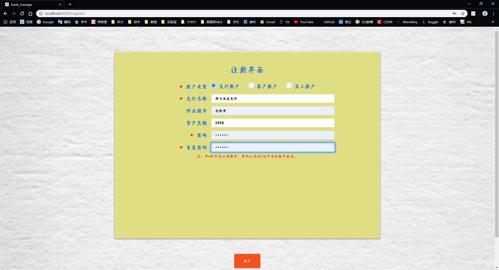

# **“银行业务管理系统”**——系统设计报告

>   小组成员：
>
>   王浩宇（PB16110428）
>
>   吴雨菲（PB15020693）
>
>   张劲暾（PB16111485）
>
>   AT:
>
>   **中国科学技术大学**
>
>   **计算机科学与技术学院**
>
>   **2019年6月**

## 目录

---

[TOC]

---

## 1. 概述

### 1.1 系统目标


### 1.2 需求说明

#### 1.2.1 数据需求

银行有多个支行。各个支行位于某个城市，每个支行有唯一的名字。银行要监控每个支行的资产。银行的客户通过其身份证号来标识。银行存储每个客户的姓名、联系电话以及家庭住址。为了安全起见，银行还要求客户提供一位联系人的信息，包括联系人姓名、手机号、 Email 以及与客户的关系。客户可以有帐户，并且可以贷款。客户可能和某个银行员工发生联系，该员工是此客户的贷款负责人或银行帐户负责人。银行员工也通过身份证号来标识。员工分为部门经理和普通员工，每个部门经理都负责领导其所在部门的员工，并且每个员工只允许在一个部门内工作。每个支行的管理机构存储每个员工的姓名、电话号码、家庭地址及部门经理的身份证号。银行还需知道每个员工开始工作的日期，由此日期可以推知员工的雇佣期。银行提供两类帐户——储蓄帐户和支票帐户。帐户可以由多个客户所共有，一个客户也可开设多个账户，但在一个支行内最多只能开设一个储蓄账户和一个支票账户。每个帐户被赋以唯一的帐户号。银行记录每个帐户的余额、开户日期、开户的支行名以及每个帐户所有者访问该帐户的最近日期。另外，每个储蓄帐户有利率和货币类型，且每个支票帐户有透支额。每笔贷款由某个分支机构发放，能被一个或多个客户所共有。每笔贷款用唯一的贷款号标识。银行需要知道每笔贷款所贷金额以及逐次支付的情况（银行将贷款分几次付给客户）。虽然贷款号不能唯一标识银行所有为贷款所付的款项，但可以唯一标识为某贷款所付的款项。对每次的付款需要记录日期和金额。

#### 1.2.2 主要功能需求

+   **支行管理**：提供支行所有信息的增、删、改、查功能；如果支行存在着关联信息，如员工、账户等，则不允许删除；
+   **员工管理**：提供支行员工所有信息的增、删、改、查功能；如果员工存在着关联数据，则不允许删除；
+   

### 1.3 本报告的主要贡献

+    

## 2. 总体设计

### 2.1 系统模块结构

```shell
bankManage\                     # web工程前后端项目文件夹
    |
    | - backEndService\         # FLASK后端项目文件夹
    |       |
    |       | - __pycache__\    # FLASK后端-Python字节码文件夹
    |       | - account.py      # FLASK后端-账户管理模块
    |       | - bank.py         # FLASK后端-支行管理模块
    |       | - customer.py     # FLASK后端-客户管理模块
    |       | - loan.py         # FLASK后端-贷款管理模块
    |       | - login.py        # FLASK后端-登录与全局路由模块
    |       | - register.py     # FLASK后端-注册模块
    |       | - staff.py        # FLASK后端-员工管理模块
    |       | - summary.py      # FLASK后端-业务统计模块
    |       | - test.py         # FLASK后端-独立于数据库的调试模块
    | - build\					# VUE webpacket 项目构建文件夹
    | - config\                 # VUE webpacket 项目配置文件夹
    | - node_modules\           # VUE webpacket 项目模型组件文件夹
    | - src\                    # VUE webpacket 项目前端源代码文件夹
    |       |
    |       | - assets
    |       | - components
    |       | - router\
    |       |       |
    |       |       | - index.js       # 全局路由
    |       | - views\
    |       |       |
    |       |       | - account.vue    # VUE前端-账户管理模块
    |       |       | - bank.vue       # VUE前端-支行管理模块
    |       |       | - customer.vue   # VUE前端-客户管理模块
    |       |       | - error.vue      # VUE前端-错误处理模块
    |       |       | - index.vue      # VUE前端-主页模块
    |       |       | - loan.vue       # VUE前端-贷款管理模块
    |       |       | - login.vue      # VUE前端-登录模块
    |       |       | - register.vue   # VUE前端-注册模块
    |       |       | - staff.vue      # VUE前端-员工管理模块
    |       |       | - summary.vue    # VUE前端-业务统计模块
    |       | - App.vue  
    |       | - main.js
    | - static\					# VUE webpacket 项目静态文件文件夹，版本控制与背景图片
    | - test\                   # VUE webpacket 项目系统测试文件夹
    | - .babelrc
    | - .editorconfig
    | - .eslintignore
    | - .eslintrc.js
    | - .gitignore
    | - .postcssrc.js
    | - index.html
    | - package-lock.json
    | - package.json
    | - README.md
sql\
    |
    | - bank.sql                    #
    | - build.sql                   #
    | - change_customer_name.sql    #
    | - change_employee_name.sql    #
    | - change_sub_bank_name.sql    #
    | - test_data.sql               #
```

### 2.2 系统工作流程


### 2.3 数据库设计

#### 2.3.0 E-R图


#### 2.3.1 支行表

存储所有支行账户信息。

| 属性       | 说明                         |
| ---------- | ---------------------------- |
| BANK_NAME  | 主键，支行名称               |
| CITY       | 支行所在城市                 |
| POSSESSION | 支行资产，默认值为0          |
| BANK_PASS  | 支行账户密码，默认值为123456 |

```sql
/* 支行表 */
CREATE TABLE SUB_BANK (
    BANK_NAME   CHAR(50)    CONSTRAINT BAMK_PK PRIMARY KEY,
    CITY        CHAR(50),
    POSSESSION  FLOAT       DEFAULT 0.0,
------------------------------------------------
    BANK_PASS   CHAR(6)     DEFAULT '123456'
);
```

#### 2.3.2 员工表

存储支行员工的信息，其中EMPLOYEE_BANK_NAME不是必须的，因为每个员工表是存储在支行管理机构的，也就是说实际上每个支行都有一张员工表，而支行名是整个表的属性，这里加一条完全是因为测试的时候只有一台主机一个表，为了测试方便所加，所以也没有对应的外键约束。

| 属性               | 说明                 |
| ------------------ | -------------------- |
| EMPLOYEE_ID        | 主键，员工身份证号码 |
| EMPLOYEE_DEPART_ID |                      |
| EMPLOYEE_BANK_NAME |                      |
| EMPLOYEE_NAME      |                      |
|                    |                      |
|                    |                      |

```sql
/* 用户表 */
CREATE TABLE EMPLOYEE (
    EMPLOYEE_ID         NUMBER(16) CONSTRAINT EMPLOYEE_PK PRIMARY KEY,
    EMPLOYEE_DEPART_ID  CHAR(10),
    EMPLOYEE_BANK_NAME  CHAR(50),
    EMPLOYEE_NAME       CHAR(32),
    EMPLOYEE_PHONE      NUMBER(12),
    EMPLOYEE_ADDRESS    CHAR(128),
    EMPLOYEE_ENTERDATE  DATE,
    EMPLOYEE_LEADER     CHAR(10),  /* 不是领导就是NULL */
------------------------------------------------
    EMPLOYEE_PASS       CHAR(6)     DEFAULT '123456',
------------------------------------------------
    CONSTRAINT LEADER_UQ    UNIQUE(EMPLOYEE_LEADER)
);
```

#### 2.3.3 客户表

| 属性 | 说明 |
| ---- | ---- |
|      |      |

```plsql
/* 用户表 */
CREATE TABLE CUSTOMER (
    CUSTOMER_ID                 NUMBER(16) CONSTRAINT CUSTOMER_PK PRIMARY KEY,
    CUSTOMER_NAME               CHAR(32),
    CUSTOMER_PHONE              NUMBER(12),
    CUSTOMER_ADDRESS            CHAR(128),
    CUSTOMER_CONTACT_NAME       CHAR(32),
    CUSTOMER_CONTACT_PHONE      NUMBER(12),
    CUSTOMER_CONTACT_EMAIL      CHAR(64),
    CUSTOMER_CONTACT_RELATION   CHAR(32),
------------------------------------------------
    CUSTOMER_PASS               CHAR(6) DEFAULT '123456'
);
```

#### 2.3.4 支票账户表

| 属性 | 说明 |
| ---- | ---- |
|      |      |

```plsql
/* 支票账户表 */
CREATE TABLE CHECK_ACCOUNT (
    CHECK_ACCOUNT_ID            NUMBER(16) CONSTRAINT CHECK_ACCOUNT_PK PRIMARY KEY,
    CHECK_ACCOUNT_MONEY         FLOAT,
    CHECK_ACCOUNT_REGDATE       DATE,
    CHECK_ACCOUNT_OVERDRAFT     FLOAT,
------------------------------------------------
    CHECK_ACCOUNT_PASS          CHAR(6) DEFAULT '123456'
);
```

#### 2.3.5 存储账户表

| 属性 | 说明 |
| ---- | ---- |
|      |      |

```plsql
/* 存储账户表 */
CREATE TABLE DEPOSIT_ACCOUNT (
    DEPOSIT_ACCOUNT_ID              NUMBER(16) CONSTRAINT DEPOSIT_ACCOUNT_PK PRIMARY KEY,
    DEPOSIT_ACCOUNT_MONEY           FLOAT,
    DEPOSIT_ACCOUNT_REGDATE         DATE,
    DEPOSIT_ACCOUNT_INTERESTRATE    FLOAT   DEFAULT 0,
    DEPOSIT_ACCOUNT_CURRENCYTYPE    NUMBER(1),
------------------------------------------------
    DEPOSIT_ACCOUNT_PASS            CHAR(6) DEFAULT '123456'
);
```

#### 2.3.6 贷款表

| 属性 | 说明 |
| ---- | ---- |
|      |      |

```plsql
/* 贷款表 */
CREATE TABLE LOAN (
    LOAN_ID     NUMBER(16)  CONSTRAINT LOAN_PK PRIMARY KEY,
    BANK_NAME   CHAR(50),
    LOAN_MONEY  FLOAT,
    STATUS      NUMBER(1),
    CONSTRAINT FK_BANK_NAME FOREIGN KEY(BANK_NAME)  REFERENCES SUB_BANK(BANK_NAME)
);
```

#### 2.3.7 支付表

| 属性 | 说明 |
| ---- | ---- |
|      |      |

```plsql
/* 支付表 */
CREATE TABLE PAY (
    LOAN_ID     NUMBER(16),
    PAY_DATE    DATE,
    PAY_MONEY   FLOAT,
    CONSTRAINT FK_LOAN_ID   FOREIGN KEY(LOAN_ID)    REFERENCES LOAN(LOAN_ID)
);
```

#### 2.3.8 客户-存储账户唯一表

| 属性 | 说明 |
| ---- | ---- |
|      |      |

```plsql
CREATE TABLE CUSTOMER_DEPOSIT_ACCOUNT (
    BANK_NAME           CHAR(50), 
    CUSTOMER_ID         NUMBER(16),
    DEPOSIT_ACCOUNT_ID  NUMBER(16),
    LAST_VIEW           DATE,
    CONSTRAINT PK_CUSTOMER_DEPOSIT_ACCOUNT  PRIMARY KEY(BANK_NAME, CUSTOMER_ID),
    CONSTRAINT FK_CD_BANK_NAME              FOREIGN KEY(BANK_NAME)          
    REFERENCES SUB_BANK(BANK_NAME),
    CONSTRAINT FK_CD_CUSTOMER_ID            FOREIGN KEY(CUSTOMER_ID)
    REFERENCES CUSTOMER(CUSTOMER_ID),
    CONSTRAINT FK_CD_DEPOSIT_ACCOUNT_ID     FOREIGN KEY(DEPOSIT_ACCOUNT_ID) 
    REFERENCES DEPOSIT_ACCOUNT(DEPOSIT_ACCOUNT_ID)
);
```

#### 2.3.9 客户-支票账户唯一表

| 属性 | 说明 |
| ---- | ---- |
|      |      |

```plsql
CREATE TABLE CUSTOMER_CHECK_ACCOUNT (
    BANK_NAME           CHAR(50),
    CUSTOMER_ID         NUMBER(16),
    CHECK_ACCOUNT_ID    NUMBER(16),
    LAST_VIEW           DATE,
    CONSTRAINT PK_CUSTOMER_CHECK_ACCOUNT    PRIMARY KEY(BANK_NAME, CUSTOMER_ID),
    CONSTRAINT FK_CC_BANK_NAME              FOREIGN KEY(BANK_NAME)          
    REFERENCES SUB_BANK(BANK_NAME),
    CONSTRAINT FK_CC_CUSTOMER_ID            FOREIGN KEY(CUSTOMER_ID)        
    REFERENCES CUSTOMER(CUSTOMER_ID),
    CONSTRAINT FK_CC_CHECK_ACCOUNT_ID       FOREIGN KEY(CHECK_ACCOUNT_ID)   
    REFERENCES CHECK_ACCOUNT(CHECK_ACCOUNT_ID)
);
```

#### 2.3.10 客户-贷款表

| 属性 | 说明 |
| ---- | ---- |
|      |      |

```plsql
CREATE TABLE LOAN_CUSTOMER (
    CUSTOMER_ID NUMBER(16),
    LOAN_ID     NUMBER(16),
    CONSTRAINT PK_LOAN_CUSTOMER     PRIMARY KEY(LOAN_ID, CUSTOMER_ID),
    CONSTRAINT FK_LC_CUSTOMER_ID    FOREIGN KEY(CUSTOMER_ID)
    REFERENCES CUSTOMER(CUSTOMER_ID),
    CONSTRAINT FK_LC_LOAN_ID        FOREIGN KEY(LOAN_ID)
    REFERENCES LOAN(LOAN_ID)
);
```

#### 2.3.11 员工-客户表

| 属性 | 说明 |
| ---- | ---- |
|      |      |

```plsql
CREATE TABLE EMPLOYEE_CUSTOMER (
    CUSTOMER_ID NUMBER(16),
    EMPLOYEE_ID NUMBER(16),
    SERVICETYPE CHAR(16),
    CONSTRAINT PK_EMPLOYEE_CUSTOMER PRIMARY KEY(EMPLOYEE_ID, CUSTOMER_ID),
    CONSTRAINT FK_EC_CUSTOMER_ID    FOREIGN KEY(CUSTOMER_ID)
    REFERENCES CUSTOMER(CUSTOMER_ID),
    CONSTRAINT FK_EC_EMPLOYEE_ID    FOREIGN KEY(EMPLOYEE_ID)
    REFERENCES EMPLOYEE(EMPLOYEE_ID)
);
```

#### 2.3.12 修改用户身份证号码存储过程

| 属性 | 说明 |
| ---- | ---- |
|      |      |

```plsql
CREATE OR REPLACE PROCEDURE CHANGE_CUSTOMER_NAME(
    oldBankName IN  CHAR,
    newBankName IN  CHAR,
    result      OUT NUMBER
)
AS
    tempCount number;
BEGIN
    SELECT COUNT(*) INTO tempCount 
    FROM DUAL 
    WHERE EXISTS(SELECT NULL FROM CUSTOMER WHERE CUSTOMER_ID = newBankName);

    IF(tempCount > 0) THEN
        result := 1;
    ELSE
        SELECT COUNT(*) INTO tempCount 
        FROM DUAL 
        WHERE EXISTS(SELECT NULL FROM CUSTOMER WHERE CUSTOMER_ID = oldBankName);

        IF(tempCount = 0) THEN
            result := 2;
        ELSE
            EXECUTE IMMEDIATE ' ALTER TABLE EMPLOYEE_CUSTOMER DROP 
                                CONSTRAINT FK_EC_CUSTOMER_ID
                                ';
            EXECUTE IMMEDIATE ' ALTER TABLE CUSTOMER_DEPOSIT_ACCOUNT DROP 
                                CONSTRAINT FK_CD_CUSTOMER_ID
                                ';
            EXECUTE IMMEDIATE ' ALTER TABLE CUSTOMER_CHECK_ACCOUNT DROP 
                                CONSTRAINT FK_CC_CUSTOMER_ID
                                ';
            EXECUTE IMMEDIATE ' ALTER TABLE LOAN_CUSTOMER DROP 
                                CONSTRAINT FK_LC_CUSTOMER_ID
                                ';
        -----------------------------------------------
            UPDATE  CUSTOMER 
            SET     CUSTOMER_ID = newBankName
            WHERE   CUSTOMER_ID = oldBankName;
        -----------------------------------------------
            UPDATE  EMPLOYEE_CUSTOMER 
            SET     CUSTOMER_ID = newBankName
            WHERE   CUSTOMER_ID = oldBankName;
        -----------------------------------------------
            UPDATE  CUSTOMER_DEPOSIT_ACCOUNT 
            SET     CUSTOMER_ID = newBankName
            WHERE   CUSTOMER_ID = oldBankName;
        -----------------------------------------------
            UPDATE  CUSTOMER_CHECK_ACCOUNT 
            SET     CUSTOMER_ID = newBankName
            WHERE   CUSTOMER_ID = oldBankName;
        -----------------------------------------------
            UPDATE  LOAN_CUSTOMER 
            SET     CUSTOMER_ID = newBankName
            WHERE   CUSTOMER_ID = oldBankName;
        -----------------------------------------------
            EXECUTE IMMEDIATE ' ALTER TABLE EMPLOYEE_CUSTOMER 
                                ADD CONSTRAINT FK_EC_CUSTOMER_ID 
                                    FOREIGN KEY(CUSTOMER_ID)  
                                    REFERENCES CUSTOMER(CUSTOMER_ID)
                                ';
            EXECUTE IMMEDIATE ' ALTER TABLE CUSTOMER_DEPOSIT_ACCOUNT 
                                ADD CONSTRAINT FK_CD_CUSTOMER_ID 
                                    FOREIGN KEY(CUSTOMER_ID)  
                                    REFERENCES CUSTOMER(CUSTOMER_ID)
                                ';
            EXECUTE IMMEDIATE ' ALTER TABLE CUSTOMER_CHECK_ACCOUNT 
                                ADD CONSTRAINT FK_CC_CUSTOMER_ID 
                                    FOREIGN KEY(CUSTOMER_ID)  
                                    REFERENCES CUSTOMER(CUSTOMER_ID)
                                ';
            EXECUTE IMMEDIATE ' ALTER TABLE LOAN_CUSTOMER 
                                ADD CONSTRAINT FK_LC_CUSTOMER_ID 
                                    FOREIGN KEY(CUSTOMER_ID)  
                                    REFERENCES CUSTOMER(CUSTOMER_ID)
                                ';
            result := 0;
        END IF;
    END IF;
END CHANGE_CUSTOMER_NAME;
/
```

#### 2.3.14 修改员工身份证号码存储过程

| 属性 | 说明 |
| ---- | ---- |
|      |      |

```plsql
CREATE OR REPLACE PROCEDURE CHANGE_EMPLOYEE_NAME(
    oldBankName IN  CHAR,
    newBankName IN  CHAR,
    result      OUT NUMBER
)
AS
    tempCount number;
BEGIN
    SELECT COUNT(*) INTO tempCount 
    FROM DUAL 
    WHERE EXISTS(SELECT NULL FROM EMPLOYEE WHERE EMPLOYEE_ID = newBankName);

    IF(tempCount > 0) THEN
        result := 1;
    ELSE
        SELECT COUNT(*) INTO tempCount 
        FROM DUAL 
        WHERE EXISTS(SELECT NULL FROM EMPLOYEE WHERE EMPLOYEE_ID = oldBankName);

        IF(tempCount = 0) THEN
            result := 2;
        ELSE
            EXECUTE IMMEDIATE ' ALTER TABLE EMPLOYEE_CUSTOMER DROP 
                                CONSTRAINT FK_EC_EMPLOYEE_ID
                                ';
        -----------------------------------------------
            UPDATE  EMPLOYEE 
            SET     EMPLOYEE_ID = newBankName
            WHERE   EMPLOYEE_ID = oldBankName;
        -----------------------------------------------
            UPDATE  EMPLOYEE_CUSTOMER 
            SET     EMPLOYEE_ID = newBankName
            WHERE   EMPLOYEE_ID = oldBankName;
        -----------------------------------------------
            EXECUTE IMMEDIATE ' ALTER TABLE EMPLOYEE_CUSTOMER 
                                ADD CONSTRAINT FK_EC_EMPLOYEE_ID 
                                    FOREIGN KEY(EMPLOYEE_ID)  
                                    REFERENCES EMPLOYEE(EMPLOYEE_ID)
                                ';
            result := 0;
        END IF;
    END IF;
END CHANGE_EMPLOYEE_NAME;
/
```

#### 2.3.15 修改支行名存储过程

| 输入输出 | 说明 |
| -------- | ---- |
|          |      |

```plsql
CREATE OR REPLACE PROCEDURE CHANGE_BANK_NAME(
    oldBankName IN  CHAR,
    newBankName IN  CHAR,
    result      OUT NUMBER
)
AS
    tempCount number;
BEGIN
    SELECT COUNT(*) INTO tempCount 
    FROM DUAL 
    WHERE EXISTS(SELECT NULL FROM SUB_BANK WHERE BANK_NAME = newBankName);

    IF(tempCount > 0) THEN
        result := 1;
    ELSE
        SELECT COUNT(*) INTO tempCount 
        FROM DUAL 
        WHERE EXISTS(SELECT NULL FROM SUB_BANK WHERE BANK_NAME = oldBankName);

        IF(tempCount = 0) THEN
            result := 2;
        ELSE
            EXECUTE IMMEDIATE ' ALTER TABLE LOAN DROP 
                                CONSTRAINT FK_BANK_NAME
                                ';
            EXECUTE IMMEDIATE ' ALTER TABLE CUSTOMER_DEPOSIT_ACCOUNT 
                                DROP CONSTRAINT FK_CD_BANK_NAME
                                ';
            EXECUTE IMMEDIATE ' ALTER TABLE CUSTOMER_CHECK_ACCOUNT 
                                DROP CONSTRAINT FK_CC_BANK_NAME
                                ';
        -----------------------------------------------
            UPDATE  SUB_BANK 
            SET     BANK_NAME = newBankName
            WHERE   BANK_NAME = oldBankName;
        -----------------------------------------------
            UPDATE  LOAN 
            SET     BANK_NAME = newBankName
            WHERE   BANK_NAME = oldBankName;
        -----------------------------------------------
            UPDATE  CUSTOMER_DEPOSIT_ACCOUNT
            SET     BANK_NAME = newBankName
            WHERE   BANK_NAME = oldBankName;
        -----------------------------------------------
            UPDATE  CUSTOMER_CHECK_ACCOUNT
            SET     BANK_NAME = newBankName
            WHERE   BANK_NAME = oldBankName;
        -----------------------------------------------
            EXECUTE IMMEDIATE ' ALTER TABLE LOAN 
                                ADD CONSTRAINT FK_BANK_NAME 
                                    FOREIGN KEY(BANK_NAME)  
                                    REFERENCES SUB_BANK(BANK_NAME)
                                ';
            EXECUTE IMMEDIATE ' ALTER TABLE CUSTOMER_DEPOSIT_ACCOUNT 
                                ADD CONSTRAINT FK_CD_BANK_NAME 
                                    FOREIGN KEY(BANK_NAME)  
                                    REFERENCES SUB_BANK(BANK_NAME)
                                ';
            EXECUTE IMMEDIATE ' ALTER TABLE CUSTOMER_CHECK_ACCOUNT 
                                ADD CONSTRAINT FK_CC_BANK_NAME 
                                    FOREIGN KEY(BANK_NAME)  
                                    REFERENCES SUB_BANK(BANK_NAME)
                                ';
            result := 0;
        END IF;
    END IF;
END CHANGE_BANK_NAME;
/
```

## 3. 详细设计

### 3.1 运行环境配置概述


### 3.2 VUE前端
Vue前端为用户提供了一个友好的接口，用户在前端的操作会被发送到后端，后端的返回也会被显示在前端。本质上，前端做的只是数据的传递与转换，并不对数据进行处理。
#### 3.2.1 VUE全局路由
##### 3.2.1.1 设计思路
在Vue中，如果要实现页面跳转，必须先将组件注册在路由表中，为其配置路径。之后，就可以通过URL进行跳转。为了实现对用户输入错误URL的处理，错误处理界面的URL被注册为*，即输入任何未注册的URL都会跳转到该界面。
##### 2.2.2.2 路由表
页面 | 组件名 | URL
:-: | :-: | :-:
登录界面 | login | /
注册界面 | register | /register
主页 | index | /index
支行管理界面 | bank | /bank
员工管理界面 | staff | /staff
客户管理界面 | customer | /customer
账户管理界面 | account | /account
贷款管理界面 | loan | /loan 
业务统计界面 | summary | /summary 
错误处理界面 | error | *

#### 3.2.2 VUE账户管理模块

##### 3.2.2.1 设计思路
由于账户可能存在多个户主，该页面设计为两个表格：主表显示账户所有的信息（对应于数据库中的CHECK_ACCOUNT表和DEPOSIT_ACCOUNT表），点击主表中“显示户主”按钮，可以在子表中显示所有的户主信息（对应于CUSTOMER_CHECK_ACCOUNT表和CUSTOMER_DEPOSIT_ACCOUNT表）。每张表格都提供了增、删、改功能。页面另有查询部分，可以对主表进行查询。
##### 3.2.2.2 向后端发送的数据
+ 查询主表内容
  + 目的地址：/account
  + `type`: "Search"
  + `bankSearch`: 支行名称（模糊查询）
  + `idSearch`: 账户号（模糊查询）
  + `ownerSearch`: 户主姓名（模糊查询）
  + `typeSearch`: 账户类型
  + `money_lo`: 余额下界
  + `money_up`: 余额上界
  + `open_lo`: 开户日期下界
  + `open_up`: 开户日期上界
+ 删除主表记录
  + 目的地址：/account
  + `type`: "Delete"
  + `primary`: 账户号（主键）
  + `acctype`: 账户类型
+ 新增或修改主表记录
  + 目的地址：/account
  + `type`: "Update",
  + `id`: 账户号
  + `bank`: 支行名称
  + `money`: 余额
  + `ownerid`: 开户者ID（只在新增时使用）
  + `open_date`: 开户日期
  + `acctype`: 账户类型
  + `interest`: 利率
  + `cashtype`: 货币类型
  + `overdraft`: 透支额
  + `old_primary`: 修改前的账户号（当新增时为null）
+ 查询子表内容
  + 目的地址：/accountCustomer
  + `type`: "Search"
  + `accid`: 账户号
  + `bank`: 开户支行
  + `acctype`: 账户类型
+ 新增子表记录
  + 目的地址：/accountCustomer
  + `type`: "Insert",
  + `accid`: 账户号
  + `bank`: 开户支行
  + `visit_date`: 最近访问日期  
  + `ownerid`: 户主ID
  + `acctype`: 账户类型
+ 删除子表记录
  + 目的地址：/accountCustomer
  + `type`: "Delete",
  + `accid`: 账户号
  + `bank`: 开户支行
  + `ownerid`: 户主ID
  + `acctype`: 账户类型

##### 3.2.2.3 后端反馈的数据

+ 查询主表内容：查询得到的结果
+ 新增主表记录：操作成功/错误码+错误原因
+ 修改主表记录：操作成功/错误码+错误原因
+ 删除主表记录：操作成功/错误码+错误原因
+ 查询子表内容：查询得到的结果
+ 新增子表内容：操作成功/错误码+错误原因  
+ 删除子表内容：操作成功/错误码+错误原因
#### 3.2.3 VUE支行管理模块

##### 3.2.3.1 设计思路


##### 3.2.3.2 输入


##### 3.2.3.3 输出


##### 3.2.3.4 核心代码概述

("..." 表示省略的部分，包括出错处理，打包，DEBUG输出等代码)

#### 3.2.4 VUE客户管理模块

##### 3.2.4.1 设计思路

##### 3.2.4.2 输入

##### 3.2.4.3 输出

##### 3.2.4.4 核心代码概述

("..." 表示省略的部分，包括出错处理，打包，DEBUG输出等代码)


#### 3.2.5 VUE错误处理模块

##### 3.2.5.1 设计思路

##### 3.2.5.2 输入

##### 3.2.5.3 输出

##### 3.2.5.4 核心代码概述

("..." 表示省略的部分，包括出错处理，打包，DEBUG输出等代码)


#### 3.2.6 VUE主页模块

##### 3.2.6.1 设计思路

##### 3.2.6.2 输入

##### 3.2.6.3 输出

##### 3.2.6.4 核心代码概述

("..." 表示省略的部分，包括出错处理，打包，DEBUG输出等代码)


#### 3.2.7 VUE贷款管理模块

##### 3.2.7.1 设计思路

##### 3.2.7.2 输入

##### 3.2.7.3 输出

##### 3.2.7.4 核心代码概述

("..." 表示省略的部分，包括出错处理，打包，DEBUG输出等代码)


#### 3.2.8 VUE登录模块

##### 3.2.8.1 设计思路

##### 3.2.8.2 输入

##### 3.2.8.3 输出

##### 3.2.8.4 核心代码概述

("..." 表示省略的部分，包括出错处理，打包，DEBUG输出等代码)


#### 3.2.9 VUE注册模块

##### 3.2.9.1 设计思路

##### 3.2.9.2 输入

##### 3.2.9.3 输出

##### 3.2.9.4 核心代码概述

("..." 表示省略的部分，包括出错处理，打包，DEBUG输出等代码)


#### 3.2.10 VUE员工管理模块

##### 3.2.10.1 设计思路

##### 3.2.10.2 输入

##### 3.2.10.3 输出

##### 3.2.10.4 核心代码概述

("..." 表示省略的部分，包括出错处理，打包，DEBUG输出等代码)


#### 3.2.11 VUE业务统计模块

##### 3.2.11.1 设计思路

##### 3.2.11.2 输入

##### 3.2.11.3 输出

##### 3.2.11.4 核心代码概述

("..." 表示省略的部分，包括出错处理，打包，DEBUG输出等代码)


### 3.3 FLASK后端

#### 3.3.1 FLASK登录与全局路由模块

##### 3.3.1.1 设计思路

##### 3.3.1.2 输入

##### 3.3.1.3 输出

##### 3.3.1.4 核心代码概

("..." 表示省略的部分，包括出错处理，打包，DEBUG输出等代码)

```python

```

#### 3.3.2 FLASK账户管理模块

##### 3.3.2.1 设计思路

##### 3.3.2.2 输入

##### 3.3.2.3 输出

##### 3.3.2.4 核心代码概

("..." 表示省略的部分，包括出错处理，打包，DEBUG输出等代码)

```python

```

#### 3.3.3 FLASK支行管理模块

##### 3.3.3.1 设计思路

##### 3.3.3.2 输入

##### 3.3.3.3 输出

##### 3.3.3.4 核心代码概

("..." 表示省略的部分，包括出错处理，打包，DEBUG输出等代码)

```python
# 支行管理 后台功能
@bank_api.route('/bank',methods=['POST'])
def bank():
    rstype=request.form['type']
#===============================================================================
    if (rstype=="Search"):  # 查 #
        ...
        bankSearch = request.form['bankSearch']
        citySearch = request.form['citySearch']
        lowerBound = request.form['lowerBound']
        upperBound = request.form['upperBound']

        sqlcommand = ""
        sqlcommand = sqlcommand + " SELECT"
        ...
        cursor.execute(sqlcommand)
        # 使读取的 Oracle 数据字典化
        cursor.rowfactory = makeDictFactory(cursor)
        result = cursor.fetchall()
        if result :
            response = make_response(
                jsonify(
                    {
                        'code': 200,
                        'list': result
                    }
                )
            )
            ...
        response = make_response(
            jsonify(
                {
                    'code': 400
                }
            )
        )
        ...
        return response
#===============================================================================
    if (rstype=="Update"):
        ...
        name        = request.form['name']
        ...
        city        = request.form['city']
        ...
        money       = request.form['money']
        old_primary = request.form['old_primary']
        ...

        sqlcommand = ""
        if len(old_primary) > 0 : # 改 #
            if name != old_primary :
                result = cursor.var(cx_Oracle.NUMBER)
                cursor.callproc('CHANGE_BANK_NAME',[old_primary, name, result ])
                ...
                if result.getvalue() == 2 :
                    cursor.close()
                    connection.close()
                    response = make_response(jsonify({    
                                                        'code':402,
                                                        'msg': 'old name do not find'
                                                    })
                                            )
                    ...
                    return response
                if result.getvalue() == 1 :
                    cursor.close()
                    connection.close()
                    response = make_response(jsonify({    
                                                        'code':401,
                                                        'msg': 'new name used'
                                                    })
                                            )
                    ...
                    return response

            sqlcommand = sqlcommand + " UPDATE SUB_BANK SET   "
            ...
        else : # 增 #
            insert = "("
            ...
            insert = insert + ")"
            sqlcommand = sqlcommand + "INSERT INTO ... " + insert

        print(sqlcommand)
        try :
            cursor.execute(sqlcommand)
        except :
            cursor.close()
            connection.close()
            response = make_response(jsonify({    
                                            'code':400,
                                            'msg': 'fail'
                                            })
                                    )
            ...
            return response

        cursor.close()
        connection.commit()
        connection.close()
        response = make_response(jsonify({    
                                        'code':200,
                                        'msg': 'ok'
                                        })
                                )
        ...
        return response
#================================================================================
    if (rstype=="Delete"): # 删 #
        ...
        primary = request.form['primary']
        ...
        sqlcommand = " SELECT * FROM EMPLOYEE WHERE "
        ...
        cursor.execute(sqlcommand)
        # 使读取的 Oracle 数据字典化
        cursor.rowfactory = makeDictFactory(cursor)
        result = cursor.fetchall()
        if len(result) > 0 :
            cursor.close()
            connection.close()
            response = make_response(jsonify({    
                                            'code': 403,
                                            'msg': '有关联员工信息'
                                            })
                                    )
            ...
            return response
        
        sqlcommand = " SELECT * FROM LOAN WHERE "
        ...
        cursor.execute(sqlcommand)
        # 使读取的 Oracle 数据字典化
        cursor.rowfactory = makeDictFactory(cursor)
        result = cursor.fetchall()
        if len(result) > 0 :
            cursor.close()
            connection.close()
            response = make_response(jsonify({    
                                            'code': 405,
                                            'msg': '有关联贷款信息'
                                            })
                                    )
            ...
            return response

        sqlcommand = " SELECT * FROM CUSTOMER_CHECK_ACCOUNT WHERE "
        sqlcommand = sqlcommand + " BANK_NAME = '" + primary + "'"
        print(sqlcommand)
        cursor.execute(sqlcommand)
        # 使读取的 Oracle 数据字典化
        cursor.rowfactory = makeDictFactory(cursor)
        result = cursor.fetchall()
        if len(result) > 0 :
            cursor.close()
            connection.close()
            response = make_response(jsonify({    
                                            'code': 405,
                                            'msg': '有关联支票账户信息'
                                            })
                                    )
            ...
            return response
        
        sqlcommand = " SELECT * FROM CUSTOMER_DEPOSIT_ACCOUNT WHERE "
        sqlcommand = sqlcommand + " BANK_NAME = '" + primary + "'"
        print(sqlcommand)
        cursor.execute(sqlcommand)
        # 使读取的 Oracle 数据字典化
        cursor.rowfactory = makeDictFactory(cursor)
        result = cursor.fetchall()
        if len(result) > 0 :
            cursor.close()
            connection.close()
            response = make_response(jsonify({    
                                            'code': 406,
                                            'msg': '有关联存款账户信息'
                                            })
                                    )
            ...
            return response

        sqlcommand = " DELETE FROM SUB_BANK WHERE "
        sqlcommand = sqlcommand + " BANK_NAME = '" + primary + "'"
        print(sqlcommand)
        cursor.execute(sqlcommand)
        cursor.close()
        connection.commit()
        connection.close()
        response = make_response(jsonify({    
                                        'code':200,
                                        'msg': 'ok'
                                        })
                                )
        ...
        return response
#===============================================================================
```

#### 3.3.4 FLASK客户管理模块

##### 3.3.4.1 设计思路

STEP 1: 判断前端请求的服务类型

STEP 2: 

+   搜索服务：
    +   获取搜索的用户姓名、用户身份证号、用户电话、用户地址、联系人姓名、联系人电话、联系人电子邮件信息
    +   构建 SELECT SQL 命令字符串
    +   调用数据库接口执行 SELECT SQL 命令，搜索符合条件的条目
    +   获取操作结果
+   修改、新增服务：
    +   获取新的用户姓名、用户身份证号、用户电话、用户地址、联系人姓名、联系人电话、联系人电子邮件信息，联系人和用户关系，旧的用户身份证号
    +   判断是修改还是新增操作
    +   修改操作：
        +   判断是否修改主键，如果修改了，调用存储过程完成对主键的修改
        +   构建 UPDATE SQL 命令字符串
        +   调用数据库接口执行 UPDATE SQL 命令，修改其他属性值
    +   新增操作：
        +   构建 INSERT SQL 命令字符串
        +   调用数据库接口执行 INSERT SQL 命令，增加新的条目
+   删除服务：
    +   获取需要删除的的用户身份证号
    +   构建并调用数据库接口执行 SELECT SQL 命令，判断用户是否还有关联的员工、支票账户、储蓄账户和贷款，如果有，则不能删除用户
    +   如果没有，构建并调用数据库接口执行 DELETE SQL 命令，删除对应的用户

STEP 3: 打包结果信息发送给前端

##### 3.3.4.2 输入

`type`: 前端请求的服务类型

+   搜索服务：
    +   `nameSearch`: 要搜索的用户姓名
    +   `idSearch`: 要搜索的用户身份证号
    +   `telSearch`: 要搜索的用户电话
    +   `addrSearch`: 要搜索的用户地址
    +   `linknameSearch`: 要搜索的联系人姓名
    +   `linktelSearch`: 要搜索的联系人电话
    +   `emailSearch`: 要搜索的联系人电子邮件信息
+   修改、新增服务：
    +   `id_s`: 要修改、新增的用户身份证号
    +   `name`: 要修改、新增的用户姓名
    +   `tel`: 要修改、新增的用户电话
    +   `addr`: 要修改、新增的用户地址
    +   `name_link`: 要修改、新增的联系人姓名
    +   `tel_link`: 要修改、新增的联系人电话
    +   `email_link`: 要修改、新增的联系人电子邮件信息
    +   `relation`: 要修改、新增的联系人和用户关系
    +   `old_primary`: 要修改、新增的旧的用户身份证号
+   删除服务：
    +   `primary`: 要删除的用户身份证号

##### 3.3.4.3 输出

+   搜索服务：
    +   200 message + 查询结果列表
+   修改、新增服务：
    +   402 message + "旧身份证号不存在"
    +   401 message + "新身份证号被使用"
    +   400 message + "操作失败"
    +   200 message + "操作成功"
+   删除服务：
    +   200 message + "操作成功"
    +   407 message + "有关联员工信息"
    +   408 message + "有关联存储账户信息"
    +   409 message + "有关联支票账户信息"
    +   410 message + "有关联贷款信息"

##### 3.3.4.4 核心代码概

("..." 表示省略的部分，包括出错处理，打包，DEBUG输出等代码)

```python
#================================================================================
# 客户管理 后台功能
@customer_api.route('/customer',methods=['POST'])
def customer():
    rstype=request.form['type']
    if (rstype=="Search"):
        
        connection = cx_Oracle.connect('System/db2019@localhost/ORCL')
        cursor = connection.cursor()

        nameSearch      = request.form['nameSearch']
        ...
        idSearch        = request.form['idSearch']
        ...
        telSearch       = request.form['telSearch']
        ...
        addrSearch      = request.form['addrSearch']
        ...
        linknameSearch  = request.form['linknameSearch']
        ...
        linktelSearch   = request.form['linktelSearch']
        ...
        emailSearch     = request.form['emailSearch']
        ...

        sqlcommand = ""
        sqlcommand = sqlcommand + " SELECT"
        ...

        cursor.execute(sqlcommand)
        # 使读取的 Oracle 数据字典化
        cursor.rowfactory = makeDictFactory(cursor)
        result = cursor.fetchall()

        response = make_response(...)
        ...
        return response

    if (rstype=="Update"):
       	
        connection = cx_Oracle.connect('System/db2019@localhost/ORCL')
        cursor = connection.cursor()
        id_s        = request.form['id']
        name        = request.form['name']
        ...
        tel         = request.form['tel']
        ...
        addr        = request.form['addr']
        ...
        name_link   = request.form['name_link']
        ...
        tel_link    = request.form['tel_link']
        ...
        email_link  = request.form['email_link']
        ...
        relation    = request.form['relation']
        ...
        old_primary = request.form['old_primary']
        ...

        sqlcommand = ""
        if len(old_primary) > 0 : # 改 #
            if id_s != old_primary :
                result = cursor.var(cx_Oracle.NUMBER)
                cursor.callproc('CHANGE_CUSTOMER_NAME',[old_primary, id_s, result ])
                
                if result.getvalue() == 2 :
                    cursor.close()
                    connection.close()
                    response = make_response(jsonify({    
                                                        'code':402,
                                                        'msg': 'old name do not find'
                                                    })
                                            )
                    ...
                    return response
                if result.getvalue() == 1 :
                    cursor.close()
                    connection.close()
                    response = make_response(jsonify({    
                                                        'code':401,
                                                        'msg': 'new name used'
                                                    })
                                            )
                    ...
                    return response
            
            sqlcommand = sqlcommand + " UPDATE CUSTOMER SET   "
            ...
            sqlcommand = sqlcommand + " WHERE CUSTOMER_ID = '" + id_s + "'"
            
        else : # 增 #
            insert = "("
            insert = insert + "'" + id_s        + "'" + ","
            insert = insert + "'" + name        + "'" + ","
            insert = insert + "'" + tel         + "'" + ","
            insert = insert + "'" + addr        + "'" + ","
            insert = insert + "'" + name_link   + "'" + ","
            insert = insert + "'" + tel_link    + "'" + ","
            insert = insert + "'" + email_link  + "'" + ","
            insert = insert + "'" + relation    + "'" 
            insert = insert + ")"
            sqlcommand =    sqlcommand + "   INSERT ... " + insert
        
        print(sqlcommand)
        try :
            cursor.execute(sqlcommand)
        except :
            cursor.close()
            connection.close()
            response = make_response(jsonify({    
                                            'code':400,
                                            'msg': 'fail'
                                            })
                                    )
            ...
            return response

        cursor.close()
        connection.commit()
        connection.close()
        response = make_response(jsonify({    
                                        'code':200,
                                        'msg': 'ok'
                                        })
                                )
        ...
        return response

    if (rstype=="Delete"):
        
        connection = cx_Oracle.connect('System/db2019@localhost/ORCL')
        cursor = connection.cursor()

        primary = request.form['primary']
        ...
    #==============================================================================
        sqlcommand = " SELECT * FROM EMPLOYEE_CUSTOMER WHERE "
        sqlcommand = sqlcommand + " CUSTOMER_ID = '" + primary + "'"
        print(sqlcommand)
        cursor.execute(sqlcommand)
        # 使读取的 Oracle 数据字典化
        cursor.rowfactory = makeDictFactory(cursor)
        result = cursor.fetchall()
        if len(result) > 0 :
            cursor.close()
            connection.close()
            response = make_response(jsonify({    
                                            'code': 407,
                                            'msg': '有关联员工信息'
                                            })
                                    )
            ...
            return response
    #==============================================================================
        sqlcommand = " SELECT * FROM CUSTOMER_DEPOSIT_ACCOUNT WHERE "
        sqlcommand = sqlcommand + " CUSTOMER_ID = '" + primary + "'"
        print(sqlcommand)
        cursor.execute(sqlcommand)
        # 使读取的 Oracle 数据字典化
        cursor.rowfactory = makeDictFactory(cursor)
        result = cursor.fetchall()
        if len(result) > 0 :
            cursor.close()
            connection.close()
            response = make_response(jsonify({    
                                            'code': 408,
                                            'msg': '有关联存储账户信息'
                                            })
                                    )
            ...
            return response
    #==============================================================================
        sqlcommand = " SELECT * FROM CUSTOMER_CHECK_ACCOUNT WHERE "
        sqlcommand = sqlcommand + " CUSTOMER_ID = '" + primary + "'"
        print(sqlcommand)
        cursor.execute(sqlcommand)
        # 使读取的 Oracle 数据字典化
        cursor.rowfactory = makeDictFactory(cursor)
        result = cursor.fetchall()
        if len(result) > 0 :
            cursor.close()
            connection.close()
            response = make_response(jsonify({    
                                            'code': 409,
                                            'msg': '有关联支票账户信息'
                                            })
                                    )
            ...
            return response
    #==============================================================================
        sqlcommand = " SELECT * FROM LOAN_CUSTOMER WHERE "
        sqlcommand = sqlcommand + " CUSTOMER_ID = '" + primary + "'"
        print(sqlcommand)
        cursor.execute(sqlcommand)
        # 使读取的 Oracle 数据字典化
        cursor.rowfactory = makeDictFactory(cursor)
        result = cursor.fetchall()
        if len(result) > 0 :
            cursor.close()
            connection.close()
            response = make_response(jsonify({    
                                            'code': 410,
                                            'msg': '有关联贷款信息'
                                            })
                                    )
            ...
            return response
    #=============================================================================
        sqlcommand = " DELETE FROM CUSTOMER WHERE "
        sqlcommand = sqlcommand + " CUSTOMER_ID = '" + primary + "'"
        print(sqlcommand)
        cursor.execute(sqlcommand)
        cursor.close()
        connection.commit()
        connection.close()

        response = make_response(jsonify({    
                                        'code':200,
                                        'msg': 'ok'
                                        })
                                )
        ...
        return response
#=================================================================================
```

#### 3.3.5 FLASK贷款管理模块

##### 3.3.5.1 设计思路

##### 3.3.5.2 输入

##### 3.3.5.3 输出

##### 3.3.5.4 核心代码概

("..." 表示省略的部分，包括出错处理，打包，DEBUG输出等代码)

```python

```


#### 3.3.6 FLASK注册模块

##### 3.3.6.1 设计思路

##### 3.3.6.2 输入

##### 3.3.6.3 输出

##### 3.3.6.4 核心代码概

("..." 表示省略的部分，包括出错处理，打包，DEBUG输出等代码)

```python
#===============================================================================
# 注册 后台功能
@register_api.route('/register',methods=['POST','OPTIONS'])
def register():
    username        = request.form['username']...
    password        = request.form['password']...
    account_type    = request.form['type']...
    city            = request.form['city']...
    money           = request.form['money']...
    name            = request.form['name']...
    tel             = request.form['tel']...
    addr            = request.form['addr']...
    name_link       = request.form['name_link']...
    tel_link        = request.form['tel_link']...
    email_link      = request.form['email_link']...
    relation        = request.form['relation']...
    dept            = request.form['dept']...
    date_s          = request.form['date_s']...
    bankname        = request.form['bankname']...
    ...
    sqlcommand = ""
    if account_type == "SUB_BANK" :
        insert = "(" + "'" + username + "'" + ','  + "'" + password + "', "
        ...
        insert = insert + ")"
        sqlcommand =    """
                        INSERT INTO 
                            ...
                        VALUES """ + insert
    elif account_type == "EMPLOYEE":
        insert = "(" + "'" + username + "'" + ','  + "'" + password + "', " 
        ...
        insert = insert + ")"
        sqlcommand =    """
                        INSERT INTO 
                            ...
                        VALUES """ + insert
    else :
        insert = "(" + "'" + username + "'" + ','  + "'" + password + "', "
        ...
        insert = insert + ")"
        sqlcommand =    """
                        INSERT INTO 
                            ...
                        VALUES """ + insert
    print(sqlcommand)
    try :
        cursor.execute(sqlcommand)
    except :
        print("数据库操作失败")
        cursor.close()
        connection.close()
        response = make_response(jsonify({    
                                            'code':400, 
                                            # 数据库操作失败
                                            'msg':'ok'
                                        })
                                    )
        ...
        return response

    cursor.close()
#===============================
    connection.commit()
#===============================
    connection.close()

    response = make_response(jsonify({    
                                        'code':200,
                                        'msg':'ok'
                                    })
                                )
    ...
    return response
```

#### 3.3.7 FLASK员工管理模块

##### 3.3.7.1 设计思路

##### 3.3.7.2 输入

##### 3.3.7.3 输出

##### 3.3.7.4 核心代码概

("..." 表示省略的部分，包括出错处理，打包，DEBUG输出等代码)

```python
#================================================================================
# 员工管理 后台功能
@staff_api.route('/staff',methods=['POST'])
def staff():
    rstype=request.form['type']
    if (rstype=="Search"):
        ...
        nameSearch  = request.form['nameSearch']
        idSearch    = request.form['idSearch']
        bankSearch  = request.form['bankSearch']
        deptSearch  = request.form['deptSearch']
        telSearch   = request.form['telSearch']
        addrSearch  = request.form['addrSearch']
        lowerBound  = request.form['lowerBound']
        upperBound  = request.form['upperBound']
        
        sqlcommand = ""
        sqlcommand = sqlcommand + " SELECT"
        ...
        
        print(sqlcommand)
        cursor.execute(sqlcommand)
        # 使读取的 Oracle 数据字典化
        cursor.rowfactory = makeDictFactory(cursor)
        result = cursor.fetchall()
        ...

        if result :
            response = make_response(jsonify({    
                                            'code':200,
                                            'list':result
                                        })
                                    )
            ...
            return response

        response = make_response(
            jsonify(
                {
                    'code': 400
                }
            )
        )
        ...
        return response

    if (rstype=="Update"):
        ...
        id_s        = request.form['id']
        name        = request.form['name']
        ...
        bank        = request.form['bank']
        ...
        dept        = request.form['dept']
        tel         = request.form['tel']
        addr        = request.form['addr']
        ...
        date_s      = request.form['date_s']
        old_primary = request.form['old_primary']
        ...

        sqlcommand = ""
        if len(old_primary) > 0 : # 改 #
            if id_s != old_primary :
                result = cursor.var(cx_Oracle.NUMBER)
                cursor.callproc('CHANGE_EMPLOYEE_NAME',[old_primary, id_s, result ])
                print(result)
                if result.getvalue() == 2 :
                    cursor.close()
                    connection.close()
                    response = make_response(jsonify({    
                                                        'code':402,
                                                        'msg': 'old name do not find'
                                                    })
                                            )
                    ...
                    return response
                if result.getvalue() == 1 :
                    cursor.close()
                    connection.close()
                    response = make_response(jsonify({    
                                                        'code':401,
                                                        'msg': 'new name used'
                                                    })
                                            )
                    ...
                    return response
            
            sqlcommand = sqlcommand + " UPDATE EMPLOYEE SET   "
            ...
            
        else : # 增 #
            insert = "("
            ...
            insert = insert + ")"
            sqlcommand =    sqlcommand + 
                            "   INSERT 
                                INTO ...
                                VALUES 
                            " 
                            + insert
        
        print(sqlcommand)
        try :
            cursor.execute(sqlcommand)
        except :
            cursor.close()
            connection.close()
            response = make_response(jsonify({    
                                            'code':400,
                                            'msg': 'fail'
                                            })
                                    )
            ...
            return response

        cursor.close()
        connection.commit()
        connection.close()
        response = make_response(jsonify({    
                                        'code':200,
                                        'msg': 'ok'
                                        })
                                )
        ...
        return response

    if (rstype=="Delete"):
        ...
        primary = request.form['primary']
        ...

        sqlcommand = " SELECT * FROM EMPLOYEE_CUSTOMER WHERE "
        sqlcommand = sqlcommand + " EMPLOYEE_ID = '" + primary + "'"
        print(sqlcommand)
        cursor.execute(sqlcommand)
        # 使读取的 Oracle 数据字典化
        cursor.rowfactory = makeDictFactory(cursor)
        result = cursor.fetchall()
        if len(result) > 0 :
            cursor.close()
            connection.close()
            response = make_response(jsonify({    
                                            'code': 403,
                                            'msg': '有关联客户信息'
                                            })
                                    )
            ...
            return response
        
        sqlcommand = " DELETE FROM EMPLOYEE WHERE "
        sqlcommand = sqlcommand + " EMPLOYEE_ID = '" + primary + "'"
        print(sqlcommand)
        cursor.execute(sqlcommand)
        cursor.close()
        connection.commit()
        connection.close()
        response = make_response(jsonify({    
                                        'code':200,
                                        'msg': 'ok'
                                        })
                                )
        ...
        return response
#===============================================================================
# 员工客户关系查询 后台功能
@staff_api.route('/staffCustomer',methods=['POST'])
def staffCustomer():
    rstype=request.form['type']
    if (rstype=="SearchByStaff"):
        ...
        staffID = request.form['staffid']
        ...

        sqlcommand = ""
        sqlcommand = sqlcommand + " SELECT"
        ...
        print(sqlcommand)
        cursor.execute(sqlcommand)
        # 使读取的 Oracle 数据字典化
        cursor.rowfactory = makeDictFactory(cursor)
        result = cursor.fetchall()
        ...

        if result :
            response = make_response(jsonify({    
                                            'code':200,
                                            'list':result
                                        })
                                    )
            ...
            return response

        response = make_response(
            jsonify(
                {
                    'code': 400
                }
            )
        )
        ...
        return response

    if (rstype=='SearchByCustomer'):
        # Todo: 实现数据库操作，返回查询的结果
        custID = request.form['custid'] # 客户身份证号，查找所有关于该客户的员工联系
        ...
        sqlcommand = sqlcommand + " SELECT"
        ...
        print(sqlcommand)
        cursor.execute(sqlcommand)
        # 使读取的 Oracle 数据字典化
        cursor.rowfactory = makeDictFactory(cursor)
        result = cursor.fetchall()
        ...

        if result :
            response = make_response(jsonify({    
                                            'code':200,
                                            'list':result
                                        })
                                    )
            ...
            return response

        response = make_response(
            jsonify(
                {
                    'code': 400
                }
            )
        )
        ...
        return response

    if (rstype=="Update"):
        ...
        custID      = request.form['custID']
        ...
        staffID     = request.form['staffID']
        ...
        serviceType = request.form['serviceType']
        ...
        old_custID  = request.form['old_custID']
        ...
        old_staffID = request.form['old_staffID']
        ...

        sqlcommand = ""
        if len(old_custID) > 0 and len(old_staffID) > 0 :
            sqlcommand = sqlcommand + " UPDATE EMPLOYEE_CUSTOMER SET   "
            ...
        else : # 增 #
            insert = "("
            ...
            insert = insert + ")"
            sqlcommand =    sqlcommand + 
                            "   INSERT \
                                INTO ...
                                VALUES " + insert
        
        print(sqlcommand)
        try :
            cursor.execute(sqlcommand)
        except :
            cursor.close()
            connection.close()
            response = make_response(jsonify({    
                                            'code':400,
                                            'msg': 'fail'
                                            })
                                    )
            ...
            return response

        cursor.close()
        connection.commit()
        connection.close()
        response = make_response(jsonify({    
                                        'code':200,
                                        'msg': 'ok'
                                        })
                                )
        ...
        return response

    if (rstype=="Delete"):
        ...
        custID = request.form['custID']
        ...
        staffID = request.form['staffID']
        ...
        sqlcommand = " DELETE FROM EMPLOYEE_CUSTOMER WHERE "
        sqlcommand = sqlcommand + " EMPLOYEE_ID = '" + staffID + "'"
        sqlcommand = sqlcommand + " AND CUSTOMER_ID = '" + custID + "'"
        print(sqlcommand)
        cursor.execute(sqlcommand)
        cursor.close()
        connection.commit()
        connection.close()
        response = make_response(jsonify({    
                                        'code':200,
                                        'msg': 'ok'
                                        })
                                )
        ...
        return response
```

#### 3.3.8 FLASK业务统计模块

##### 3.3.8.1 设计思路

##### 3.3.8.2 输入

##### 3.3.8.3 输出

##### 3.3.8.4 核心代码概

("..." 表示省略的部分，包括出错处理，打包，DEBUG输出等代码)

```python

```

## 4. 实现与测试

### 4.1 实现结果(界面展示)

#### 4.1.1 登录界面


#### 4.1.2 注册界面


#### 4.1.3 支行路由界面


#### 4.1.4 员工路由界面


#### 4.1.5 客户路由界面


#### 4.1.6 支行管理界面


#### 4.1.7 员工管理界面


#### 4.1.8 客户管理界面


#### 4.1.9 账户管理界面


#### 4.1.10 贷款管理界面


#### 4.1.11 业务统计界面


#### 4.1.12 非法访问界面


### 4.2 测试结果(功能测试)

#### 4.2.1 支行注册登录功能




#### 4.2.2 员工注册登录功能


#### 4.2.3 客户注册登录功能


#### 4.2.4 支行条件查询


#### 4.2.5 支行信息修改


#### 4.2.6 支行删除


#### 4.2.7 员工条件查询


#### 4.2.8 员工详情查看


#### 4.2.9 员工信息修改


#### 4.2.10 员工删除


#### 4.2.11 员工与客户联系增加


#### 4.2.12 员工与客户联系修改


#### 4.2.13 员工与客户联系删除


#### 4.2.14 客户条件查询


#### 4.2.15 客户详情查看


#### 4.2.16 客户信息修改


#### 4.2.17 客户删除


#### 4.2.18 客户与员工联系增加


#### 4.2.19 客户与员工联系修改


#### 4.2.20 客户与员工联系删除


#### 

#### 

## 5. 总结与讨论

张劲暾：

>   1.

王浩宇：

>   1.

吴雨菲：

>   1.

## 附录 团队介绍与工作分工

（**本实验使用github管理项目，通过git日志展示开发流程和成员分工**，(用户名已改为学生姓名，无意义的merge条目被删除)）

```shell

```


